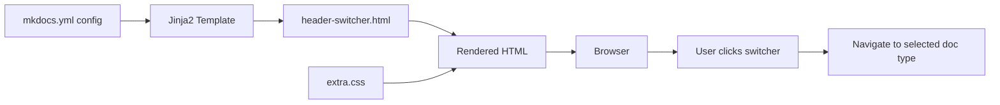

# Design Document: Documentation Switcher

## Overview

The documentation switcher is a navigation component that enables users to switch between different documentation types (user manual, developer manual, docguide, and swagger APIs) within the GeoServer documentation site. The component will be implemented as a dropdown menu integrated into the MkDocs Material theme's navigation header.

### Key Design Decisions

1. **MkDocs Material Theme Integration**: Leverage the Material theme's built-in dropdown components and styling system to ensure visual consistency
2. **Configuration-Based Approach**: Define documentation types and their URLs in the MkDocs configuration file (`mkdocs.yml`) to enable easy maintenance
3. **Template Override**: Extend the Material theme's header template to inject the switcher component near the logo
4. **Future-Proof Structure**: Design the switcher to accommodate future version selection via Mike integration without requiring major refactoring

### Technology Stack

- **MkDocs Material Theme**: Base theme providing UI components and styling
- **Jinja2 Templates**: Template engine for customizing theme components
- **CSS**: Custom styling to position and style the switcher
- **JavaScript**: Optional enhancement for dropdown behavior (if Material theme's built-in behavior is insufficient)

## Architecture

### Component Structure

```
doc/themes/geoserver/
├── partials/
│   └── header-switcher.html          # New: Switcher component template
├── stylesheets/
│   └── extra.css                      # Modified: Switcher styling
└── overrides/
    └── partials/
        └── header.html                # New: Override Material header to include switcher
```

### Integration Points

1. **MkDocs Configuration**: Each documentation type's `mkdocs.yml` will include:
   - `extra.doc_type`: Current documentation type identifier
   - `extra.doc_switcher`: List of available documentation types with labels and URLs

2. **Theme Template**: The header override will inject the switcher component between the logo and the main navigation

3. **CSS Styling**: Custom CSS will handle:
   - Positioning relative to the logo
   - Responsive behavior for mobile devices
   - Visual feedback for hover/active states

### Data Flow



## Components and Interfaces

### 1. Configuration Schema

Each documentation type's `mkdocs.yml` will include:

```yaml
extra:
  doc_type: "user"  # Current documentation type: user, developer, docguide, swagger
  doc_switcher:
    - label: "User Manual"
      url: "/en/user/"
      type: "user"
    - label: "Developer Manual"
      url: "/en/developer/"
      type: "developer"
    - label: "Documentation Guide"
      url: "/en/docguide/"
      type: "docguide"
    - label: "Swagger APIs"
      url: "/swagger/"
      type: "swagger"
```

### 2. Switcher Component Template

**File**: `doc/themes/geoserver/partials/header-switcher.html`

The template will:
- Read `extra.doc_type` to determine the active documentation
- Iterate over `extra.doc_switcher` to build dropdown options
- Apply appropriate CSS classes for styling
- Mark the current documentation type as active

**Template Structure**:
```jinja2

<div class="md-doc-switcher">
  <button class="md-doc-switcher__button" aria-label="Switch documentation type">
    <span class="md-doc-switcher__label">
      {{ current_doc_label }}
    </span>
    <svg><!-- dropdown icon --></svg>
  </button>
  <div class="md-doc-switcher__dropdown">
    
    <a href="{{ doc.url }}" 
       class="md-doc-switcher__link md-doc-switcher__link--active">
      {{ doc.label }}
    </a>
    
  </div>
</div>

```

### 3. Header Override Template

**File**: `doc/themes/geoserver/overrides/partials/header.html`

This template will extend the Material theme's header and inject the switcher component:

```jinja2



<header class="md-header">
  <nav class="md-header__inner md-grid">
    <!-- Logo -->
    <a href="{{ config.site_url }}" class="md-header__button md-logo">
      
    </a>
    
    <!-- Documentation Switcher (NEW) -->
    
    
    <!-- Rest of header content -->
    <!-- ... -->
  </nav>
</header>

```

### 4. CSS Styling

**File**: `doc/themes/geoserver/stylesheets/extra.css` (additions)

The CSS will handle:

```css
/* Documentation Switcher Styles */
.md-doc-switcher {
  position: relative;
  margin-left: 1rem;
  display: inline-block;
}

.md-doc-switcher__button {
  /* Button styling matching Material theme */
  display: flex;
  align-items: center;
  padding: 0.5rem 1rem;
  background: transparent;
  border: 1px solid var(--md-default-fg-color--lighter);
  border-radius: 0.25rem;
  cursor: pointer;
  transition: all 0.2s;
}

.md-doc-switcher__button:hover {
  background: var(--md-default-fg-color--lightest);
}

.md-doc-switcher__dropdown {
  /* Dropdown menu styling */
  position: absolute;
  top: 100%;
  left: 0;
  min-width: 200px;
  background: var(--md-default-bg-color);
  border: 1px solid var(--md-default-fg-color--lighter);
  border-radius: 0.25rem;
  box-shadow: 0 2px 8px rgba(0,0,0,0.1);
  display: none;
  z-index: 1000;
}

.md-doc-switcher:hover .md-doc-switcher__dropdown,
.md-doc-switcher__button:focus + .md-doc-switcher__dropdown {
  display: block;
}

.md-doc-switcher__link {
  display: block;
  padding: 0.75rem 1rem;
  color: var(--md-default-fg-color);
  text-decoration: none;
  transition: background 0.2s;
}

.md-doc-switcher__link:hover {
  background: var(--md-default-fg-color--lightest);
}

.md-doc-switcher__link--active {
  background: var(--md-primary-fg-color);
  color: var(--md-primary-bg-color);
  font-weight: 600;
}

/* Mobile responsive behavior */
@media screen and (max-width: 76.1875em) {
  .md-doc-switcher {
    margin-left: 0.5rem;
  }
  
  .md-doc-switcher__button {
    padding: 0.4rem 0.8rem;
    font-size: 0.9rem;
  }
}

@media screen and (max-width: 47.9375em) {
  .md-doc-switcher {
    /* On very small screens, move to hamburger menu or simplify */
    position: static;
    width: 100%;
    margin: 0.5rem 0;
  }
  
  .md-doc-switcher__dropdown {
    position: static;
    box-shadow: none;
    border: none;
  }
}
```

## Data Models

### Documentation Type Configuration

```typescript
interface DocSwitcherConfig {
  doc_type: string;           // Current documentation type identifier
  doc_switcher: DocType[];    // List of available documentation types
}

interface DocType {
  label: string;              // Display name (e.g., "User Manual")
  url: string;                // Relative or absolute URL to documentation root
  type: string;               // Type identifier (e.g., "user", "developer")
}
```

### Example Configuration Instance

```yaml
extra:
  doc_type: "user"
  doc_switcher:
    - label: "User Manual"
      url: "/en/user/"
      type: "user"
    - label: "Developer Manual"
      url: "/en/developer/"
      type: "developer"
    - label: "Documentation Guide"
      url: "/en/docguide/"
      type: "docguide"
    - label: "Swagger APIs"
      url: "/swagger/"
      type: "swagger"
```

### Future Extension for Version Switching

The configuration can be extended to support Mike versioning:

```yaml
extra:
  doc_type: "user"
  doc_version: "3.0"          # NEW: Current version
  doc_switcher:
    # ... documentation types
  version_switcher:            # NEW: Version selection (Mike integration)
    - version: "latest"
      title: "Latest (3.0)"
      aliases: []
    - version: "3.0"
      title: "3.0"
      aliases: []
    - version: "2.28.x"
      title: "2.28.x"
      aliases: []
```

The switcher component can be extended to show both documentation type and version selection in a hierarchical or side-by-side layout.


## Error Handling

### Configuration Errors

**Missing Configuration**:
- If `extra.doc_switcher` is not defined in `mkdocs.yml`, the switcher component will not render
- The site will function normally without the switcher
- No error messages will be displayed to end users

**Invalid Configuration**:
- If `extra.doc_type` doesn't match any entry in `extra.doc_switcher`, the switcher will still render but no option will be marked as active
- Missing required fields (label, url, type) will cause that entry to be skipped during rendering
- Jinja2 template will use safe navigation (`config.extra.doc_switcher | default([])`) to prevent template errors

### Navigation Errors

**Broken Links**:
- If a documentation type URL is incorrect or the target doesn't exist, users will encounter a 404 error
- This is a configuration issue that should be caught during build/deployment testing
- Solution: Validate all URLs in `doc_switcher` configuration during CI/CD pipeline

**Cross-Origin Issues**:
- If documentation types are hosted on different domains, ensure CORS policies allow navigation
- For GeoServer documentation, all types are expected to be under the same domain (`docs.geoserver.org`)

### Responsive Design Fallbacks

**Mobile Devices**:
- If JavaScript is disabled, the CSS-only hover behavior may not work on touch devices
- Fallback: Use CSS `:focus-within` pseudo-class for keyboard/touch accessibility
- Alternative: Implement a simple JavaScript toggle for mobile devices

**Browser Compatibility**:
- Modern browsers (Chrome, Firefox, Safari, Edge) support all CSS features used
- Older browsers may not support CSS custom properties (CSS variables)
- Fallback: Provide static color values in addition to CSS variables

### Template Rendering Errors

**Theme Override Conflicts**:
- If Material theme updates change the header structure, the override template may break
- Mitigation: Pin Material theme version in `requirements.txt` or `mkdocs.yml`
- Testing: Verify switcher functionality after any theme updates

**Jinja2 Template Errors**:
- Use defensive programming with default filters: `{{ config.extra.doc_type | default('') }}`
- Wrap optional sections in `` blocks to prevent undefined variable errors
- Log warnings during build if configuration is incomplete

## Testing Strategy

### Unit Testing

Unit tests will focus on specific examples and edge cases that demonstrate correct behavior:

1. **Configuration Parsing**:
   - Test that valid `mkdocs.yml` configuration is correctly parsed
   - Test that missing optional fields are handled gracefully
   - Test that empty `doc_switcher` list doesn't break rendering

2. **Template Rendering**:
   - Test that the switcher renders with valid configuration
   - Test that the active documentation type is correctly highlighted
   - Test that the switcher doesn't render when configuration is missing

3. **CSS Styling**:
   - Visual regression tests to ensure styling matches design specifications
   - Test responsive breakpoints (desktop, tablet, mobile)
   - Test dark mode and light mode color schemes

4. **Link Generation**:
   - Test that URLs are correctly generated from configuration
   - Test relative vs absolute URL handling
   - Test URL encoding for special characters

### Property-Based Testing

Property-based tests will verify universal properties across all inputs using a suitable testing library. Each test will run a minimum of 100 iterations.

**Testing Library**: For Python-based MkDocs testing, we'll use **Hypothesis** for property-based testing.

**Test Configuration**:
- Minimum 100 iterations per property test
- Each test tagged with: **Feature: documentation-switcher, Property {number}: {property_text}**

The specific correctness properties will be defined in the next section based on the acceptance criteria analysis.

### Integration Testing

1. **Build Testing**:
   - Build all documentation types (user, developer, docguide) with the switcher enabled
   - Verify that builds complete without errors
   - Verify that generated HTML includes the switcher component

2. **Cross-Documentation Navigation**:
   - Test navigation from user manual to developer manual
   - Test navigation from developer manual to docguide
   - Verify that the active documentation type updates after navigation

3. **Theme Integration**:
   - Test that the switcher doesn't conflict with other Material theme features
   - Test interaction with search, navigation tabs, and mobile menu
   - Test that the switcher works with both light and dark themes

### Manual Testing

1. **Visual Testing**:
   - Verify positioning relative to logo across different screen sizes
   - Verify dropdown appearance and behavior
   - Verify hover and active states

2. **Accessibility Testing**:
   - Test keyboard navigation (Tab, Enter, Escape)
   - Test screen reader compatibility
   - Verify ARIA labels and roles

3. **Browser Testing**:
   - Test on Chrome, Firefox, Safari, Edge
   - Test on mobile browsers (iOS Safari, Chrome Mobile)
   - Test with JavaScript disabled

### Acceptance Testing

Each requirement from the requirements document will be validated:

**Requirement 1: Display Documentation Switcher**
- Verify switcher is visible in navigation header
- Verify switcher shows current documentation type
- Verify switcher appears on all pages

**Requirement 2: Navigate Between Documentation Types**
- Verify dropdown shows all documentation types
- Verify clicking a type navigates to correct URL
- Verify active type updates after navigation

**Requirement 3: Maintain Consistent Visual Design**
- Verify styling matches Material theme
- Verify responsive behavior on mobile
- Verify hover/focus feedback

**Requirement 4: Support Future Version Switching**
- Verify configuration structure can accommodate version selection
- Verify switcher design can be extended without breaking changes


## Correctness Properties

*A property is a characteristic or behavior that should hold true across all valid executions of a system—essentially, a formal statement about what the system should do. Properties serve as the bridge between human-readable specifications and machine-verifiable correctness guarantees.*

### Property 1: Active Documentation Type Display

*For any* documentation page within a specific documentation type, the switcher SHALL display that documentation type as the active selection.

**Validates: Requirements 1.2, 2.4**

### Property 2: Switcher Presence Across Pages

*For any* page within the documentation site, the switcher component SHALL be present in the rendered HTML within the navigation header.

**Validates: Requirements 1.3**

### Property 3: Complete Configuration Rendering

*For any* valid documentation switcher configuration, all configured documentation types SHALL appear in the dropdown menu with their corresponding URLs correctly set as link targets.

**Validates: Requirements 2.1, 2.3**

### Property 4: Responsive Behavior

*For any* viewport width, the switcher SHALL render with appropriate styling and layout as defined by the responsive CSS media queries (desktop, tablet, mobile breakpoints).

**Validates: Requirements 3.3**

### Property 5: Interactive Feedback

*For any* interactive element within the switcher (button, links), CSS styles for hover and focus states SHALL be defined and applied when the element receives user interaction.

**Validates: Requirements 3.4**

### Property 6: Configuration Backward Compatibility

*For any* existing documentation switcher configuration, adding version selection configuration (for Mike integration) SHALL NOT break the rendering or functionality of the documentation type switcher.

**Validates: Requirements 4.3**

### Property 7: Configuration Round-Trip

*For any* valid `doc_switcher` configuration in YAML format, parsing the configuration and rendering it to HTML, then extracting the documentation types from the HTML, SHALL produce a list equivalent to the original configuration.

**Validates: Requirements 2.1, 2.2**

