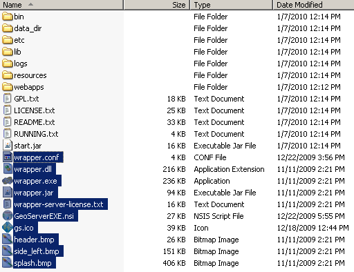
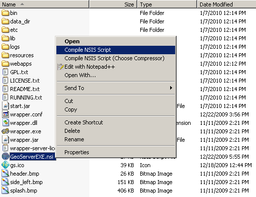
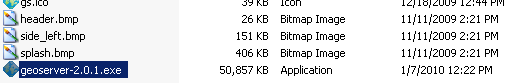

# Build Windows installer

We presently have a Windows build server which is responsible for packaging up the windows installer for each release.

The [NSIS](https://nsis.sourceforge.io/Main_Page) program used here can also be run on Linux; however we make use of a Windows build server in order to digitally sign the result.

However you can create your own installer (using a Windows machine).

!!! note

    This step requires a Windows machine.

!!! note

    A community provided Powershell script that automates the following steps is available [here](https://github.com/geoserver/geoserver/edit/main/src/release/installer/win/win-installer-builder.ps1).

1.  Download and install [NSIS](http://nsis.sourceforge.net/).

2.  Install the [NSIS Access Control plugin](http://nsis.sourceforge.net/AccessControl_plug-in). The simplest way to do this is to download the zip, extract the .DLL files (**`AccessControl.dll`**) and copy it to the NSIS plugins directory (usually **`C:\Program Files\NSIS\Plugins\x86-ansi`**).

3.  Download and unzip the binary GeoServer package:

        unzip geoserver-[VERSION]-bin.zip

4.  Download and unzip the source GeoServer package:

        unzip geoserver-[VERSION].zip

5.  Copy the files **`LICENSE.md`**, **`src/release/licenses/GPL.md`** and the following files from **`src/release/installer/win`** from the Geoserver source GeoServer package to the root of the unpacked archive (the same directory level as the **`start.jar`**):

        GeoServerEXE.nsi
        gs.ico
        header.bmp
        side_left.bmp
        splash.bmp
        wrapper.conf
        wrapper.dll
        wrapper.exe
        wrapper.jar
        wrapper-server-license.txt

    

6.  Right-click on the installer script **`GeoServerEXE.nsi`** and select ***Compile Script***.

    

7.  After successfully compiling the script, an installer named **`geoserver-[VERSION].exe`** will be located in the root of the unpacked archive.

    
