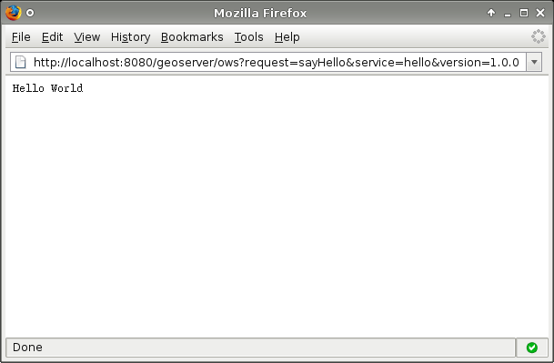

# Implementing a simple OWS service

This section explains How to Create a Simple GeoServer OWS service for GeoServer using the following scenario. The service should supply a capabilities document which advertises a single operation called "sayHello". The result of a sayHello operation is the simple string "Hello World".

## Setup

The first step in creating our plug-in is setting up a maven project for it. The project will be called "hello".

1.  Create a new directory called **`hello`** anywhere on your file system.
2.  Add a maven pom called **`pom.xml`** to the **`hello`** directory:

~~~xml
<!-- Malformed include statement: programming-guide/ows-services/hello/pom.xml -->
<!-- TODO: Fix or remove -->
~~~

1.  Create a java source directory, **`src/main/java`** under the **`hello`** directory:

        hello/
          + pom.xml
          + src/
            + main/
              + java/

## Creating the Plug-in

A plug-in is a collection of extensions realized as spring beans. In this example the extension point of interest is a HelloWorld POJO (Plain Old Java Object).

1.  Create a class called **HelloWorld**:

~~~java
<!-- Malformed include statement: programming-guide/ows-services/hello/src/main/java/HelloWorld.java -->
<!-- TODO: Fix or remove -->
~~~

The service is relatively simple. It provides a method sayHello(..) which takes a HttpServletRequest, and a HttpServletResponse. The parameter list for this function is automatically discovered by the org.geoserver.ows.Dispatcher.

1.  Create an **`applicationContext.xml`** declaring the above class as a bean.

~~~xml
<!-- Malformed include statement: programming-guide/ows-services/hello/src/main/java/applicationContext.xml -->
<!-- TODO: Fix or remove -->
~~~

At this point the hello project should look like the following:

``` sh
hello/
  + pom.xml
  + src/
    + main/
      + java/
        + HelloWorld.java
        + applicationContext.xml
```

## Trying it Out

1.  Install the **`hello`** module:

``` sh
[hello]% mvn install
```

``` sh
[INFO] Scanning for projects...
[INFO]                                                                         
[INFO] ------------------------------------------------------------------------
[INFO] Building Hello World Service Module 1.0
[INFO] ------------------------------------------------------------------------
[INFO] 
[INFO] --- maven-clean-plugin:2.5:clean (default-clean) @ hello ---
[INFO] Deleting /home/bradh/devel/geoserver/doc/en/developer/source/programming-guide/ows-services/hello/target
[INFO] 
[INFO] --- cobertura-maven-plugin:2.6:clean (default) @ hello ---
[INFO] 
[INFO] --- git-commit-id-plugin:2.0.4:revision (default) @ hello ---
[INFO] [GitCommitIdMojo] .git directory could not be found, skipping execution
[INFO] 
[INFO] --- maven-resources-plugin:2.6:resources (default-resources) @ hello ---
[INFO] Using 'UTF-8' encoding to copy filtered resources.
[INFO] Copying 1 resource
[INFO] skip non existing resourceDirectory /home/bradh/devel/geoserver/doc/en/developer/source/programming-guide/ows-services/hello/src/main/resources
[INFO] 
[INFO] --- maven-compiler-plugin:2.3.2:compile (default-compile) @ hello ---
[INFO] Compiling 1 source file to /home/bradh/devel/geoserver/doc/en/developer/source/programming-guide/ows-services/hello/target/classes
[INFO] 
[INFO] --- maven-resources-plugin:2.6:testResources (default-testResources) @ hello ---
[INFO] Using 'UTF-8' encoding to copy filtered resources.
[INFO] skip non existing resourceDirectory /home/bradh/devel/geoserver/doc/en/developer/source/programming-guide/ows-services/hello/src/test/java
[INFO] skip non existing resourceDirectory /home/bradh/devel/geoserver/doc/en/developer/source/programming-guide/ows-services/hello/src/test/resources
[INFO] 
[INFO] --- maven-compiler-plugin:2.3.2:testCompile (default-testCompile) @ hello ---
[INFO] No sources to compile
[INFO] 
[INFO] --- maven-surefire-plugin:2.12.3:test (default-test) @ hello ---
[INFO] No tests to run.
[INFO] 
[INFO] --- maven-jar-plugin:2.4:jar (default-jar) @ hello ---
[INFO] Building jar: /home/bradh/devel/geoserver/doc/en/developer/source/programming-guide/ows-services/hello/target/hello-1.0.jar
[INFO] 
[INFO] --- maven-jar-plugin:2.4:test-jar (default) @ hello ---
[WARNING] JAR will be empty - no content was marked for inclusion!
[INFO] Building jar: /home/bradh/devel/geoserver/doc/en/developer/source/programming-guide/ows-services/hello/target/hello-1.0-tests.jar
[INFO] 
[INFO] >>> maven-source-plugin:2.2.1:jar (attach-sources) > generate-sources @ hello >>>
[INFO] 
[INFO] --- git-commit-id-plugin:2.0.4:revision (default) @ hello ---
[INFO] [GitCommitIdMojo] .git directory could not be found, skipping execution
[INFO] 
[INFO] <<< maven-source-plugin:2.2.1:jar (attach-sources) < generate-sources @ hello <<<
[INFO] 
[INFO] --- maven-source-plugin:2.2.1:jar (attach-sources) @ hello ---
[INFO] Building jar: /home/bradh/devel/geoserver/doc/en/developer/source/programming-guide/ows-services/hello/target/hello-1.0-sources.jar
[INFO] 
[INFO] >>> maven-source-plugin:2.2.1:test-jar (attach-sources) > generate-sources @ hello >>>
[INFO] 
[INFO] --- git-commit-id-plugin:2.0.4:revision (default) @ hello ---
[INFO] [GitCommitIdMojo] .git directory could not be found, skipping execution
[INFO] 
[INFO] <<< maven-source-plugin:2.2.1:test-jar (attach-sources) < generate-sources @ hello <<<
[INFO] 
[INFO] --- maven-source-plugin:2.2.1:test-jar (attach-sources) @ hello ---
[INFO] No sources in project. Archive not created.
[INFO] 
[INFO] --- maven-install-plugin:2.4:install (default-install) @ hello ---
[INFO] Installing /home/bradh/devel/geoserver/doc/en/developer/source/programming-guide/ows-services/hello/target/hello-1.0.jar to /home/bradh/.m2/repository/org/geoserver/hello/1.0/hello-1.0.jar
[INFO] Installing /home/bradh/devel/geoserver/doc/en/developer/source/programming-guide/ows-services/hello/pom.xml to /home/bradh/.m2/repository/org/geoserver/hello/1.0/hello-1.0.pom
[INFO] Installing /home/bradh/devel/geoserver/doc/en/developer/source/programming-guide/ows-services/hello/target/hello-1.0-tests.jar to /home/bradh/.m2/repository/org/geoserver/hello/1.0/hello-1.0-tests.jar
[INFO] Installing /home/bradh/devel/geoserver/doc/en/developer/source/programming-guide/ows-services/hello/target/hello-1.0-sources.jar to /home/bradh/.m2/repository/org/geoserver/hello/1.0/hello-1.0-sources.jar
[INFO] ------------------------------------------------------------------------
[INFO] BUILD SUCCESS
[INFO] ------------------------------------------------------------------------
[INFO] Total time: 2.473 s
[INFO] Finished at: 2015-10-20T10:14:16+11:00
[INFO] Final Memory: 23M/589M
[INFO] ------------------------------------------------------------------------
```

1.  Next we need to make sure **`hello-1.0.jar`** is included when we run GeoServer:

    - If you are running a GeoServer in Tomcat, copy **`target/hello-1.0.jar`** into **`webapps/geoserver/WEB-INF/lib`** (just like we manually install extensions or community modules).

      Restart GeoServer to pick up the change.

    - If running with ***Eclipse*** using maven eclipse plugin, the easiest approach is edit the **`web-app/pom.xml`** with the following dependency:

      > ``` xml
      > <dependency>
      >    <groupId>org.geoserver</groupId>
      >    <artifactId>hello</artifactId>
      >    <version>1.0-SNAPSHOT</version>
      >   </dependency>
      > ```
      >
      > After editing **`webapps/pom.xml`** we need run ``mvn eclipse:eclipse``, and then from ***Eclipse*** right click on web-app project and **Refresh** for the IDE to notice the change.

    - If and IDE like IntellJ, Eclipse M2 Maven plugin or NetBeans refresh the project so it picks up the changes to **`pom.xml`**

2.  Restart GeoServer and visit:

        http://<host>/geoserver/ows?request=sayHello&service=hello&version=1.0.0

    request

    :   the method we defined in our service

    service

    :   the name we passed to the Service descriptor in the applicationContext.xml

    version

    :   the version we passed to the Service descriptor in the applicationContext.xml



!!! note

    A common pitfall is to bundle an extension without the **`applicationContext.xml`** file. If you receive the error message "No service: ( hello )" this is potentially the case. To ensure the file is present inspect the contents of the hello jar present in the **`target`** directory of the hello module.

## Bundling with Web Module

An alternative to plugging into an existing installation is to build a complete GeoServer war that includes the custom hello plugin. To achieve this a new dependency is declared from the core **web/app** module on the new plugin project. This requires building GeoServer from sources.

1.  Build GeoServer from sources as described [here](../../maven-guide/index.md).

2.  Install the **`hello`** module as above.

3.  Edit **`web/app/pom.xml`** and add the following dependency:

    ``` xml
    <dependency>
        <groupId>org.geoserver</groupId>
        <artifactId>hello</artifactId>
        <version>1.0</version>
    </dependency>
    ```

4.  Install the **`web/app`** module

> ``` sh
> [web/app] mvn install
> ```

A GeoServer war including the hello extension should now be present in the **`target`** directory.

!!! note

    To verify the plugin was bundled properly unpack **`geoserver.war`** and inspect the contents of the **`WEB-INF/lib`** directory and ensure the hello jar is present.

## Running from Source

During development the most convenient way to work with the extension is to run it directly from sources.

1.  Setup GeoServer in eclipse as described [here](../../eclipse-guide/index.md).

2.  Move the hello module into the GeoServer source tree under the `community` root module.

3.  Edit the **`community/pom.xml`** and add a new profile:

        <profile>
          <id>hello</id>
          <modules>
            <module>hello</module>
          </modules>
        </profile>

4.  If not already done, edit **`web/app/pom.xml`** and add the following dependency:

    ``` xml
    <dependency>
        <groupId>org.geoserver</groupId>
        <artifactId>hello</artifactId>
        <version>1.0</version>
    </dependency>
    ```

5.  From the root of the GeoServer source tree run the following maven command:

> ``` sh
> [src] mvn -P hello eclipse:eclipse
> ```

1.  In eclipse import the new hello module and refresh all modules.
2.  In the `web-app` module run the `Start.java` main class to start GeoServer.

!!! note

    Ensure that the `web-app` module in eclipse depends on the newly imported `hello` module. This can be done by inspecting the `web-app` module properties and ensuring the `hello` module is a project dependency.
