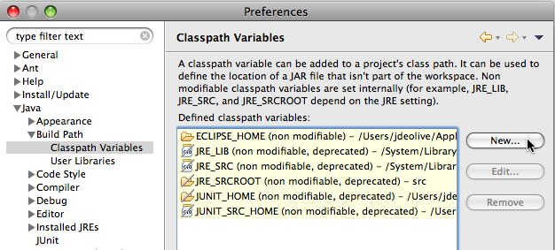
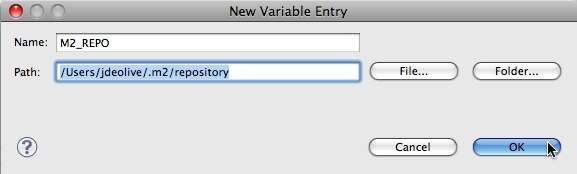
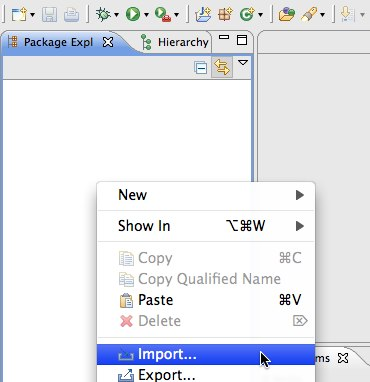
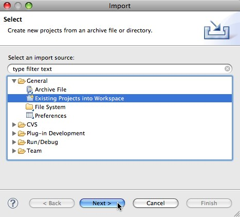
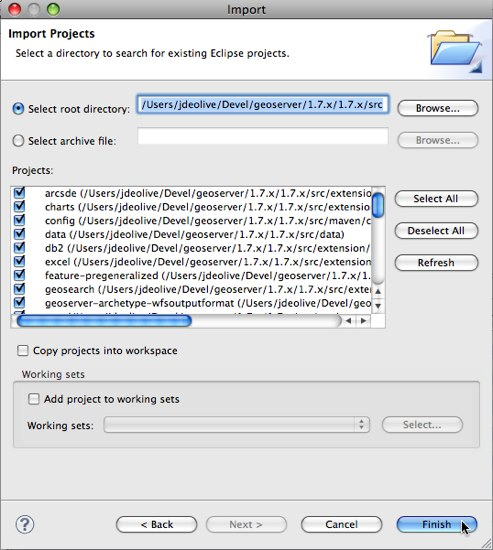

# Maven Eclipse Plugin Quickstart

This guide is designed to get developers up and running as quick as possible. For a more comprehensive guide see the [Eclipse Guide](../eclipse-guide/index.md).



## Generate Eclipse project files with Maven

Generate the eclipse `.project` and `.classpath` files:

    mvn eclipse:eclipse

## Import modules into Eclipse

1.  Run the Eclipse IDE

2.  Open the Eclipse `Preferences`

3.  Navigate to `Java`, `Build Path`, `Classpath Variables` and click `New...`

    

4.  Create a classpath variable named "M2_REPO" and set the value to the location of the local Maven repository, and click `Ok`

    

5.  Click `Ok` to apply the new Eclipse preferences

6.  Right-click in the `Package Explorer` and click `Import...`

    {width="300px"}

7.  Select `General`, `Existing Projects into Workspace` and click `Next`. (Do not make the mistake of importing `Maven`, `Existing Maven Projects`!)

    {width="400px"}

8.  Navigate to the `geoserver/src` directory

9.  Ensure all modules are selected and click `Finish`

    {width="350px"}

## Run GeoServer from Eclipse

1.  From the `Package Explorer` select the `web-app` module

2.  Navigate to the `org.geoserver.web` package

3.  Right-click the `Start` class and navigate to `Run as`, `Java Application`

    {width="600px"}

4.  After running the first time you can return to the `Run Configurations` dialog to fine tune your launch environment (including setting a GEOSERVER_DATA_DIR).

!!! note

    If you already have a server running on localhost:8080 see the [Eclipse Guide](../eclipse-guide/index.md) for instructions on changing to a different port.

### Run GeoServer with Extensions

The above instructions assume you want to run GeoServer without any extensions enabled. In cases where you do need certain extensions, the `web-app` module declares a number of profiles that will enable specific extensions when running `Start`. To enable an extension, re-generate the root eclipse profile with the appropriate maven profile(s) enabled:

    % mvn eclipse:eclipse -P wps

The full list of supported profiles can be found in `src/web/app/pom.xml`.

## Access GeoServer front page

- After a few seconds, GeoServer should be accessible at: <http://localhost:8080/geoserver>
- The default `admin` password is `geoserver`.
