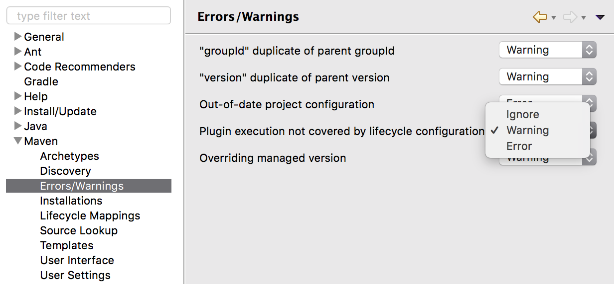
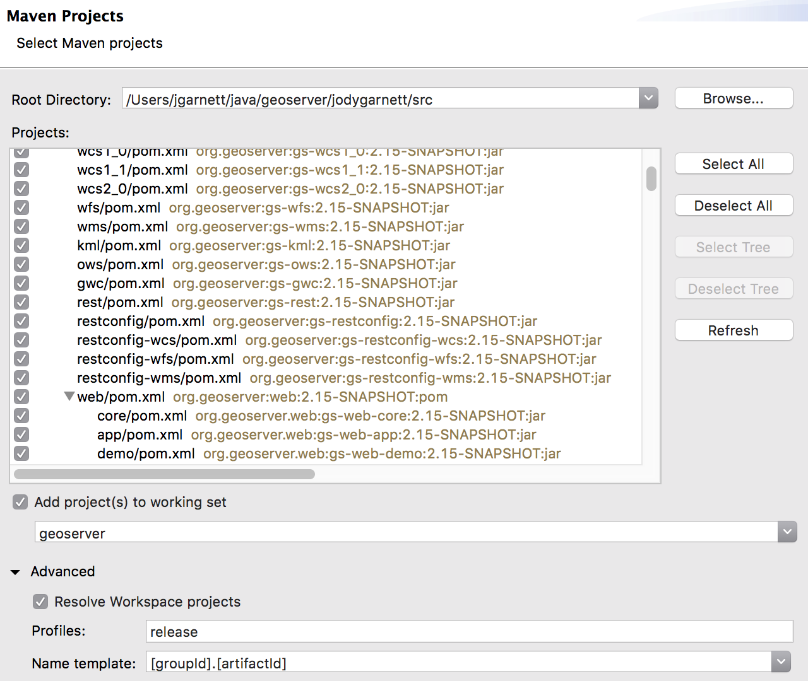
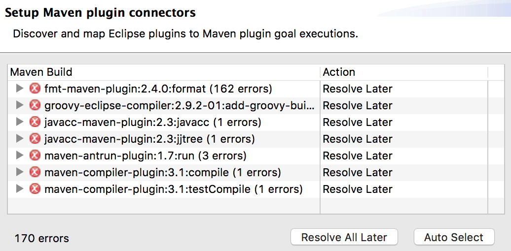
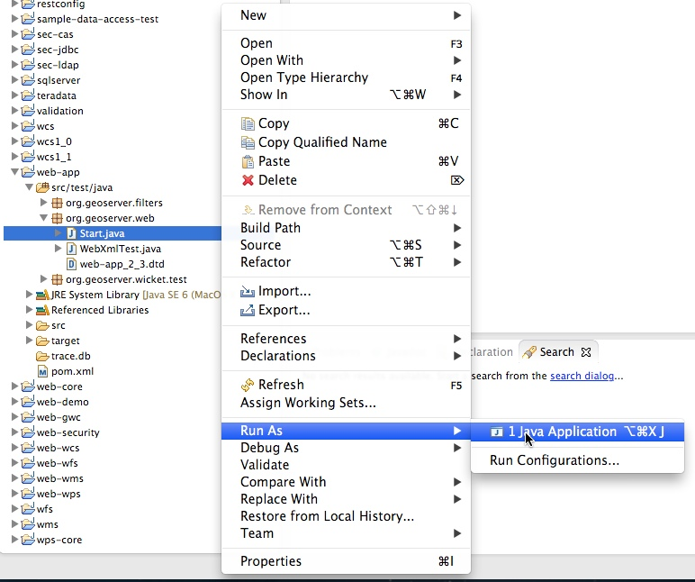

# Eclipse M2 Quickstart

This guide is designed to get developers up and running as quick as possible. For a more comprehensive guide see the [Eclipse Guide](../eclipse-guide/index.md).

[M2Eclipse](https://www.eclipse.org/m2e/) provides tight integration for Apache Maven into the Eclipse IDE.



## Eclipse Maven builder

The maven build supplied with eclipse works with the **`pom.xml`** files, however it does recognize some of our custom build steps:

1.  Go to Preferences and navigate to **Maven --> Errors/Warning**
2.  Change the **Plugin execution not covered by lifecycle configuration** to `Warning`.

## java-cc-maven-plugin

The Eclipse M2 builder does recognize this plugin, build once on the command line first:

1.  Navigate to ``**`src/wcs1_1``**`.

2.  Compile, to force the code to be generated:

        mvn compile

        [INFO] --- javacc-maven-plugin:2.3:jjtree (jjtree) @ gs-wcs1_1 ---
        Java Compiler Compiler Version 4.0 (Tree Builder)
        (type "jjtree" with no arguments for help)
        "src/wcs1_1/target/jjtree/org/geoserver/wcs/kvp/rangesubset/ASTFieldId.java" does not exist.  Will create one.
        ...
        Annotated grammar generated successfully in src/wcs1_1/target/jjtree/org/geoserver/wcs/kvp/rangesubset/rangeset.jj
        [INFO] 
        [INFO] --- javacc-maven-plugin:2.3:javacc (javacc) @ gs-wcs1_1 ---
        Java Compiler Compiler Version 4.0 (Parser Generator)
        (type "javacc" with no arguments for help)
        Reading from file src/wcs1_1/target/jjtree/org/geoserver/wcs/kvp/rangesubset/rangeset.jj . . .
        File "TokenMgrError.java" does not exist.  Will create one.
        File "ParseException.java" does not exist.  Will create one.
        ...
        Parser generated successfully.
        [INFO] 

        [INFO] --- fmt-maven-plugin:2.4.0:format (default) @ gs-wcs1_1 ---
        [debug] Using AOSP style
        [INFO] Processed 47 files (0 reformatted).
        [INFO] 

## Import modules into Eclipse

1.  Use **File --> Import** to open the **Import** wizard. Select **Maven --> Existing Maven Projects** import wizard, and **Next**.

2.  Define the **Root Directory** by browsing to the GeoServer **`src`** folder.

3.  Open **Advanced** options:

    - Profiles: ``release``
    - Name template: [[groupId].[artifactId]]{.title-ref}

    

#\. Press **Finish** to start import.

> During import use `Resolve Later`, exclude lifecycle mapping.
>
> 

## Run GeoServer from Eclipse

1.  From the `Package Explorer` select the `web-app` module

2.  Navigate to the `org.geoserver.web` package

3.  Right-click the `Start` class and navigate to `Run as`, `Java Application`

    

4.  After running the first time you can return to the `Run Configurations` dialog to fine tune your launch environment (including setting a GEOSERVER_DATA_DIR).

!!! note

    If you already have a server running on localhost:8080 see the [Eclipse Guide](../eclipse-guide/index.md) for instructions on changing to a different port.

## Access GeoServer front page

- After a few seconds, GeoServer should be accessible at: <http://localhost:8080/geoserver>
- The default `admin` password is `geoserver`.
