# IntelliJ QuickStart



## Import modules into IntelliJ

1.  Run the IntelliJ IDE

2.  From the initial panel select `Open`.

    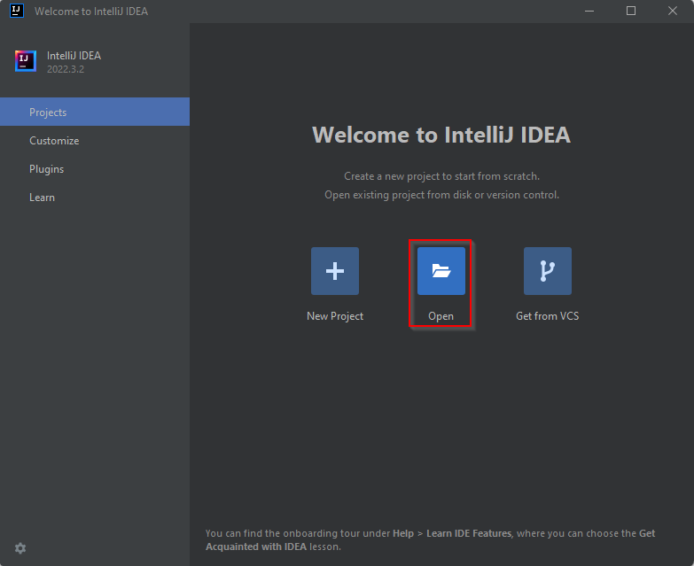{width="500px"}

3.  Navigate to the `geoserver/src/pom.xml` directory and click `OK`.

    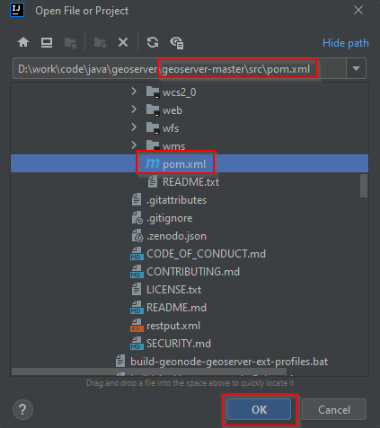{width="350px"}

4.  When asked click on `Open as a Project`.

    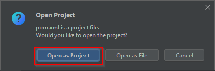{width="350px"}

5.  Optionally, depending on which platform, IntelliJ may ask to `Trust the Project`.

    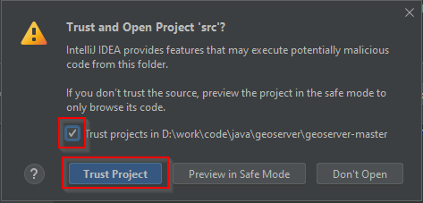{width="350px"}

6.  Wait for IntelliJ to `Sync` the dependencies, it's possible to follow the process from the `Build` tab panel on the bottom.

    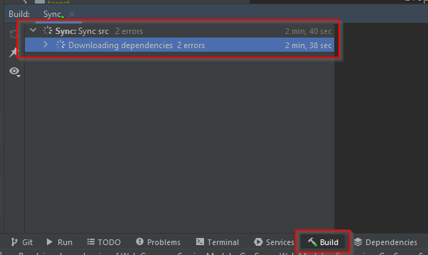{width="500px"}

### Finalize the GeoServer Project configuration

1.  Click `File > Project Structure`.

    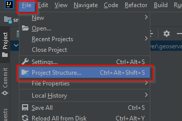{width="300px"}

2.  Update the `Name` and select the correct `SDK` accordingly to the GeoServer version.

    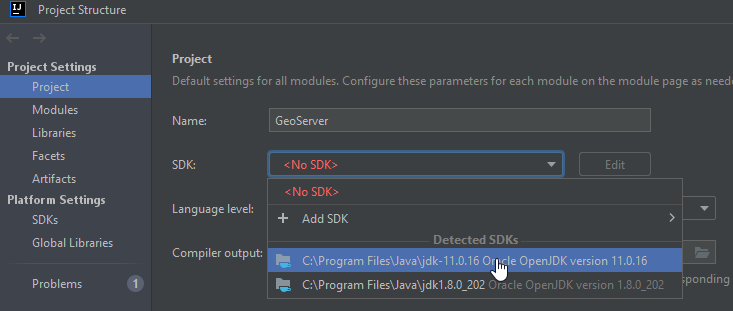{width="400px"}

3.  Click `File > Settings`.

    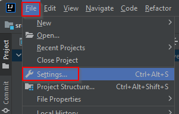{width="300px"}

4.  From `Build, Execution, Deployment > Compiler > Annotation Processors`, enable the `Annotation processing`.

    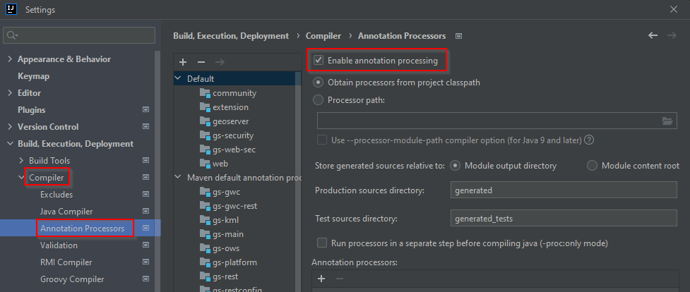{width="600px"}

5.  Click `Build > Rebuild Project`.

    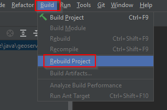{width="300px"}

## Run GeoServer from IntelliJ

1.  From the Project browser select the `web-app` module

2.  Navigate to the `org.geoserver.web` package

3.  Right-click the `Start` class and click to `Modify Run Configuration...`

    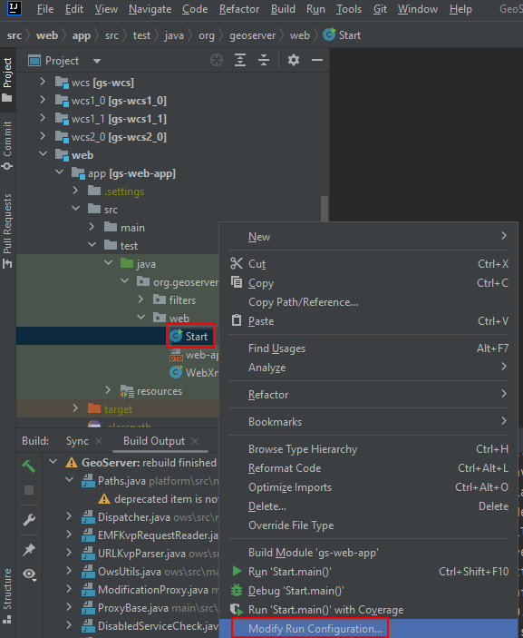{width="500px"}

4.  It is **important** to correctly set the `Working directory` to `src/web/app`. While having the `Edit Configurations` dialog open, fine tune the launch environment (including setting a `GEOSERVER_DATA_DIR` or the `jetty.port`). When settings are satisfactory, click `OK`.

    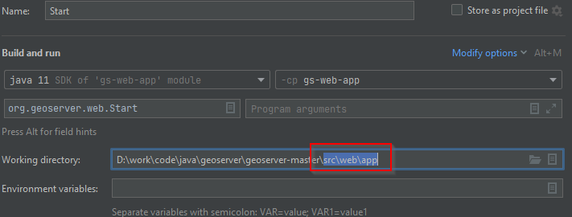{width="600px"}

5.  It's possible now to run GeoServer by selecting `Run -> Run 'Start'`

    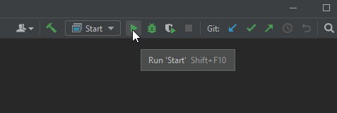{width="300px"}

### Troubleshooting

1.  If there are errors such as "cannot find symbol class ASTAxisId", some generated code is not being included in the build. Using `wcs1_1` as the working directory, run a `mvn clean install`.

2.  

    In the case of compiler errors like `java.lang.NoSuchMethodError`, it might be due to `Error Prone`. This tool is switched off by default, but sometimes it turns on after import to IntelliJ. There are two options to fix it:

    :   1.  Go to Maven tool window and uncheck the `errorprone` profile, then click `Reimport All Maven Projects`:

            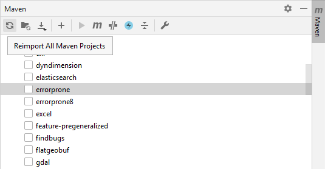{width="400px"}

        2.  To use `errorprone`, notably to perform the QA checks, install the `Error Prone Compiler` plugin, restart the IDE and set `Javac with error-prone` as a default compiler for the project. Please note that this will slow down the build.

3.  If there are errors such as "cannot find symbol AbstractUserGroupServiceTest", rebuild the `security-tests` project in the security module. Right-click on the `security-tests` project and click Rebuild.

4.  In the last versions of IntelliJ Annotations processors are enabled. If there are errors because of this uncheck this option from compiler settings.

    {width="600px"}

5.  If IntelliJ complains with an error message like `Command line is too long.`, click on `Shorten the command line and run.`

    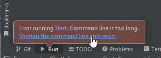{width="300px"}

!!! note

    If there's a server running on localhost:8080 please check the [Eclipse Guide](../eclipse-guide/index.md) for instructions on changing to a different port.

### Run GeoServer with Extensions

The above instructions assume running GeoServer without any extensions enabled. In cases where certain extensions are needed, the `web-app` module declares a number of profiles that will enable specific extensions when running `Start`. To enable an extension, open the `Maven Projects` tool and select the profile(s) to enable.

> 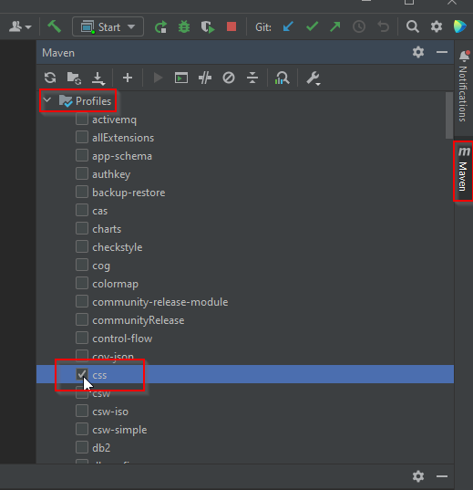{width="600px"}

The full list of supported profiles can be found in `src/web/app/pom.xml`.

In order to sync the GeoServer execution with the new modules, from the `Maven Projects` tool click the `Reload All Maven Project` button (1), then `Build the Project` (2) and, once finished, `Run 'Start'` (3).

> 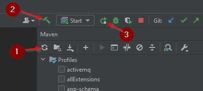{width="400px"}

## Access GeoServer front page

- After a few seconds, GeoServer should be accessible at: <http://localhost:8080/geoserver>
- The default `admin` password is `geoserver`.

## Development Environment

### Code formatting

GeoServer uses the [palantir-java-format](<https://github.com/palantir/palantir-java-format?tab=readme-ov-file#palantir-java-format>) which is a fork of the google-java-format AOSP style updated Lamda expressions and 120 columns.

The formatter plugin is embedded in the build and will reformat the code at each build, matching the coding conventions. Please always build locally before committing!

The [palantir-java-format](https://github.com/palantir/palantir-java-format) project offers a [plugin](<https://plugins.jetbrains.com/plugin/13180-palantir-java-format>) for IntelliJ.

Code formatting is covered by our build [Quality Assurance](../qa-guide/index.md#spotless) checks.
