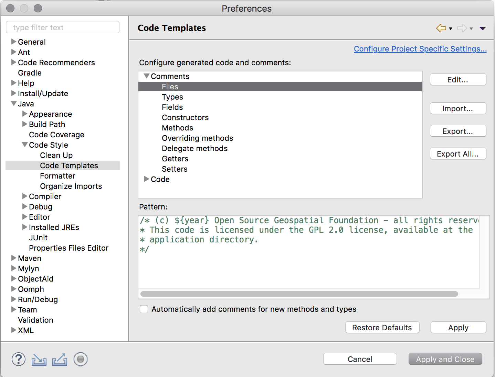

.. _eclipse_guide:

Eclipse Guide
=============

A reference for developing GeoServer with Eclipse.

.. contents:: :local:

Setting up Eclipse
------------------

Use of Maven M2 Plugin
^^^^^^^^^^^^^^^^^^^^^^

The Eclipse built-in support for maven can be used to build and run GeoServer, see :ref:`quickstart_eclipse_m2` for details.

Use of maven eclipse plugin
^^^^^^^^^^^^^^^^^^^^^^^^^^^

The maven eclipse plugin is used to generate eclipse projects for a set of 
modules::

  mvn eclipse:eclipse

After which the modules can be imported into an eclipse workspace, see :ref:`quickstart_eclipse` for details.

A useful feature of the plugin is the ability to download associated source code
for third party dependencies. This is done with the ``downloadSources`` flag::

  mvn -DdownloadSources eclipse:eclipse

.. warning::

   The first time you enable the ``downloadSources`` flag the build will take a  long time as it will attempt to download the sources for every single library GeoServer depends on.
   
Running and debugging
---------------------

Run or debug the class ``org.geoserver.web.Start`` in the ``web-app`` 
module. The steps to do so are detailed in the :ref:`quickstart_eclipse` or :ref:`quickstart_eclipse_m2`.

Running GeoServer with Extensions
^^^^^^^^^^^^^^^^^^^^^^^^^^^^^^^^^

By default, GeoServer will run without any extensions enabled. In order to run GeoServer with extensions, the ``web-app`` module declares a number of profiles used to enable specific extensions when running ``Start``. To enable an extension, re-generate the root eclipse profile with the appropriate maven profile(s) enabled::

  % mvn eclipse:eclipse -P wps

The full list of supported profiles can be found in ``src/web/app/pom.xml``.

Setting the data directory
^^^^^^^^^^^^^^^^^^^^^^^^^^

If unset, GeoServer will default to the ``minimal`` directory inside of the 
``web-app`` module for its data directory. To change this:

 #. Open ``Debug Configurations...`` from the Eclipse menu

    .. image:: dd1.jpg

 #. Select the ``Start`` configuration, select the ``Arguments`` panel and 
    specify the ``-DGEOSERVER_DATA_DIR`` parameter, setting it to the absolute
    path of the data directory

    .. image:: dd2.jpg

Changing the default port for Jetty
^^^^^^^^^^^^^^^^^^^^^^^^^^^^^^^^^^^

If unset, Jetty will default to port ``8080``. To change this:

  #. Open the ``Arguments`` panel of the ``Start`` configuration as described
     in the above section

  #. Specify the ``-Djetty.port`` parameter, setting it to the desired port

     .. image:: port.jpg

Configuring JNDI resources in Jetty
^^^^^^^^^^^^^^^^^^^^^^^^^^^^^^^^^^^

JNDI resources such as data sources can be configured by supplying a Jetty
server configuration file named in the system property ``jetty.config.file``,
specified as a line in ``VM arguments`` in the ``Arguments`` panel of the launch
configuration for ``Start`` (separate lines are joined when the JVM is launched).
The path to the configuration file is relative to the root of the ``web-app`` module,
in which the launch configuration runs. Naming factory system properties must also be
configured for Jetty. For example, ``VM arguments`` could include::

    -Djetty.config.file=../../../../../settings/jetty.xml
    -Djava.naming.factory.url.pkgs=org.eclipse.jetty.jndi
    -Djava.naming.factory.initial=org.eclipse.jetty.jndi.InitialContextFactory

The following Jetty server configuration file
configures a JNDI data source ``java:comp/env/jdbc/demo`` that is a
connection pool for an Oracle database::

    <?xml version="1.0"?>
    <!DOCTYPE Configure PUBLIC "-//Mort Bay Consulting//DTD Configure//EN" "http://jetty.mortbay.org/configure.dtd">
    <Configure class="org.eclipse.jetty.server.Server">
        <New class="org.eclipse.jetty.plus.jndi.Resource">
            <Arg>java:comp/env/jdbc/demo</Arg>
            <Arg>
                <New class="org.apache.commons.dbcp.BasicDataSource">
                    <Set name="driverClassName">oracle.jdbc.OracleDriver</Set>
                    <Set name="url">jdbc:oracle:thin:@oracle.example.com:1521:demodb</Set>
                    <Set name="username">claudius</Set>
                    <Set name="password">s3cr3t</Set>
                    <Set name="maxActive">20</Set>
                    <Set name="maxIdle">10</Set>
                    <Set name="minIdle">0</Set>
                    <Set name="maxWait">10000</Set>
                    <Set name="minEvictableIdleTimeMillis">300000</Set>
                    <Set name="timeBetweenEvictionRunsMillis">300000</Set>
                    <Set name="numTestsPerEvictionRun">20</Set>
                    <Set name="poolPreparedStatements">true</Set>
                    <Set name="maxOpenPreparedStatements">100</Set>
                    <Set name="testOnBorrow">true</Set>
                    <Set name="validationQuery">SELECT SYSDATE FROM DUAL</Set>
                    <Set name="accessToUnderlyingConnectionAllowed">true</Set>
                </New>
            </Arg>
        </New>
    </Configure>

Jetty does not mandate a ``reference-ref`` in GeoServer ``WEB-INF/web.xml``,
so there is no need to modify that file. No Jetty-specific information is
required inside the GeoServer ``web-app`` module or data directory, so JNDI 
resources can be tested under Jetty for later deployment under Tomcat.
See also the tutorial `Setting up a JNDI connection pool with Tomcat
<http://docs.geoserver.org/stable/en/user/tutorials/tomcat-jndi/tomcat-jndi.html>`_
in the GeoServer User Manual.

Starting Jetty with an open SSL port
^^^^^^^^^^^^^^^^^^^^^^^^^^^^^^^^^^^^

The SSL port used ``8843``. 

  #. Open the ``Arguments`` panel of the ``Start`` configuration. 
  #. Specify the ``-Dssl.hostname`` parameter, setting it to the full qualified host name of the box 
     running Jetty.  

     .. image:: ssl.jpeg
     
On first time startup, a key store is created in ``<home directory>/.geoserver/keystore.jks``. 
The password is **changeit** and the key store contains a self signed certificate for the host name
passed in the ``ssl.hostname`` parameter.

Test the SSL connection by opening a browser and entering  
**https://ux-desktop03.mc-home.local:8843/geoserver**. The browser should complain about the self 
singed certificate which does not hurt for test and development setups. 

Eclipse preferences
-------------------

Code formatting
^^^^^^^^^^^^^^^

The Google formatter plugin is embedded in the build and will reformat the code at each build, matching the coding conventions. Please always build before committing!

The `google-java-format <https://github.com/google/google-java-format>`__ project offers a plugin for Eclipse, but we are waiting an support for ASOP variant. While we wait for this fix build once on the command line, to format the any code changes before committing.

As workaround you could use a `modified version <https://github.com/fernandor777/google-java-format/releases/download/1.7-gsgt/google-java-format-eclipse-plugin-1.6.0.jar>`__ with 4 spaces indent by default, putting the jar file on Eclipse dropins folder.

You may also:

#. Download https://github.com/geotools/geotools/blob/master/build/eclipse/eclipse-java-google-style.xml
#. Navigate to ``Java``, ``Code Style``, ``Formatter`` and click ``Import...``
#. Select the ``eclipse-java-google-style.xml`` file downloaded in step 1
#. Click ``Apply``

   .. image:: code_formatting2.png

#. We follow `Google Code Formatting <https://google.github.io/styleguide/javaguide.html>`__ with the AOSP variant (4 spaces indent instead of 2).
  
   For more information see GeoTools `Coding Style <http://docs.geotools.org/latest/developer/conventions/code/style.html>`__ page.

Code templates
^^^^^^^^^^^^^^

#. Download :download:`codetemplates.xml </../../../../build/codetemplates.xml>`.
#. Navigate to ``Java``, ``Code Style``, ``Code Templates`` and click ``Import...``
#. Select the ``codetemplates.xml`` file downloaded in step 1   
#. Click ``Apply``

Text editors
^^^^^^^^^^^^

#. Navigate to ``General``, ``Editors``, ``Text Editors``
#. Check ``Insert spaces for tabs``
#. Check ``Show print margin`` and set ``Print margin column`` to "100"
#. Check ``Show line numbers``
#. Check ``Show whitespace characters`` (optional)

   .. note::

      Showing whitespace characters can help insure that unecessary whitespace 
      is not unintentionaly comitted.
   
   .. image:: text_editors.png

#. Click ``Apply``
