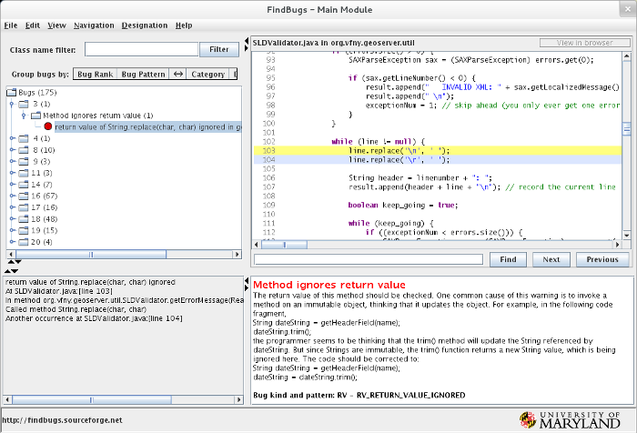
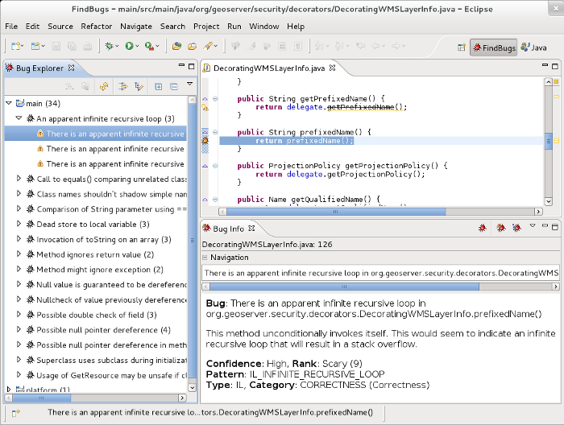

Findbugs Guide
==============

Findbugs is a static analysis tool for Java bytecode.
It operates by searching compiled Java code for common programming errors such as dereferencing null pointers.
In GeoServer we use Findbugs to augment the unit test suite.

We publish the analysis results as part of GeoServer's nightly builds.
You can view them online at http://gridlock.opengeo.org:8080/hudson/job/geoserver-trunk-findbugs/ .
Click the :guilabel:`FindBugs Warnings` link in the left sidebar to view the bug report for the latest build.

.. seealso:: More information on Findbugs is available at http://findbugs.sourceforge.net/ .

Running the Findbugs Report Locally with Maven
----------------------------------------------

Findbugs is integrated with :doc:`Maven </maven-guide/index>`, enabling automatic running of Findbugs checks locally.

Generating a report
^^^^^^^^^^^^^^^^^^^

The basic form for running a report is to use the ``findbugs:findbugs`` goal for Maven.
This requires bytecode to already be generated, so the full command is::

    $ mvn compile findbugs:findbugs

This command respects profiles for :doc:`/policies/community-modules`.
For example, you can generate a Findbugs report for the monitoring community module using::

    $ mvn compile findbugs:findbugs -Pmonitoring

Filters
^^^^^^^

Findbugs patterns vary in their reliability - sometimes a questionable construct is the right solution to a problem.
In order to avoid distractions from bug patterns that don't always indicate real problems, the GeoServer project maintains an bug filter that has been vetted by the project.
When using Maven, you can enable this filter with::

    $ mvn compile findbugs:findbugs -P findbugs \
        -Dfindbugs.excludeFilterFile=/path/to/src/maven/findbugs/findbugs-excludeNone.xml

.. note:: Please note that it's necessary to specify the **full path** to the exclude filter.

Browsing Bugs
^^^^^^^^^^^^^

The ``findbugs:findbugs`` goal generates a report of Findbugs violations in XML format, stored in :file:`target/findbugsXml.xml` in each project.
For manual inspection, Findbugs provides a graphical browser with descriptions of the potential problems found, and sorting/filtering/linking to sources for each detected violation.
To launch it, switch into a module first and use the ``findbugs:gui`` Maven goal::

    $ cd main/
    $ mvn findbugs:gui

.. warning::

    If you do not change directories Maven will traverse all modules and launch the findbugs browser for each in sequence!!
    If you do so, you can cancel with :kbd:`Control+C` in the terminal window where Maven is running.

    The Findbugs bug browser running against the GeoServer Main module

.. seealso:: More information on the Findbugs Maven plugin is available at http://mojo.codehaus.org/findbugs-maven-plugin/ .

Using the Findbugs Eclipse Plugin
---------------------------------

Findbugs integrates with :doc:`/eclipse-guide/index` as well.
This allows you to run bug reports and browse their results in the same tool you use to edit code.

For more information on installing and using the Findbugs plugin for Eclipse, see http://findbugs.sourceforge.net/manual/eclipse.html .

    The Findbugs Eclipse perspective browsing the GeoServer Main module

Fixing Bugs from Findbugs
-------------------------

We are always looking to eliminate bugs from GeoServer!
If you want to help out, one way is to remove one of the Findbugs rules from the exclusion filter, then re-run the analysis locally.
Once you fix all the bugs, submit a patch to GeoServer for review.
A core developer will review the changes, and we'll be able to make our "lax" Findbugs filter that much stricter.
