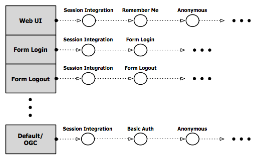

.. _security:

Security
========

This section provides an overview of the GeoServer security subsystem api.

.. _security_manager:

Security Manager
----------------

The ``GeoServerSecurityManager`` class is the main facade for the security
subsystem. It plays a similar role to that of the ``GeoServer`` and ``Catalog``
interfaces for the configuration and catalog subsystems respectively. Some of
the duties of this class include:

* Access to security services such as user group and role services,
  authentication providers, etc...
* Manage the lifecycle of security services
* CRUD operations for security service configurations
* Access to various singleton classes such as ``ResourceAccessManager``,
  ``KeyStoreProvider``, ``AuthenticationCache``,
  ``GeoServerSecurityFilterChain``, etc..
* Implement the spring security AuthentictionProviderManager interface
  providing the list of active :ref:`auth_provider` instances.

Security Services
-----------------

``GeoServerSecurityService`` is the base interface for all security services, including:

* User/group services
* Role services
* Authentication filters
* Authentication providers
* Master password providers

The interface provides some common methods for all security services,
including::

    void initializeFromConfig(SecurityNamedServiceConfig config);

Every type of security service corresponds to a configuration object for that
service. The configuration object is a simple java bean that contains the
service configuration. These objects are persisted via xstream in the GeoServer
data directory. See :ref:`service_config` for more details.

Security services are created via methods provided by the securty manager. For
instance to create a new xml user group service::

   GeoServerSecurityManager mgr = ...;
   XMLSecurityServiceConfig config = new XMLSecurityServiceConfig();
   config.setName("foo");
   config.setFilename("users.xml");
   mgr.saveUserGroupService(config);

An instance of a security service is obtained by looking it up by the name
matching its configuration object::

   GeoServerUserGroupService ugService = mgr.loadUserGroupService("foo");

The config object for the service can be looked up in a similar way::

   SecurityUserGroupServiceConfig config = mgr.loadUserGroupServiceConfig("foo");

And modified accordingly::

   config.setPasswordEncoderName("digest");
   mgr.saveUserGroupServiceConfig(config);

.. _usergroup_service:

UserGroup Service/Store
^^^^^^^^^^^^^^^^^^^^^^^

The ``GeoServerUserGroupService`` and ``GeoServerUserGroupStore`` interfaces provides a database
for users and groups. A GeoServerUserGroupService may be read only in that it acts solely
as a source without the ability to create new or edit existing users and groups.

The interfaces provide access to users and groups::

   GeoServerUserGroupService ugService = mgr.loadUserGroupService("default");

   ugService.getUsers();
   GeoServerUser user = ugService.getUserByUsername("admin");

   ugService.getGroups();
   GeoServerUserGroup group = ugService.getGroupByGroupname("users");

The service interface advertises whether it is read only::

   if (ugService.canCreateStore()) {
     GeoServerUserGroupStore store = ugService.createStore();
     store.addUser(new GeoServerUser("bob"));
     store.store();
   }

The ``GeoServerUserGroupService`` implements the spring security ``UserDetailsService``
interface in order to integrate with existing facilities such as remember me
services which require a user details service for loading user information at
runtime.

.. _role_service:

Role Service/Store
^^^^^^^^^^^^^^^^^^

``GeoServerRoleService`` and ``GeoServerRoleStore`` provide a database for roles and role
associations for users and groups. Like user group services a ``GeoServerRoleService``
may be read only::

  GeoServerRoleService roleService = mgr.loadRoleService("default");
  roleService.getRoles();
  roleService.getRolesForUser("admin");
  roleService.getRolesForGroup("users");

  if (roleService.canCreateStore()) {
    GeoServerRoleStore store = roleService.createStore();
    GeoServerRole role = new GeoServerRole("ROLE_FOO");

    store.addRole(role);
    store.associateRoleToGroup(role, "users");
    store.store();
  }

.. _auth_provider:

Authentication Provider
^^^^^^^^^^^^^^^^^^^^^^^

``GeoServerAuthenticationProvider`` is an extension of the spring security ``AuthenticationProvider``
interface and is responsible for performing authentication of user credentials.

The class extends the ``AuthenticationProvider`` contract and provides methods
for authentication that provide access to the current request to make it
easier for providers that require request information to perform authentication::

    @Override
    public final Authentication authenticate(Authentication authentication)
        throws AuthenticationException {
        return authenticate(authentication, request());
    }

    /**
     * Same function as {@link #authenticate(Authentication)} but is provided with
     * the current request object.
     */
    public abstract Authentication authenticate(Authentication authentication,
        HttpServletRequest request) throws AuthenticationException;

The list of active authentication providers is maintained by the GeoServerSecurityManager
which extends the spring security ``AuthenticationProviderManager`` interface.

.. _auth_filter:

Authentication Filter
^^^^^^^^^^^^^^^^^^^^^

``GeoServerSecurityFilter`` is the base class for servlet filters that play a part
in the authentication process. Such filters can play two roles.
The first is to gather authentication credentials to passed off to a provider for
actual authentication. An example would be a filter for doing HTTP basic auth.

The second role is to perform "pre-authentication" in which involves doing
authentication by recognizing authentication that has already taken place "outside"
of GeoServer. An example would be when using a security proxy such as Siteminder or
a "J2ee" authentication which involves delegating to the servlet container for
doing authentication.

Security filters are maintained in the :ref:`filter chain <auth_filter_chain>` which maintains
the mapping of the filters to be applied to a specific type of request. For example
the filters applied to a web ui request are different than those applied to an OGC
or REST request.

Password Policy
^^^^^^^^^^^^^^^

``PasswordPolicy`` is the interface for validating user passwords,applying constraints such
as password length, character mix, etc...

MasterPasswordProvider
^^^^^^^^^^^^^^^^^^^^^^

Security service that provides a method for obtaining the GeoServer master password.
The master password serves two purposes.

#. Is the password for the GeoServer "root" account
#. Protects the GeoServer keystore that is used to store encryption keys

.. _service_config:

Security Plugin Provider
------------------------

The ``GeoServerSecurityProvider`` is the actual extension point that allows for the
plugging in of instances of the services discussed above. The single interface covers
all the security services.

For each type of security service the provider has two methods to implement. For example
with a user group service::

   public Class<? extends GeoServerUserGroupService> getUserGroupServiceClass() {
       return null;
   }

   public GeoServerUserGroupService createUserGroupService(SecurityNamedServiceConfig config)
       throws IOException {
       return null;
   }

The first method reports on the specific class of user group service it implements.
This is how a specific security provider is chosen from a specific configuration object.
``SecurityNamedServiceConfig.getClassName()`` is used to locate the provider.

The second method creates an instance of the security service from a specified
configuration object. Providers are registered via spring, for example::

  <bean id="ldapSecurityProvider" class="org.geoserver.security.ldap.LDAPSecurityProvider">
    <constructor-arg ref="geoServerSecurityManager"/>
  </bean>

Security Configuration
----------------------

Service Configuration
^^^^^^^^^^^^^^^^^^^^^

As mentioned above each type of security service corresponds to a configuration class.
The ``SecurityNamedServiceConfig`` is the base class for all such configuration classes
and maintains three properties that all classes inherit. The first is name for the
configuration::

    /**
     * The name of the service.
     */
    String getName();

This name is used to reference both the configuration directly, or to the corresponding
service implementation. For example consider a user group service named "foo"::

   GeoServerUserGroupService service = mgr.loadUserGroupService("foo");
   SecurityUserGroupServiceConfig config = mgr.loadUserGroupServiceConfig("foo");

The second property is the fully qualified class name of the service implementation
that the config object corresponds to::

    /**
     * Name of class for implementation of the service.
     */
    String getClassName();

For instance consider creating an XML user group service::

   XMLUserGroupServiceConfig config = new XMLUserGroupServiceConfig();
   config.setClassName(XMLUserGroupService.class.getName());

The third property is an internal identifier, similar to how catalog and configuration
objects have an id::

    /**
     * Internal id of the config object.
     * 

     * This method should be used by client code.
     * 

     */
    String getId();

The main purpose of this id is to detect if the security service
config has been persisted or not.

Service configuration objects are persisted in the geoserver data directory under
the ``security`` directory. Under ``security`` are sub directories for each service
type::

    security/
      auth/
      filter/
      masterpw/
      pwpolicy/
      role/
      usergroup/

Under each directory are additional subdirectories for each named service of that type.
For example, out of the box GeoServer security is configured with the following:

* Single user/group service named "default"
* Single role service named "default"
* Single authentication provider named "default"

This would correspond to the following directory structure::

    security/
      auth/
        default/
      role/
        default/
      usergroup/
        default/

Let's say an additional authentication provider named "ldap" was added. The tree would look
like::

    security/
      auth/
        default/
        ldap/
      .
      .
      .

Inside each named configuration directory is a file named ``config.xml`` that contains the
direct xstream serialization of the configuration object. For example the default user
group service configuration is persisted in the file ``security/usergroup/default/config.xml``
and looks like::

    <userGroupService>
      <id>7aacccc3:13660a38ccb:-7ffd</id>
      <name>default</name>
      <className>org.geoserver.security.xml.XMLUserGroupService</className>
      <fileName>users.xml</fileName>
      <checkInterval>10000</checkInterval>
      <validating>true</validating>
      <passwordEncoderName>pbePasswordEncoder</passwordEncoderName>
      <passwordPolicyName>default</passwordPolicyName>
    </userGroupService>

Global Configuration
^^^^^^^^^^^^^^^^^^^^

Aside from configuration objects for the various security services is the ``SecurityManagerConfig``
class which provides the same function but for global security settings. It contains a number of
configuration properties such as the active role service, the list of authentication providers
and filters making up the active :ref:`auth_filter_chain`, and configuration for remember me
services.

Interacting with the global configuration is much like interacting with a security service
configuration::

    SecurityManagerConfig config = mgr.getSecurityConfig();
    config.setEncryptingUrlParams(false);
    config.getAuthProviderNames().add("ldap");
    config.saveSecurityConfig(config);

.. _auth_filter_chain:

Authentication Chain
--------------------

The ``GeoServerSecurityFilterChain`` class is a data structure that maintains mappings
from request type to a list of named :ref:`security filters <auth_filter>`. This class is
persisted with the rest of the global security configuration as available as a property
of the ``SecurityManagerConfig`` class::

   GeoServerSecurityFilterChain filterChain = mgr.getSecurityConfig().getFilterChain();

The filterChain is essentially a map whose keys are strings corresponding to ant request
patterns. The values are lists of :ref:`auth_filter` names.

``GeoServerSecurityFilterChainProxy`` is an extension of the spring security ``FilterChainProxy``
and is responsible for creating the actual filter chain from the
``GeoServerSecurityFilterChain`` configuration object.

