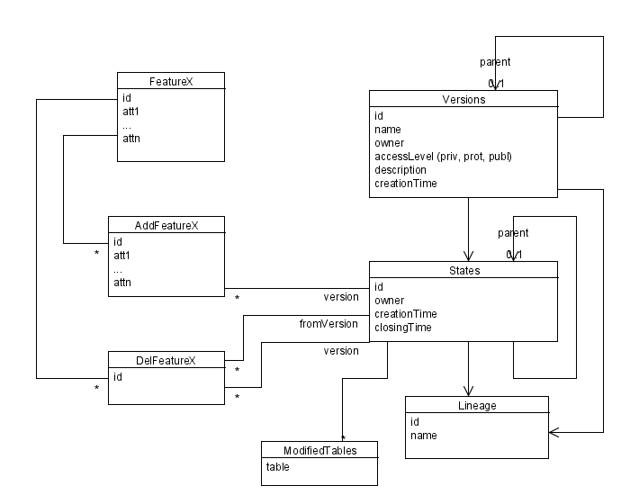
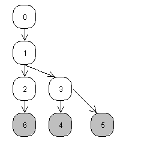

.. _versioning_implementations_arcsde:

Versioning WFS - ArcSDE
=======================

ArcSDE is a forward change feature version system, capable of handling multiple branches, and based on a set of database tables.
The standard parlance in ArcSDE is a little different than the one used in SVN:

* version: branch/trunch/tag, that is, the equivalent of an svn copy. Trunk is called the "default" version;
* state: revision
* post a version B to version A: perform a merge of changes occurred in B onto A, where B was branched off earlier. This usually also closes version B.

In ArcSDE states are maintained as sets of adds and deletes to the initial state of data, and each add or update is a full copy, not a diff.

The following diagram provides a picture of entities involved into versioning.

 
Each "version" is identified by a name and owned by some user. The access level may be private (only the owner can read and write), protected (only the owner can write) or public.
Each version has a parent, and it can be posted back to that parent once done (I haven't seen examples of posting to another version, don't know if it's possible).

Each version refers a state, which is in turn a set of modifications on the feature set, and has a parent state, thus building a tree of states. Each state hold modifications for a number of features, and the list of feature tables modified in a certain state is held in the ModifiedTables associated records.

Both version and state do refer a lineage, which the documentation does not comment much about. Anyways, since an efficient way to look up the ancestors of a given state or version is needed, lineage probably stores an ancestors path or a similar way to encode a hierarchy. For example, version 6 lineage may be something like 0.1.2.6. For a discussion of ways to encode a hierarchy in a sql database refer to the DBAzine article "Nested sets and materialized paths".

 
For each feature table "FeatureX" in the database, we do have a AddFeatureX table whose structure is the same as the feature table table, along with a reference to the state the record is associated to, and a DelFeatureX, which holds just a reference to the deleted object, along with the last state where the object was alive, and the state where the object has been deleted.
For each added feature, a record appears in the AddFeatureX table, for each deleted feature a record appears in the DelFeatureX table, and for each updated feature a record appears in both tables.

The record in the AddFeatureX tables always represents the new full state of a feature, so no delta computation is performed: this allows a faster retrieval of current state at the expense of extra space consumption. On the bright side, the features at a certain state can be retrieved with a single SQL query. Assuming the state ancestry is maintained with the materialized path method, the query would look like::

	select id, att1, ... attn
	from FeatureX
	where id not in (
	   select id
	   from DelFeatureX, States
	   where DelFeatureX.stateId = States.id
	   and States.lineage in ('0', '0.1', '0.1.2', '0.1.2.6')
	)
	union
	select id, att1, ...., attn
	from AddFeatureX, States
	where AddFeatureX.state_id =
	(
	   select max(state_id)
	   from AddFeatureX af2
	   where af2.id = AddFeatureX.id
	)
	and AddFeatureX.state_id = States.id
	and States.lineage in ('0', '0.1', '0.1.2', '0.1.2.6')
	and AddFeatureX.id not in (
	   select id
	   from DelFeatureX, States
	   where DelFeatureX.stateId = States.id
	   and States.lineage in ('0', '0.1', '0.1.2', '0.1.2.6')
	   and DelFeatureX.stateId <> AddFeatureX.stateId
	)

that is, all original features that have not been updated of deleted during the states history, union the last record of all features that have been added or updated, and not been deleted during the states history.

Here we suppose we know the lineage of the state and that we won't incur in sql length problems... this is a little naïve of course, an alternative would be to keep full ancetry information in a separate table that can be quied, allowing from something like "state_id in (select parent from state_hierarchy where child = current_state_id))". Of course such a table is bound to become very big.
