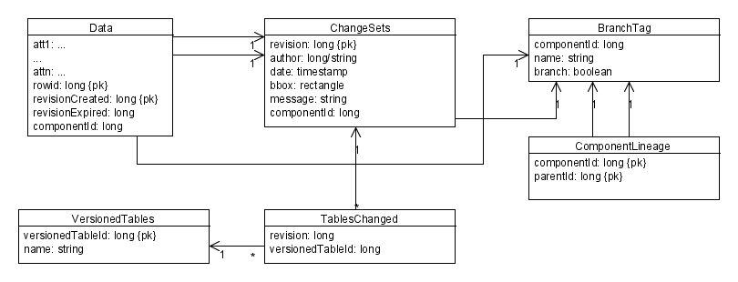

.. _versioning_implementation_phase2:

Phase two implementation proposal
=================================

Branching support could be added to the previous design by using an approach similar to Oracle and ArcSDE, that is, tagging each "path" in the versioning tree with a number, and creating a new one each time a tag or a branch is created. This number is called componentId here.

 
The **BranchTag**  table holds both tag and branch names (branch is used to discriminate branches and tags) and **ComponentLineage** holds a set of all fathers of a specific path component so that the whole path that let to a specific branch can be rebuilt.
 
Of course all the above queries can be modified to take into account branches adding extra subqueries, and thus adding a performance overhead. On the bright side, this schema allows for cheap branching (since it does not have to create extra row copies).

Taking into consideration branches in the API
---------------------------------------------

The DataStore API provides reading hooks for versioning using Query.getVersion() which is a string and can be freely intepreted. So, if we wanted to encode version 10 of branch "gizmo" we would use "gizmo:10".

Writing does not use Query at all. In the no branch case, all the relevant informations such as user and commit message have been encoded as Transaction properties. Version is no need in this picture, because we cannot write again a specific revision, but only against "latest".
When branch comes into the picture, we see that branch information need to be encoded as a transaction property, leaving to a bit of inconsistency, because in the reading case it makes more sense to have it in the Query (it matches the WFS level) whilst in the writing case we need to encode it in the transaction.
Moreover, phase one did not leave any place to store the branch information, unless we devise some fancy way to provide that one along with the handle (not really good looking). This leaves us out to encode branch information in a new attribute, something we tried to avoid with commit message included as the handle.
