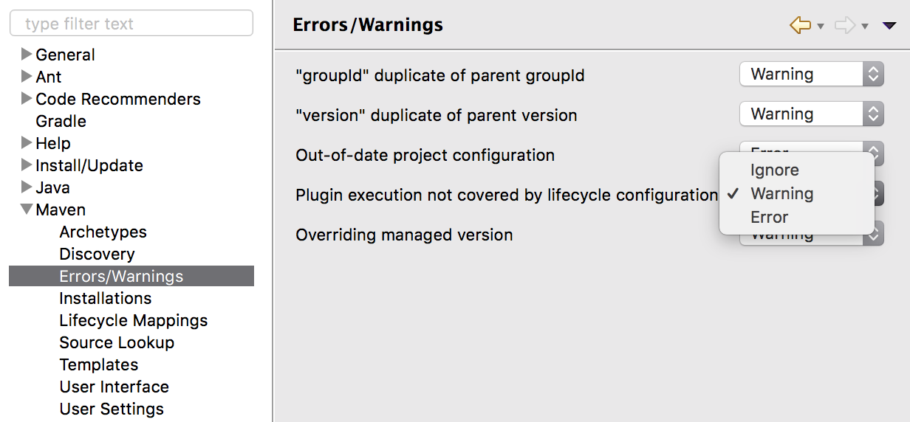

.. _quickstart_eclipse_m2:

Eclipse M2 Quickstart
=====================

This guide is designed to get developers up and running as quick as possible. For a more comprehensive guide see the the :ref:`eclipse_guide`.
  
.. include:: checkout.txt

Eclipse Maven builder
---------------------

The maven build supplied with eclipse works with the :file:`pom.xml` files, however it does recognize some of our custom build steps:

#. Go to Preferences and navigate to :menuselection:`Maven --> Errors/Warning`
#. Change the :guilabel:`Plugin executino not covered by lifecycle configuration` to ``Warning``.

java-cc-maven-plugin
--------------------

THe Eclipse M2 builder does recognize this plugin, build once on the command line first:

#. Navigate to `:file:`src/wcs1_1``.
#. Compile, to force the code to be generated::
     
     mvn compile

   ::
     
     [INFO] --- javacc-maven-plugin:2.3:jjtree (jjtree) @ gs-wcs1_1 ---
     Java Compiler Compiler Version 4.0 (Tree Builder)
     (type "jjtree" with no arguments for help)
     "src/wcs1_1/target/jjtree/org/geoserver/wcs/kvp/rangesubset/ASTFieldId.java" does not exist.  Will create one.
     ...
     Annotated grammar generated successfully in src/wcs1_1/target/jjtree/org/geoserver/wcs/kvp/rangesubset/rangeset.jj
     [INFO] 
     [INFO] --- javacc-maven-plugin:2.3:javacc (javacc) @ gs-wcs1_1 ---
     Java Compiler Compiler Version 4.0 (Parser Generator)
     (type "javacc" with no arguments for help)
     Reading from file src/wcs1_1/target/jjtree/org/geoserver/wcs/kvp/rangesubset/rangeset.jj . . .
     File "TokenMgrError.java" does not exist.  Will create one.
     File "ParseException.java" does not exist.  Will create one.
     ...
     Parser generated successfully.
     [INFO] 

     [INFO] --- fmt-maven-plugin:2.4.0:format (default) @ gs-wcs1_1 ---
     [debug] Using AOSP style
     [INFO] Processed 47 files (0 reformatted).
     [INFO] 

Import modules into Eclipse
---------------------------

#. Use :menuselection:`File --> Import` to open the :guilabel:`Import` wizard.
   Select :menuselection:`Maven --> Existing Maven Projects` import wizard, and :guilabel:`Next`.

#. Define the :guilabel:`Root Directory` by browsing to the GeoServer :file:`src` folder.

#. Open :guilabel:`Advanced` options:
   
   * Profiles: :kbd:`release`
   * Name template: :kbd:`[groupid].artifactid]`

   .. figure:: img/m2_import.png
      :scale: 50%
      
#. Press :guilabel:`Finish` to start import.
   
   During import import use ``Resolve Later``, exclude lifecyce mapping.

   .. figure:: img/m2_plugin_connectors.png
      :scale: 50%
      
Run GeoServer from Eclipse
--------------------------

#. From the ``Package Explorer`` select the ``web-app`` module
#. Navigate to the ``org.geoserver.web`` package
#. Right-click the ``Start`` class and navigate to ``Run as``, ``Java Application``

   .. figure:: img/eclipse_run1.jpg
      :width: 80%

#. After running the first time you can return to the ``Run Configurations`` dialog
   to fine tune your launch environment (including setting a GEOSERVER_DATA_DIR).

.. note::
   
   If you already have a server running on localhost:8080 see the :ref:`eclipse_guide` for instructions on changing to a different port.

Access GeoServer front page
---------------------------

* After a few seconds, GeoServer should be accessible at: `<http://localhost:8080/geoserver>`_
* The default ``admin`` password is ``geoserver``.