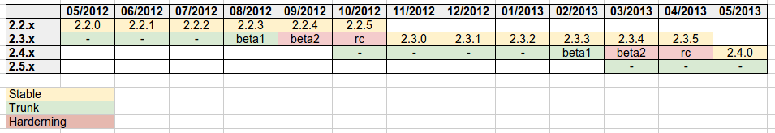

.. _time_boxed_releases:

Release Schedule
================

Starting with version 2.2 GeoServer releases follow a time boxed model in which releases occur 
at regular predictable frequencies rather than at ad-hoc dates. In a time boxed the software is 
released at predictable frequencies with whatever fixes, improvements, and feature are available
at the time of release. This differs from the previous feature based model in which releases occur 
when a certain number of key features have accumulated.

To compensate for the inherent unpredictability of the release contents the model includes strict 
rules about what type of development is appropriate during specific periods of a branches life 
cycle. These rules include a suitably long hardening period for the unstable branch to mature and
eventually become stable.

Release branches
----------------

At any given time GeoServer is undergoing two to three main branches of development.

#. The *stable* branch in which only bug fixing, and smaller scale feature development occurs on
#. The *unstable* (master) branch in which more experimental and larger scale feature development occurs
#. The *maintenance* branch which was the previously stable branch that is nearing end of life and sees
   only the most stable development, typically mostly bug fixes.

Release cycle
-------------

On the stable branches release follow a monthly cycle in a which a new minor release occurs once a 
month. On the unstable branch releases follow a 6 month cycle in which a new major release occurs
once every 6 months. The following diagram illustrates the cycle:



Things to note:
 
* monthly releases on the stable branch
* a four month open development period followed by two months hardening period on the unstable branch
* beta releases are supposed to be released out of the unstable series on a monthly basis
  across the switch between open development and hardening, followed by the first release candidate
* release candidates are pushed out every two weeks until we reach a stable code base, which will be released
  as the new major stable release
* the first release candidate marks the branch off of a new trunk, on which open development starts again

The time of the first release candidate marks the origin of a new stable branch in which the unstable branch 
becomes the stable branch, and the stable branches becomes a maintenance branch.

Every month, on the same day, a new release is issued from the stable branch using whatever revision of
GeoServer/Geotools passed the last CITE tests. The release is meant to improve upon the previous release in 
both functionality and stability, so unless the project steering committee determines reasons to block the release 
it will happen regardless of what bug reports are in Jira. Pending resourcing, they can be fixed in the next release 
that comes out one month later.

At any given point in time there are two branches under the development, the stable branch and the master/unstable
branch. Once every six months when the creation of a new stable branch occurs a third active maintenance branch 
is created. This branch is kept up to date with the stable stable for a period of one-month after which the final
release on that branch is created. That said there is nothing against a developer continuing to maintain the branch
or creating release from it, it is just not expected.

Development phases
------------------

The type of development that can occur on a branch is dictated by where the branch is in terms of its life cycle.

Stable branch
`````````````

The type of acceptable development on the stable branch does not change much over its lifetime. It is meant 
for bug fixes and new features that do not affect the GeoServer API or significantly affect the stability.
A PSC vote (with eventual proposal) can be called in case a significant new feature or change needs 
to be back ported to the stable branch overriding the above rules.

If, for any reason, a release is delayed the next release will be rescheduled 30 days after the last release
(that is, delaying the whole train of remaining releases).

Unstable branch
```````````````

The type of development on the master/unstable branch changes over its lifetime from four months of open
development to two months of stable/hardening development.

Open development phase
``````````````````````

The open development phase starts when the new stable release is branched off, and ends when hardening
starts, four months after the new stable release is made.

During this phase developers are free to commit stability undermining changes (even significant ones). 
Those changes still need to be voted as GSIP anyways to ensure, as usual, resourcing checks, API consistency 
and community review.

After three months from the release of the stable series a first beta will be released, 
one month after that the second beta will be released and the branch will switch into hardening mode.

Hardening phase
```````````````

The hardening phase starts when the second beta is released and continues through all release candidate (RC)
releases. The first RC is released one month after the second beta, and then bi-weekly releases
will be issued until no major issues will be reported by the user base, at which point the last RC
will be turned into the new stable release.

During hardening only bug-fixes and new non core plugins can be developed

Commit rules
------------

The following are guidelines as to what types of commits can occur in any particular phase. While the PSC 
reserves the right to vote and override the committing guidelines the following rules reflect the 
current policies.

The **hardening phase**, and by extension the stable and open phases, can receive any of the following 
types of commits:

* bug fixes
* documentation improvements
* new plugins contributed as community or extension modules (with a cautionary note that during 
  hardening the attention should be concentrated as much as possible on getting the new release stable)

In addition the **stable phase** can receive any of the following types of commits:

* new minor core functionality (e.g. new output format)
* new API that we can commit to for a long period of time (provided it's not a change to existing API unless the PSC votes otherwise). 
  GeoServer is not a library, so defining API can be hard, but any class that can be used by pluggable 
  extension points should be changed with care, especially so in a stable series

In addition to the above the **stable phase** can receive the following types of changes provided there are no 
reservations or concerns about them from the PSC. Such changes may be subject to voting:

* promotion of extensions to core
* core changes that are unlikely to affect the stability of the upcoming release 
  (if the PSC is ok better land them right after a release to get as a large window for testing as possible)
* back port of larger changes that have proven to be working well on trunk for an extended period of time

During the **open development phase** all types of commits are fair game but of course large changes are still subject to proposals and reviews.

During a Release
----------------

During a release (on any branch) your cooperation is needed:

* We hold off merging fixes several days prior to release, email if you are approaching this deadline and need help
* To help identify any blockers (an email will be sent out prior to release)
* Help test pre-release artifacts prior to their being published for download
* Keep issue tracker status up to date so the release notes are correct
* Please treat our release volunteers with respect, we know deadlines can be stressful