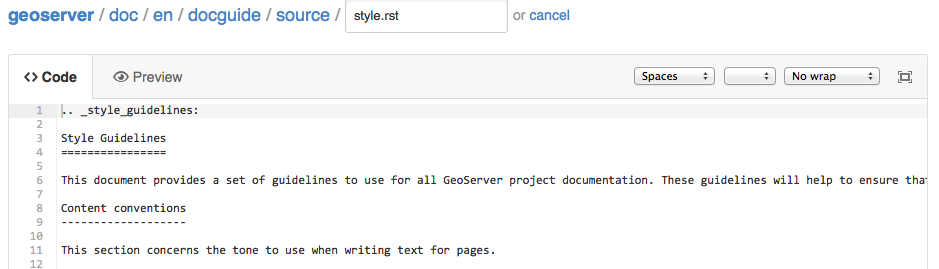

# Quickfix

For really quick fixes:

1.  Browse the documentation source code directly on the GitHub website:

    - <https://github.com/geoserver/geoserver/tree/main/doc/en>

2.  Navigate to the file you wish to change and click the **edit** icon

    
    *GitHub Preview of style.rst page*

3.  Use the editor to modify the file

    
    *GitHub Editor for style.rst page*

4.  Scroll to the bottom of the page, provide a commit comment and submit.

5.  GitHub will:

    - Create a fork and submit a pull request on your behalf; or
    - Immediately make the change for those with commit access

!!! warning

    This technique is great for fixing small typos - but has the danger of introducing formatting mistakes preventing the documentation from being generated.
    
    To make extensive changes see [Workflow](workflow.md).
