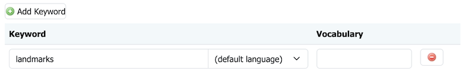

# Markdown Syntax

These markdown conventions are carefully constructed for consistent representation of user interface elements, files, data and field input.

## Basic markup

The simplest Markdown elements are:

| **Format** | **Syntax**        | **Output**  |
|------------|-------------------|-------------|
| Italics    | `*italics*`       | *italics*   |
| Bold       | `**bold**`        | **bold**    |
| Monospace  | `` `monospace` `` | `monospace` |


Application is carefully constructed for consistent representation of user interface elements, files, data and field input.


| Markdown                 | Directive                   |
|--------------------------|-----------------------------|
| `**strong**`             | gui label, menu selection   |
| `` `monospace` ``        | text input, item selection  |
| `*emphasis*`             | figure (caption)            |
| `***strong-emphasis***`  | application, command        |
| **`monospace-strong`**   | file                        |

!!! note

    The above conventions are important for consistency and are required by the translation process.
    As an example we do not wish to translate a search terms, so these are represented as monospace text input.


### User interface components

Use `**strong**` to name user interface components for interaction (press for buttons, click for link).

=== "Preview"

    Navigate to **Data --> Layers** page,
    and press **Add a new layer** to create a new layer.

=== "Markdown"

    ```markdown
    Navigate to **Data --> Layers** page,
    and press **Add a new layer** to create a new layer.
    ```

### User input

Use `` `item` `` for user supplied input, or item in a list or tree::

=== "Markdown"

    ```markdown
    Select `Basemap` layer.
    ```

=== "Preview"

    Select `Basemap` layer.


Use `` `text` `` for user supplied text input:

=== "Markdown"

    ```markdown
    Use the *Search* field enter `sf`.
    ```

=== "Preview"

    Use the *Search* field enter `sf`.


Use `++key++` for keyboard keys.

=== "Markdown"

    ```markdown
    Press ++control+f++ to find on page.
    ```

=== "Preview"

    Press ++control+f++ to find on page.
    
Use definition list to document data entry. The field names use strong as they name a user interface element. Field values to input uses monspace as user input to type in.

=== "Markdown"

    ```markdown
    1.  To login as the GeoServer administrator using the default password:
    
        **User**
        :   `admin`
    
        **Password**
        :   `geoserver`
    
        **Remeber me**
        :   Unchecked
    
        Press **Login**.
    ```

=== "Preview"

    1.  To login as the GeoServer administrator using the default password:
    
        **User**
        :   `admin`
    
        **Password**
        :   `geoserver`
    
        **Remeber me**
        :   Unchecked
    
        Press **Login**.

### Applications, commands and tools

Use **bold** and *italics* for proper names of applications, commands, tools, and products.

=== "Markdown"

    ```markdown
    Launch ***pgAdmin*** and connect to the databsae `tutorial`.
    ```

=== "Preview"

    Launch ***pgAdmin*** and connect to the databsae `tutorial`.

### Files

Use **bold** **monospace** for files and folders:

=== "Markdown"

    ```markdown
    See configuration file
    **`security/rest.properties`**
    for access control.
    ```

=== "Preview"
    
     See configuration file **`security/rest.properties`** for access control.


### Links and references

Specific kinds of links:

Reference to other section of the document (some care is required to reference a specific heading):

- Relative paths are used
- Use of `#anchor` to locate anchor within a page, generated from heading text
- References to `index.md` are converted to `index.md`.
  
  !!! note
  
      Use of `directory/index.md`, rather than `directory`,
      is required for documentation to export to work
      on local file system.

=== "Markdown"

    ```
    Administrators have option to manage
    [default langauge](../../user/configuration/internationalization/index.md#default-language).
    ```

=== "Preview"

    Administrators have option to manage
    [default langauge](../../user/configuration/internationalization/index.md#default-language).

### Icons, Images and Figures

Material for markdown has extensive icon support, for most user interface elements we can directly make use of the appropriate icon in Markdown:

- Use Material for mkdocs [Icons, Emojis](https://squidfunk.github.io/mkdocs-material/reference/icons-emojis/) page to serach included icons.
- You can also refrence emojii by name
- Add custom icons to **`overrides/.icons/silk`** .

=== "Markdown"

    ```markdown
    1.  Press the **:material-plus: Add Layer** button at the top of the page.
    ```

=== "Preview "

    1.  Press the **:material-plus: Add Layer** button at the top of the page.

Figures are handled by convention, adding emphasized text after each image, and trust CSS rules to provide a consistent presentation:

=== "Markdown"

    ```markdown
      
    *Keywords with **Add Layer**, and individual **Remove Layer** buttons.**
    ```
    
    !!! note
        
        The first line has two trailing `  ` space characters, to affect a newline
        to position the caption under the figure.

=== "Preview"
   
      
    *Keywords with **Add Layer**, and individual **Remove Layer** buttons.**

Raw images are not used very often:

=== "Markdown"

    ```markdown
    
    ```

=== "Preview"

    

### Lists

Bulleted lists:

=== "Markdown"

    ```markdown
    - An item
    - Another item
    - Yet another item
    ```

=== "Preview"

    - An item
    - Another item
    - Yet another item

Numbered lists:

=== "Markdown"

    1. First item
    2. Second item
    3. Third item

=== "Preview"

    ```markdown
    1. First item
    2. Second item
    3. Third item
    ```

Nested bullets and outdenting

=== "Markdown"
    
    ```markdown
    - Top level
        - Nested level
    ```

=== "Preview"

    - Top level
        - Nested level

To return to top level, use 0 indentation again. For example:

=== "Markdown"

    ```markdown
    - Top level
        - Nested
    - Back to top level
    ```

=== "Preview"

    - Top level
        - Nested
    - Back to top level

### Tables

Documentation uses pipe-tables only "List-packed" tables
as they are supported by both ***mkdocs*** and ***pandoc***.

Tables are constructed with Leading / tailing `|`, and headers seperated by `---`.

=== "Markdown"
    
    ```markdown
    | Shapes | Description |
    |--------|-------------|
    | Square | Four sides of equal length, 90 degree angles |
    | Rectangle | Four sides, 90 degree angles |
    ```
    
=== "Preview"

    | Shapes | Description |
    |--------|-------------|
    | Square | Four sides of equal length, 90 degree angles |
    | Rectangle | Four sides, 90 degree angles |

Column alignment using `:`

=== "Markdown"
    
    ```Markdown
    | First Header | Second Header | Third Header |
    |:-------------|:-------------:|-------------:|
    | Left         |    Center     |        Right |
    | Left         |    Center     |        Right |
    ```
=== "Preview"

    | First Header | Second Header | Third Header |
    |:-------------|:-------------:|-------------:|
    | Left         |    Center     |        Right |
    | Left         |    Center     |        Right |

### Notes and warnings (admonitions)

GeoServer documentation uses the `admonition` extension in Markdown for notes and warnings.

Important user guidance:

- `!!! note`, `!!! warning`, etc. is valid at top level, and in list nesting when indented to the same depth as surrounding list content.
- For top-level admonitions, use 0-3 spaces before `!!!` and indent block content by 4 spaces.
- For nested admonitions in lists, align `!!!` with the list item block content (e.g. 4 / 8 / 12 spaces depending on nesting).

  This means `!!!` can be at 12 spaces and still render when it is nested in a list item at that depth.

=== "Markdown"

    ```Markdown
    !!! note
        Do not wait for a release to fall out of support before upgrading.
    ```

=== "Preview"

    !!! note
        Do not wait for a release to fall out of support before upgrading.


If you need a note-like callout inside a list item, use inline emphasis instead:

=== "Markdown"

    ```Markdown
    - Remember:
        - **Note:** Do not rely on this in production.
    ```
    
=== "Preview"

    - Remember:
        - **Note:** Do not rely on this in production.

<a name="anchor"/>

### Headings

Use `#`, `##`, `###`, etc... to define headings within a page:

- Headings are used to establish "Page contents" along the right hand side allowing easy navigation between headings

=== "Markdown"

    ```md
    # Main section
    ## Subsection
    ### Sub-subsection
    ```

### Page labels and anchors

In Markdown, you can use heading-based anchors or explicit named anchors (with HTML) if needed.
  
=== "Markdown"
    
    ```markdown
    <a name="anchor"/>
    
    ### Linking
    ```

### Linking

When linking do not use "here" as link text, instead use the title of the heading
being navigated to.

- Bad: [here](#linking)
- Good: [Linking](#linking)


=== "Markdown"
    
    ```Markdown
    Links to content within a page: [anchors](#anchor), and [linking](#linking),
    or link to content on another page: [Be concist](style#be-concise).
    ```

=== "Preview"

    Links to content within a page: [anchors](#anchor), and [linking](#linking),
    or link to content on another page: [Be concist](style#be-concise).


External link:

=== "Markdown"

    ```md
    [Text of the link](http://example.com)
    ```

=== "Preview"

    [Text of the link](http://example.com)

### External files

=== "Markdown"

    ```md
    [An external file](img/logo-icon.svg)
    ```

=== "Preview"

    [An external file](img/logo-icon.svg)
    
To force a download link:

=== "Markdown"

    ```md
    [GeoServer Logo](img/logo-icon.svg){:download="geoserver.svg"}
    ```

=== "Preview"

    [GeoServer Logo](img/logo-icon.svg){:download="geoserver.svg"}

### Code blocks and inline code

Inline code is presented as monspace using `` ` ``.
=== "Markdown"
    
    ```Markdown
    Inline code: `myCommand`.
    ```
    
=== "Preview"

    Inline code: `myCommand`.


Fenced block are used to represent code examples:
- Syntax highlighting is available for `bash`, `Markdown`, `xml`, `Java`, etc...

=== "Markdown"
    
    
    `````md
    ```bash
    command args
    ```
    `````

=== "Preview"

    ```bash
    command args
    ```


### Include code snippets

Use snippet `--8<--` include a code snippet into a code block:

* Syntax highlighting is available

=== "Markdown"
    
    ```` Markdown
    ```xml
    --8<-- "build/qa/pmd-ruleset.xml:23:25"
    ```
    ````

=== "Preview"

    ```xml
    --8<-- "build/qa/pmd-ruleset.xml:23:25"
    ```

### Show Source

All pages have a "Show Source" link in the right-hand table of contents.
