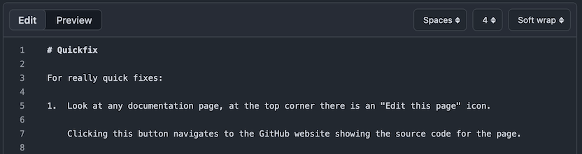
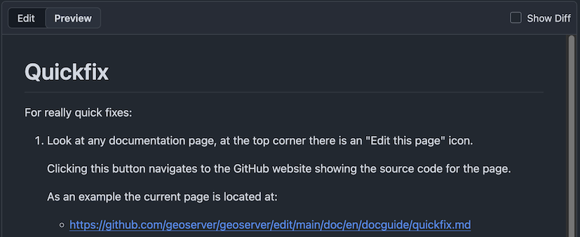
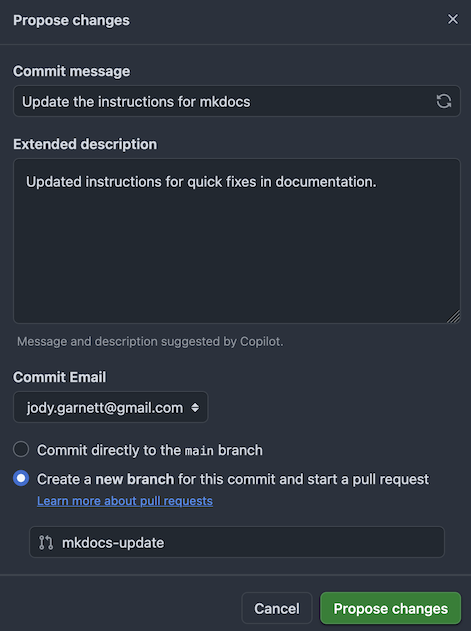

# Quickfix

For really quick fixes:

1.  Look at any documentation page, at the top corner there is an "Edit this page" icon.
    
    Clicking this button navigates to the GitHub website showing the source code for the page.
    
    As an example the current page is located at:
    
    - <https://github.com/geoserver/geoserver/edit/main/doc/en/docguide/quickfix.md>
    
2.  The GitHub website will open to an **Edit** tab allowing you to update the contents:

      
    *GitHub Edit for quickfix.md page*
    
    The editor also has a **Preview** tab:

      
    *GitHub Preview for quickfix.md page*
    
    Note: you must first be signed into GitHub, and GitHub will help you create a fork from which to submit the quick fix, (we recommend that you keep the fork for next time.)

4.  Scroll to the bottom of the page, provide a commit comment and submit.
    
      
    *GitHub Commit Message**
    
    GitHub will:

    - Create a fork and submit a pull request on your behalf; or
    - Immediately make the change for those with commit access

!!! warning
    This technique is great for fixing small typos - but has the danger of introducing formatting mistakes preventing the documentation from being generated.
    
    To make extensive changes see [Workflow](workflow.md).
