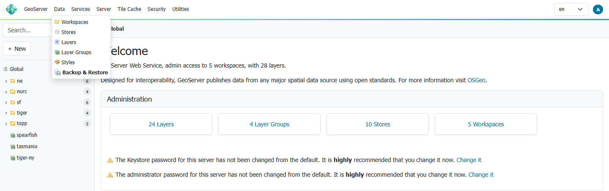
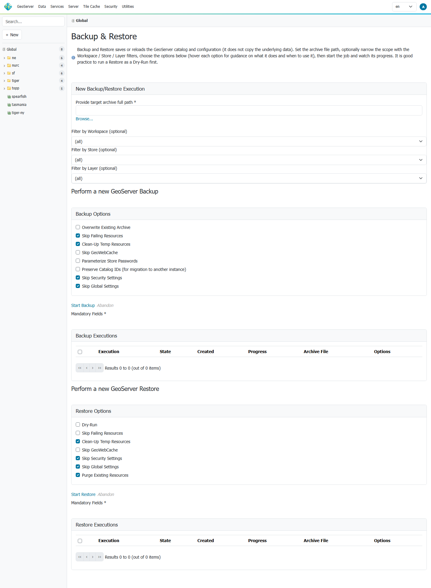
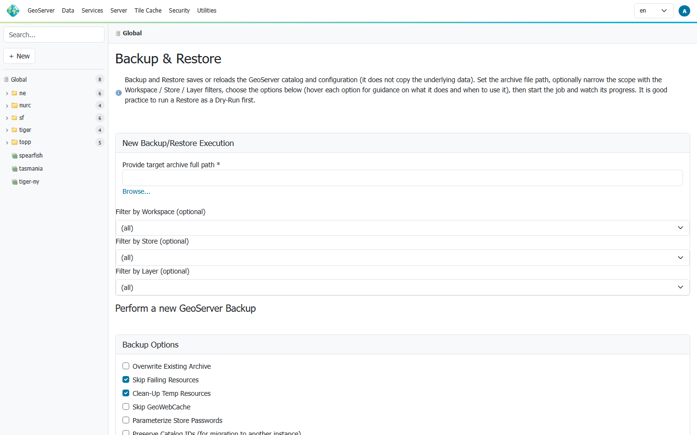
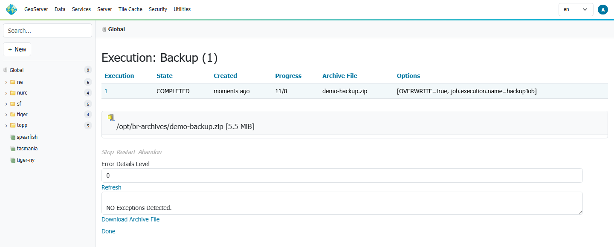
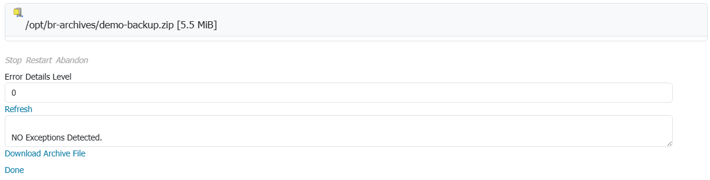
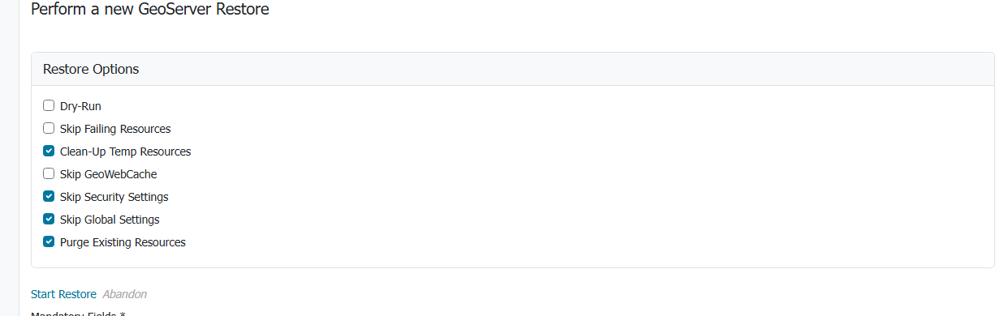
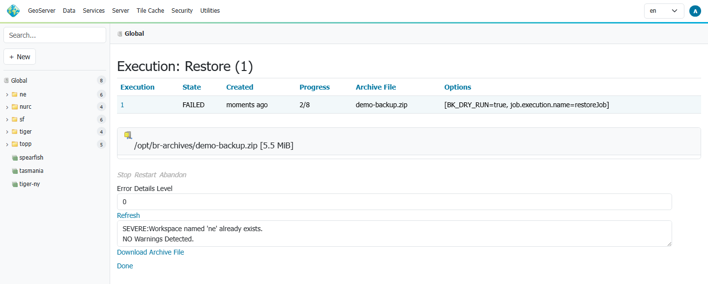
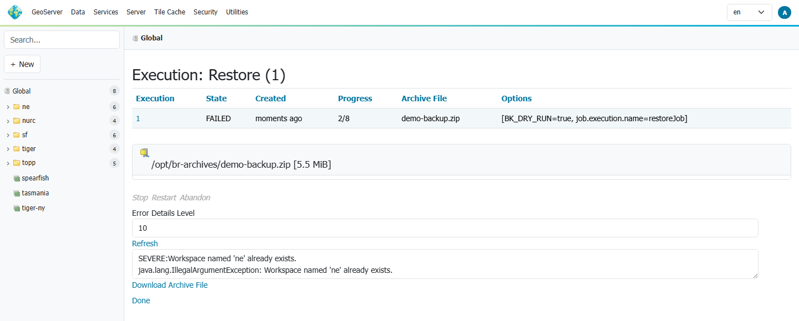
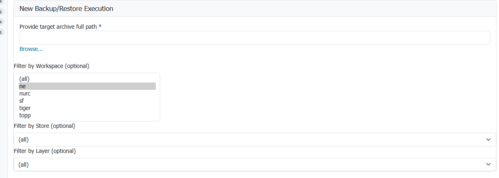

# Usage Via GeoServer's User Interface

At the end on Backup and Restore plugin installation you will see a new section in GeoServer UI

Clicking on the `Backup and Restore` label will give you access to the Backup and Restore configuration settings:

Here you'll be able to specify various parameters for the Backup / Restore procedure:

1.  `Archive full path`: Path on the file system to the archive created by the backup procedure, in case a Backup is executed, or the archive to restore from, in case of a Restore procedure.

2.  `Filter by Workspace`: Optional parameter that allows you to restrict the scope of the Backup / Restore to workspaces that meet the specified filter.

3.  `Backup Options`:

    1.  `Overwrite Existing Archive`: When enabled the backup procedure will overwrite any previously existing archive
    2.  `Skip Failing Resources`: If enabled and errors are found during the backup of existing resources, skip the resource and go ahead with the backup procedure
    3.  `Clean-Up Temp Resources`: Delete the temporary working folder at the end of the execution
    4.  `Skip GeoWebCache`: Exclude the GWC catalog and tile-layer folders from the backup
    5.  `Parameterize Store Passwords`: Replace store passwords in the archive with parameterizable tokens instead of the encrypted values (see `BK_PARAM_PASSWORDS` under [Usage Via REST](usagerest.md))
    6.  `Preserve Catalog IDs (for migration)`: Keep catalog object ids and write cross-references by id, producing an archive suited to migrating into another, already-populated instance. Off by default (the portable, name-based archive). See [Migrating a catalog to another GeoServer instance](usecases.md#migrating-a-catalog-to-another-geoserver-instance)
    7.  `Skip Security Settings`: Exclude the security configuration (users, groups, roles, services) from the backup. **Checked by default**, matching the `BK_SKIP_SECURITY` REST default. Uncheck to include security in the archive
    8.  `Skip Global Settings`: Exclude the global settings from the backup. **Checked by default**, matching the `BK_SKIP_SETTINGS` REST default

4.  `Backup Executions`: Report of running and previously run backups

5.  `Restore Options`:

    1.  `Dry Run`: Test the restore procedure using the provided archive but do not apply any changes to current configuration. Useful to test archives before actually performing a Restore
    2.  `Skip Failing Resources`: If enabled and errors are found during the restore of resources, skip the resource and go ahead with the restore procedure
    3.  `Clean-Up Temp Resources`: Delete the temporary working folder at the end of the execution
    4.  `Skip GeoWebCache`: Exclude the GWC catalog and tile-layer folders from the restore
    5.  `Skip Security Settings`: Do not restore the security configuration. **Checked by default**, matching the `BK_SKIP_SECURITY` REST default. Uncheck only when the archive contains a security folder you intend to restore
    6.  `Skip Global Settings`: Do not restore the global settings. **Checked by default**, matching the `BK_SKIP_SETTINGS` REST default
    7.  `Purge Existing Resources`: Delete incoming resources where possible before restoring (e.g. drop existing workspaces). **Checked by default**, matching the `BK_PURGE_RESOURCES` REST default. Uncheck to merge into the existing catalog without deleting

6.  `Restore Executions`: Report of running and previously run restore

!!! warning
    `Skip Security Settings` is checked by default for a reason: restoring security configuration replaces the target's users, groups, roles and authentication settings. Only uncheck it when you understand the archive's security content and intend to overwrite the target's security. See the [partial / cross-instance restore notes](usecases.md#partial-and-cross-instance-restores).

!!! note
    The remaining `BK_*` options (e.g. password-token substitution, `exclude.file.path`) are available only through the [REST API](usagerest.md), which exposes the full option set.

## Performing a full backup via UI

In order to perform a full backup, provide the full path of the target `.zip` archive where to store the configuration data.

!!! note
    Please notice that the backup will store just the configuration files and **not** the original data.

It is also possible to use the `Browse` instrument to navigate the server folders. In any case the backup procedure won't start until it find a valid `.zip` path archive.

It is possible to select the backup options by enabling the appropriate checkboxes before starting the backup procedure.

!!! note
    Please notice that while performing a backup or restore task, GeoServer won't allow users to access other sections by locking the catalog and configuration until the process has finished. Although it is always possible to stop or abandon a backup or restore procedure.

While the job runs, the status shown next to the `Start` button updates automatically and reports the current progress as `<status> — step <done>/<total> (<current step>)`. At the end of the backup, the user will be redirected to an `Execution Summary` page

The same page can be accessed also later by clicking an execution link from the main page.

!!! note
    The `Execution Details` page refreshes itself automatically while the job is still running, so the step states and progress update without any action; a manual `refresh` link is also available. The page stops auto-refreshing once the job reaches a terminal state.

!!! note
    Please notice that the list of executions is not persisted and therefore it will be reset after a GeoServer container **restart**.

At the bottom of the `Execution Details` page, it's possible to download the `.zip` archive directly by clicking on the `Download Archive File` link.

In case some running exceptions or warning have been caught by the process, they will be presented on the execution summary. The `Error Detail Level` allows to inspect the causes by exposing the stack trace for each of them.

## Restoring via UI

The steps are almost the same of the backup. Just select the `.zip` archive full path before launching the restore process.

!!! warning
    Please notice that a **non-dry-run restore** will lose all your current GeoServer configuration by replacing it with the new one, so be careful and be sure to backup everything before starting a restore.

### DRY-RUN RESTORE

`Dry Run` option allows a user to **test** a `.zip` archive before actually performing a full restore.

!!! note
    Please notice that the dry run should always being executed when trying to restore a new configuration.

A **failing** restore dry-run will appear like this

If some exception occurs, it will be listed on the execution summary page. The original cause can be inspected by rising up the errors details level and refreshing

## Saving/restoring only specific workspaces

It is possible to backup or restore only a subset of the available workspaces in the catalog. From the WEB interface is currently possible to select all or just one workspace to backup/restore

Through the REST APIs it is possible to filter out also more than one workspaces as explained in the next sections.

!!! note
    Please notice that from a backup archive containing filtered workspaces won't be possible to restore also the missing ones. In order to do that it is advisable to backup the whole catalog and then restore only the workspaces needed.
