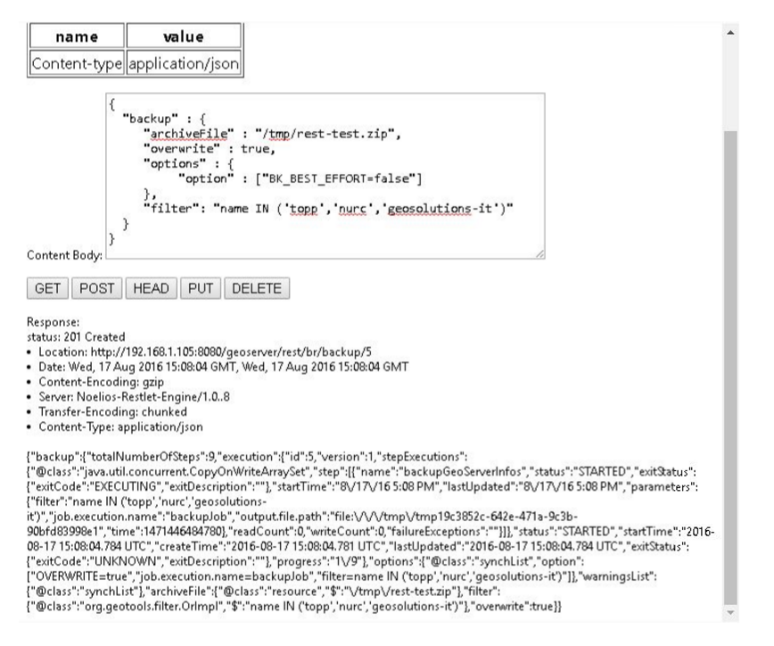
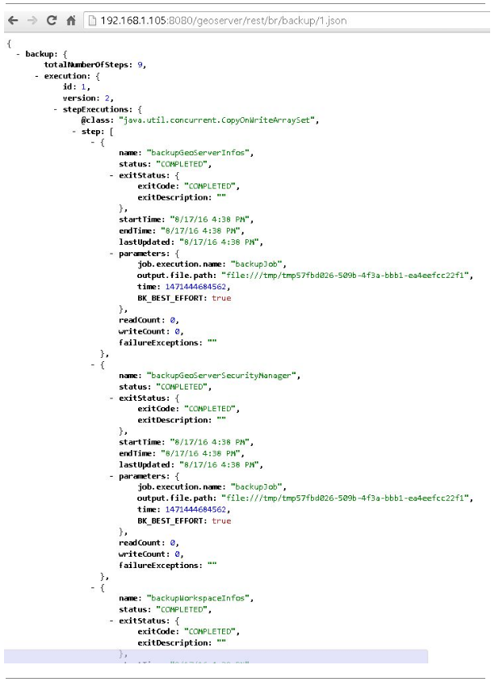
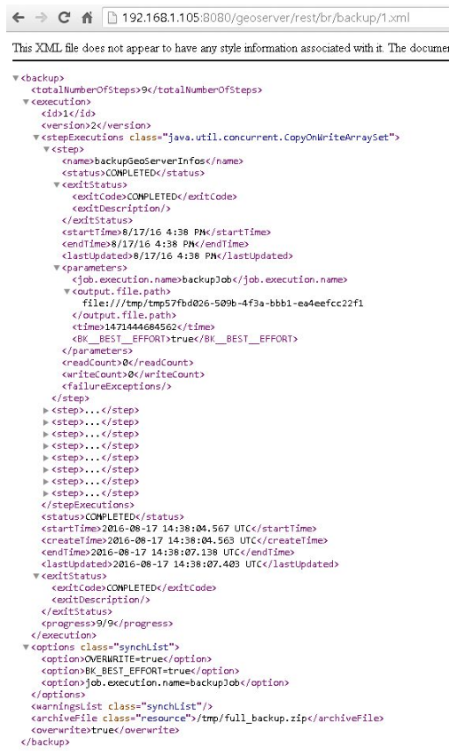
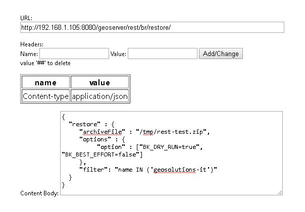
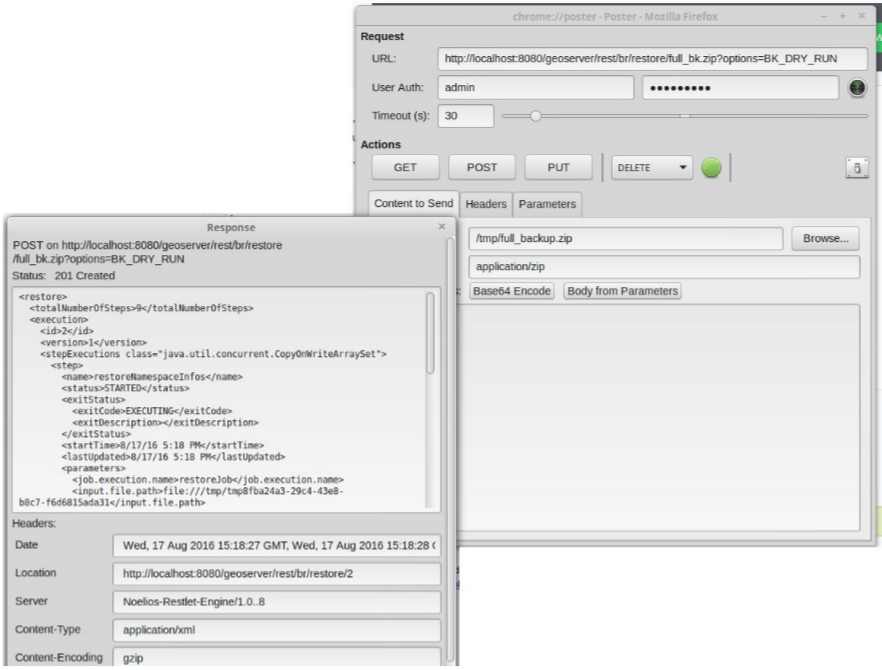

# Usage Via GeoServer's REST API

The Backup and Restore REST API consists of a few resources meant to be used in an asynchronous fashion:

| Resource | Method | Parameters and Notes |
|----|----|----|
| /rest/br/backup/ | POST | Post a JSON/XML document with the backup parameters, see below |
| /rest/br/backup/backupId | GET | Returns a json/xml representation of the backup operation. See below |
| /rest/br/backup/backupId | DELETE | Cancels the backup operation |
| /rest/br/restore | POST | Post a JSON/XML document with the restore parameters, see below |
| /rest/br/restore/restoreId | GET | Returns a json/xml representation of the backup operation, see below |
| /rest/br/restore/restoreId | DELETE | Cancels the restore operation |

## Usage Example

We are going to use the command line tool cURL to send HTTP REST requests to GeoServer.

The `/rest/br/backup/` and `/rest/br/restore` endpoints accept an optional format suffix that allows the Backup / Restore archive to be streamed to / from the client instead of being written on / read from the file system.

### Initiate a Backup

Prepare a file containing with a JSON object representing the Backup procedure configuration.

`backup_post.json`:

```json
{
   "backup":{
      "archiveFile":"/home/sg/BackupAndRestore/test_rest_1.zip",
      "overwrite":true,
      "options":{
      }
   }
}
```

In this case we did not specify any options in the backup configuration so default values will be used.

Available options are:

1.  `BK_BEST_EFFORT`: Skip any failing resources and proceed with the backup procedure. Default: `false`.
2.  `BK_PARAM_PASSWORDS`: Whether outgoing store passwords should be parameterized in the backup. With this option set all store passwords will be replaced with a token that looks like `\${workspaceName:storeName.passwd.encryptedValue}`. See also `BK_PASSWORD_TOKENS` for the Restore command.
3.  `BK_SKIP_SECURITY`: This will exclude security settings from the backup. Default: `true` (security is excluded). A workspace `Filter` also forces security to be skipped.
4.  `BK_SKIP_SETTINGS`: This will attempt to exclude global settings from the backup, as well as security settings. Default: `true`.
5.  `BK_SKIP_GWC`: This option will avoid backup / restore the GWC catalog and folders. Default: `false`.
6.  `BK_CLEANUP_TEMP`: This will attempt to delete temporary folder at the end of the execution. Default: `true`.
7.  `BK_PRESERVE_IDS`: Keep every catalog object's internal id in the archive and write cross-references **by id** instead of by name. Default: `true`. By default the archive is a portable **migration artifact**: it preserves the original object identities, so it restores into another, already-populated GeoServer with cross-references and GWC tile-layer links intact (see [Migrating a catalog to another GeoServer instance](usecases.md#migrating-a-catalog-to-another-geoserver-instance)). Set this to `false` to produce the legacy *name-based* archive — ids are stripped and regenerated on restore — which is only needed when restoring into a fresh, empty data directory. The flag is a **backup-side** option only: the restore reads whichever of `<id>`/`<name>` each reference carries, so an archive restores correctly with the default restore command — no matching option is required. (Changed in 3.0 — see [What changed between 2.x and 3.x](migration.md).)
8.  `exclude.file.path`: A `;` separated list of paths relative to the `GEOSERVER_DATA_DIR` (e.g.: 'exclude.file.path=/data/geonode;/monitoring;/geofence'). If exist, the backup / restore will skip the path listed. Default: `[]`. WARNING: `security` and `workspaces` are treated differently. This option should be used only for custom external resources located under the `GEOSERVER_DATA_DIR`.

!!! note
    `BK_SKIP_SECURITY` and `BK_SKIP_SETTINGS` default to `true`, so a backup **excludes** security and global settings unless you pass `=false`. To include them, set the option explicitly (the GeoServer UI exposes these as checkboxes).

Also an optional `Filter` can be passed to restrict the scope of the restore operation to a list of workspaces.

For example:

```json
{
   "backup":{
      "archiveFile":"/home/sg/BackupAndRestore/test_rest_1.zip",
"overwrite":true,
      "options":{
        "option": ["BK_BEST_EFFORT=true"] 
      },
"filter": "name IN ('topp','geosolutions-it')"
   }
}
```

Backup procedure will be initiated.

Here is a sample response:

```http
HTTP/1.1 201 Created
Date: Mon, 01 Aug 2016 14:35:44 GMT
Location: http://mygeoserver/geoserver/rest/br/backup/1
Server: Noelios-Restlet-Engine/1.0..8
Content-Type: application/json
Transfer-Encoding: chunked
```

```json
{
   "backup":{
      "totalNumberOfSteps":9,
      "execution":{
         "id":1,
         "version":1,
         "stepExecutions":{
            "@class":"java.util.concurrent.CopyOnWriteArraySet"
         },
         "status":[
            "STARTED"
         ],
         "startTime":"2016-08-01 14:35:44.802 UTC",
         "createTime":"2016-08-01 14:35:44.798 UTC",
         "lastUpdated":"2016-08-01 14:35:44.803 UTC",
         "exitStatus":{
            "exitCode":"UNKNOWN",
            "exitDescription":""
         },
         "progress":"1\/9"
      },
      "options":{
         "@class":"synchList",
         "option":[
            "OVERWRITE=true"
         ]
      },
      "warningsList":{
         "@class":"synchList"
      },
      "archiveFile":{
         "@class":"resource",
         "$":"\/home\/sg\/BackupAndRestore\/test_rest_1.zip"
      },
      "overwrite":true
   }
}
```

At the end of the backup procedure you'll be able to download the generated archive to your local file system by making an HTTP GET request to the same endpoint, using the **backup ID** as above and adding the `.zip` at the end.

```bash
curl -u "admin:geoserver" -i -X GET  "http://mygeoserver/geoserver/rest/br/backup/1.zip" -o 1.zip
```



### Query status of Backup executions

Status of the operation can be queried making an HTTP GET request to the location listed in the response.

```text
http://mygeoserver/geoserver/rest/br/backup/$ID.{json/xml}
```

Replace `$ID` with the **ID** of the backup operation you'd like to inspect.

```bash
curl -u "admin:geoserver" http://mygeoserver/geoserver/rest/br/backup/1.json
```

or

```bash
curl -u "admin:geoserver" http://mygeoserver/geoserver/rest/br/backup/1.xml
```

GeoServer will respond with the status of the backup job corresponding to that ID





Here you are able to see the status of all the steps involved in the backup procedure with creation time, start time, end time, exit status etc.

### Cancel a Backup

Cancel an in progress Backup by sending an HTTP DELETE request with the ID of the task

```bash
curl -v -XDELETE -u "admin:geoserver" http://mygeoserver/geoserver/rest/br/backup/$ID
```

Replace `$ID` with the **ID** of the backup operation you'd like to cancel.

### Initiate a Restore

Prepare a file with a JSON object representing the Restore procedure configuration

`restore_post.json`:

```json
{
   "restore":{
      "archiveFile":"/home/sg/BackupAndRestore/test_rest_1.zip",
      "options":{
      }
   }
}
```

In this case we did not specify any options in the restore configuration so default values will be used.

Available Options are:

1.  `BK_DRY_RUN`: Only test the archive, do not persist the restored configuration. Default: `false`. Since 3.x a dry-run **snapshots and rolls back** the affected data-directory subtrees, so it leaves the data directory untouched even though the restore otherwise writes incrementally (see [What changed](migration.md#transactional-dry-run-and-fail-on-invalid)).

2.  `BK_BEST_EFFORT`: Skip any failing resources and proceed with the restore procedure. Default: `false`.

3.  `BK_PASSWORD_TOKENS`: A comma separated list of equal sign separated key/values to be replaced in data store passwords in an incoming backup. For example:

    ```text
    BK_PASSWORD_TOKENS=${workspace:store1.passwd.encryptedValue}=foo,${workspace:store2.passwd.encryptedValue}=bar
    ```

4.  `BK_SKIP_SECURITY`: This will exclude security settings from the restore. Default: `true` (security is **not** restored). A workspace `Filter` also forces security to be skipped. Set `BK_SKIP_SECURITY=false` to restore the security configuration from the archive (this overwrites the target's users, groups, roles and authentication).

5.  `BK_SKIP_SETTINGS`: This will attempt to exclude global settings from the restore, as well as security settings. Default: `true`.

6.  `BK_PURGE_RESOURCES`: Whether the restore deletes pre-existing resources (e.g. drops existing workspaces) before restoring. Default: `true` — **a restore is destructive by default**. Set `BK_PURGE_RESOURCES=false` to merge the archive into the existing catalog without deleting anything.

7.  `BK_SKIP_GWC`: This option will avoid backup / restore the GWC catalog and folders. Default: `false`.

8.  `BK_CLEANUP_TEMP`: This will attempt to delete temporary folder at the end of the execution. Default: `true`.

9.  `BK_MERGE_SECURITY`: When `true`, **merge** the archive's users, groups and roles into the target's existing security services instead of replacing the whole `security` folder. The target keeps its own configuration, keystore and master password, so this works even when the source and target master passwords differ. New principals keep their archived (digest) passwords; reversible passwords must be reset on the target afterwards. Default: `false` (replace mode). Has effect only when security is actually restored, i.e. `BK_SKIP_SECURITY=false`. New in 3.0.

10.  `BK_SOURCE_MASTER_PASSWORD` / `BK_TARGET_MASTER_PASSWORD`: Supplied together on a security **replace** restore (`BK_SKIP_SECURITY=false`, `BK_MERGE_SECURITY=false`) to re-encrypt the archive's keystore from the source's master password to the target's — without them a keystore encrypted under a different source master password cannot be read on the target. `BK_TARGET_MASTER_PASSWORD` must match the target instance's actual master password or the re-encryption is rejected. Both are **sensitive**: pass them as transient parameters, never store them in scripts or logs. New in 3.0.

11.  `BK_FAIL_ON_INVALID`: When `true`, the restore runs a **pre-flight validation pass** over the fully-assembled restore catalog and **aborts** (the job is marked `FAILED`, the live configuration reload is skipped, and the data directory is rolled back to its pre-restore state) if any catalog object is invalid. Default: `false` — the pass still runs but only logs the problems and records them as execution warnings. Combine with `BK_DRY_RUN=true` to validate an archive non-destructively before committing to a real restore. New in 3.0.

12.  `exclude.file.path`: A `;` separated list of paths relative to the `GEOSERVER_DATA_DIR` (e.g.: 'exclude.file.path=/data/geonode;/monitoring;/geofence'). If exist, the backup / restore will skip the path listed. Default: `[]`. WARNING: `security` and `workspaces` are treated differently. This option should be used only for custom external resources located under the `GEOSERVER_DATA_DIR`.

!!! warning
    A restore is **destructive by default**: with the default options it drops pre-existing resources (`BK_PURGE_RESOURCES=true`) and does not restore security or global settings (`BK_SKIP_SECURITY` / `BK_SKIP_SETTINGS` = `true`). To **merge** an archive into the current catalog without deleting anything, pass `BK_PURGE_RESOURCES=false`. Always run a `BK_DRY_RUN=true` first. The GeoServer UI exposes all three as checkboxes (pre-checked to these defaults).

!!! note
    There is no `BK_PRESERVE_IDS` option on the restore side. The restore automatically adapts to whatever the archive contains: a name-based (default) archive is matched against the target catalog by name, while an id-based archive (produced with `BK_PRESERVE_IDS=true` on the backup) is matched first by id and then by name. Restoring an id-based archive into the **same** instance is therefore idempotent — objects whose id already exists are skipped — and restoring it into a **different** instance preserves the original ids so cross-references and GWC tile layers re-link correctly. See [Migrating a catalog to another GeoServer instance](usecases.md#migrating-a-catalog-to-another-geoserver-instance).

Also an optional `Filter` can be passed to restrict the scope of the restore operation to a list of workspaces.

For example:

```text
{
   "restore":{
      "archiveFile":"/home/sg/BackupAndRestore/test_rest_1.zip",
      "options":{
        "option": ["BK_DRY_RUN=true"] 
      },
"filter": "name IN ('topp','geosolutions-it')"
   }
}
```

If `archiveFile` is specified, the archive specified on that path of the remote file system will be used to initiate the restore procedure. Otherwise the archive needs to be uploaded from your local system.

Then make a POST HTTP request to GeoServer's REST interface endpoint for the restore procedure

```bash
curl -u "admin:geoserver" -i -H "Content-Type: application/json" -X POST --data @restore_post.json http://mygeoserver/geoserver/rest/br/restore/
```

Restore procedure will be initiated.

Here is a sample response:

```http
HTTP/1.1 201 Created
Date: Mon, 01 Aug 2016 15:07:29 GMT
Location: http://mygeoserver/geoserver/rest/br/restore/2
Server: Noelios-Restlet-Engine/1.0..8
Content-Type: application/json
Transfer-Encoding: chunked
```

```json
{
   "restore":{
      "totalNumberOfSteps":9,
      "execution":{
         "id":2,
         "version":1,
         "stepExecutions":{
            "@class":"java.util.concurrent.CopyOnWriteArraySet"
         },
         "status":[
            "STARTED"
         ],
         "startTime":"2016-08-01 15:07:29.398 UTC",
         "createTime":"2016-08-01 15:07:29.393 UTC",
         "lastUpdated":"2016-08-01 15:07:29.398 UTC",
         "exitStatus":{
            "exitCode":"UNKNOWN",
            "exitDescription":""
         },
         "progress":"0\/9"
      },
      "options":{
         "@class":"synchList"
      },
      "warningsList":{
         "@class":"synchList"
      },
      "archiveFile":{
         "@class":"resource",
         "$":"\/home\/sg\/BackupAndRestore\/test_rest_1.zip"
      }
   }
}
```



To upload the archive from our local system instead, omit the archiveFile parameter in the JSON object and pass the `--upload-file` parameter to cURL:

`restore_post.json`:

```json
{
   "restore":{
      "options":{
      },
   }
}
```

```bash
curl -u "admin:geoserver" -i -H "Content-Type: application/json" --upload-file "archive_to_restore.zip" -X POST --data @restore_post.json http://localhost:8081/geoserver/rest/br/restore/
```

Local `archive_to_restore.zip` archive will be uploaded and used by the restore procedure.



Query for status of Restore operations

`http://mygeoserver/geoser/restore/$ID.{json/xml}`:

```text
{
   "restore":{
      "execution":{
         "hash":2,
         "key":{
            "@class":"long",
            "$":"2"
         },
         "val":{
            "@class":"restore",
            "totalNumberOfSteps":9,
            "execution":{
               "id":2,
               "version":2,
               "stepExecutions":{
                  "@class":"java.util.concurrent.CopyOnWriteArraySet",
                  "step":[
                     {
                        "name":"restoreNamespaceInfos",
                        "status":"COMPLETED",
                        "exitStatus":{
                           "exitCode":"COMPLETED",
                           "exitDescription":""
                        },
                        "startTime":"8\/1\/16 3:07 PM",
                        "endTime":"8\/1\/16 3:07 PM",
                        "lastUpdated":"8\/1\/16 3:07 PM",
                        "parameters":{
                           "input.file.path":"file:\/\/\/opt\/tomcat-geoserver-2.9.x\/temp\/tmpbbe2388a-f26d-4f26-a20f-88c653d88aec",
                           "time":1470064049392
                        },
                        "readCount":1,
                        "writeCount":1,
                        "failureExceptions":""
                     },
                    ...
                     {
                        "name":"restoreGeoServerSecurityManager",
                        "status":"COMPLETED",
                        "exitStatus":{
                           "exitCode":"COMPLETED",
                           "exitDescription":""
                        },
                        "startTime":"8\/1\/16 3:07 PM",
                        "endTime":"8\/1\/16 3:07 PM",
                        "lastUpdated":"8\/1\/16 3:07 PM",
                        "parameters":{
                           "input.file.path":"file:\/\/\/opt\/tomcat-geoserver-2.9.x\/temp\/tmpbbe2388a-f26d-4f26-a20f-88c653d88aec",
                           "time":1470064049392
                        },
                        "readCount":0,
                        "writeCount":0,
                        "failureExceptions":""
                     }
                  ]
               },
               "status":"COMPLETED",
               "startTime":"2016-08-01 15:07:29.398 UTC",
               "createTime":"2016-08-01 15:07:29.393 UTC",
               "endTime":"2016-08-01 15:07:30.356 UTC",
               "lastUpdated":"2016-08-01 15:07:30.772 UTC",
               "exitStatus":{
                  "exitCode":"COMPLETED",
                  "exitDescription":""
               },
               "progress":"9\/9"
            },
            "options":{
               "@class":"synchList"
            },
            "warningsList":{
               "@class":"synchList"
            },
            "archiveFile":{
               "@class":"resource",
               "$":"\/home\/sg\/BackupAndRestore\/test_rest_1.zip"
            }
         }
      }
      ...
```

Here you are able to see the status of all the steps involved in the restore procedure with creation time, start time, end time, exit status etc.

### Cancel a Restore

Cancel an in-progress Restore by sending an HTTP DELETE request:

```bash
curl -v -XDELETE -u "admin:geoserver" http://mygeoserver/geoserver/rest/br/restore/$ID
```

Replace `$ID` with the **ID** of the restore operation you'd like to cancel.
