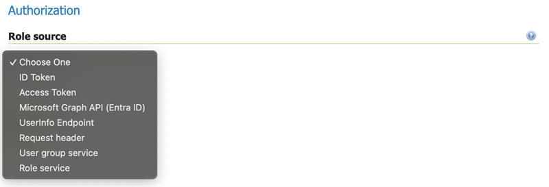
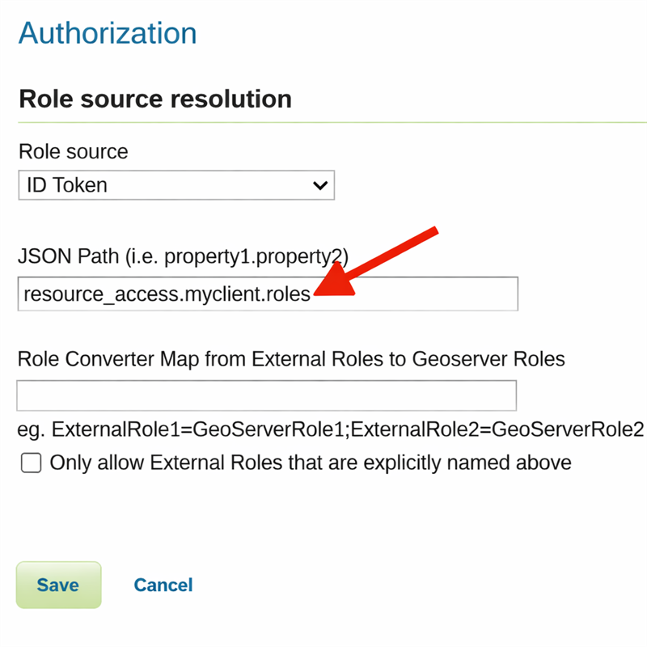
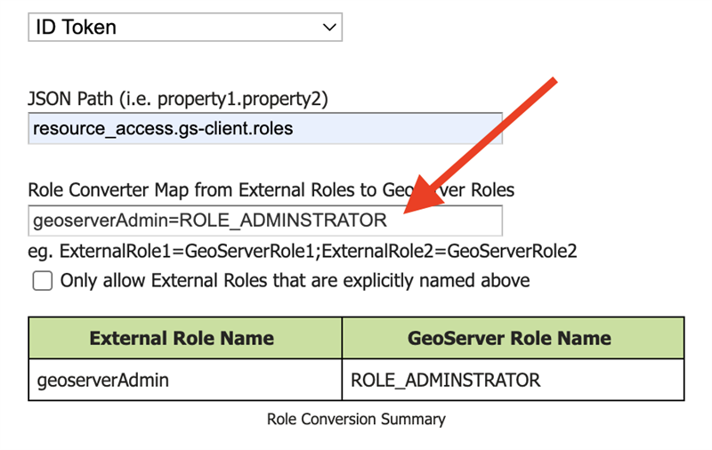
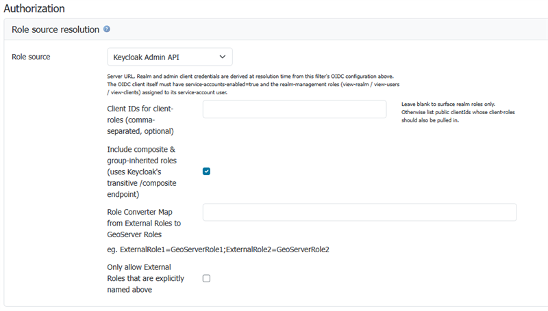

# Configuring the roles source

You can configure role sources from two main groups:

- [The standard GeoServer role source](../../security/usergrouprole/index.md)
- From OIDC-specific sources (see below)

For more examples, see the IDP-specific configuration examples - [Google](oauth2/google.md), [GitHub](oauth2/github.md), [Keycloak](oauth2/keycloak.md), [MS Azure and Entra](oauth2/azure.md), [Generic OpenID Connect](oauth2/generic.md).

## Extracting Roles from the OIDC IDP

The `oidc` module allows for providing user roles with the standard GeoServer role providers. It also adds five OIDC-specific ones: ID Token, Access Token, UserInfo, Microsoft Graph and Keycloak Admin API.

| Name | Meaning |
|----|----|
| ID Token | The [ID token](https://auth0.com/docs/secure/tokens/id-tokens) is an OIDC specific [JWT](https://en.wikipedia.org/wiki/JSON_Web_Token) token that contains signed [claims](https://auth0.com/docs/secure/tokens/json-web-tokens/json-web-token-claims) from the OIDC [IDP](https://en.wikipedia.org/wiki/Identity_provider). These claims can be used for GeoServer roles (see below). This is the recommended place to get roles from. |
| Access Token | The [Access Token](https://en.wikipedia.org/wiki/Access_token) is a OAUTH2 token that is also present in OIDC. Typically, one should not be looking inside the Access Token, however, if your provider's access token is a JWT, then you can use it extract claims. This is not the recommended method of getting roles, but is provided as an option. |
| UserInfo | The OIDC [specification](https://openid.net/developers/specs/) provides a [UserInfo endpoint](https://connect2id.com/products/server/docs/api/userinfo) that accepts an Access Token and returns a JSON document with claims about the user. This is recommended only if the ID Token doesn't contain the claims to get roles from. |
| Microsoft Graph | [Microsoft Graph](https://learn.microsoft.com/en-us/graph/overview) is a Microsoft product for use with their cloud IDP. Only use this if you are using a Microsoft product like Microsoft Entra ID (formerly Azure AD). |
| Keycloak Admin API | Server-side fetch of the logged-in user's role assignments via Keycloak's [Admin REST API](https://www.keycloak.org/docs-api/latest/rest-api/index.html). Use this when you need to surface roles assigned to the user **through groups** (not just direct realm-role assignments) or when composite-role expansion needs to happen server-side. Only valid against a Keycloak IDP. See [Configuring with Keycloak](oauth2/keycloak.md#community_oidc_keycloak_admin_api) for the prerequisite Keycloak-side setup. |

## Role Configuration Overview

1.  Choose a role source - typically `ID Token`, but can also be `Access Token` or `UserInfo`.



2.  Set the JSON Path to point to where in the Token/UserInfo you want to extract a set of external IDP roles



3.  Set the `Role Converter Map` so it converts the IDP's roles to GeoServer roles.



## Configuring Roles from the ID Token, Access Token, or UserInfo

The basis of the ID Token, Access Token, and UserInfo is a [JSON](https://en.wikipedia.org/wiki/JSON) document with information about the user.

Here is an example of a [Keycloak](https://www.keycloak.org/) ID Token:

```json
{
   "exp": 1708555947,
   "iat": 1708555647,
   "auth_time": 1708555288,
   "jti": "42ee833e-89d3-4779-bd9d-06b979329c9f",
   "iss": "http://localhost:7777/realms/dave-test2",
   "aud": "live-key2",
   "sub": "98cfe060-f980-4a05-8612-6c609219ffe9",
   "typ": "ID",
   "azp": "live-key2",
   "nonce": "4PhqmZSJ355KBtJPbAP_PdwqiLnc7B1lA2SGpB0zXr4",
   "session_state": "7712b364-339a-4053-ae0c-7d3adfca9005",
   "at_hash": "2Tyw8q4ZMewuYrD38alCug",
   "acr": "0",
   "sid": "7712b364-339a-4053-ae0c-7d3adfca9005",
   "upn": "david.blasby@geocat.net",
   "resource_access":  {
         "live-key2": {
             "roles": 
                 [
                     "GeonetworkAdmin", 
                     "GeoserverAdmin"
                 ]
         }
   },
   "email_verified": false,
   "address": { },
   "name": "david blasby",
   "groups": ["default-roles-dave-test2", "offline_access", "uma_authorization"],
   "preferred_username": "david.blasby@geocat.net",
   "given_name": "david",
   "family_name": "blasby",
   "email": "david.blasby@geocat.net"
}
```

Many IDPs (including Keycloak) form the ID Token, Access Token (JWT), and UserInfo in a similar format.

In this token's JSON claims, notice this part:

```json
"resource_access": {
    "live-key2":  {
        "roles": 
            [
                "GeonetworkAdmin", 
                "GeoserverAdmin"
            ]
    }
}
```

We would, therefore, specify the JSON Path to `resource_access.live-key2.roles` to get the two external IDP roles ("`GeonetworkAdmin`", and "`GeoserverAdmin`"). In keycloak, the JSON path will be of the form `resource_access.<client name>.roles`. Other OIDC IDPs will put the roles in a different location.

### Access Token

If you choose the Access Token as your role source, you can also use `scope` for the JSON path. This will look at the OIDC IDP's [code response](https://auth0.com/docs/authenticate/login/oidc-conformant-authentication/oidc-adoption-auth-code-flow) to see what [scopes](https://auth0.com/docs/get-started/apis/scopes/openid-connect-scopes) are available.

For **very** advanced users (not recommended - only do this if your IDP uses this mechanism), you can also extract other parts from the code response. This is only provided to help with opaque (non-JWT) Access Tokens. Here is what a typical code response looks like:

```json
{
    "access_token": "....",
    "token_type": "Bearer",
    "refresh_token": "...",
    "expires_in": 3600,
    "id_token": "..."
}
```

Both of these techniques are advanced - and should only be used if you **must** use the Access Token and the Access Token is **not** a JWT.

## Configuring Microsoft Graph

See the [Azure/Entra Configuration](oauth2/azure.md)

## External-Internal Role Translation

The `oidc` module provides an easy way to convert the name of an external IDP's role to a local GeoServer role.


In this example, the OIDC IDP will return a `geoserverAdmin` role (see ID Token example, above). You can configure GeoServer to understand what this means, however, this can be complex. Instead this defines a very simple translation from the role in the ID Token (`External Role Name`) to an internal GeoServer role name.

In this example we are converting the IDP's `geoserverAdmin` role to `ROLE_ADMINISTRATOR`.

You can specify multiple translations separated by the "`;`" character.

If you turn on the "`Only allow External Roles that are explicitly named above`", then roles that are not mentioned in the Role Converter Map will **not** be in the set of GeoServer roles. For example, in the example ID Token, the user has role "geoserverAdmin" and "geonetworkAdmin". If this is not turned on, then the user will have the GeoServer roles "ROLE_ADMINISTRATOR" (translated from "geoserverAdmin") as well as "geonetworkAdmin". If it is turned on, then they will only have the "ROLE_ADMINISTRATOR" (translated from "geoserverAdmin") role.

## Configuring Roles from the Keycloak Admin REST API {: #community_oidc_keycloak_admin_api_role_source }

The `Keycloak Admin API` role source is a Keycloak-specific alternative to the token-claim-based sources. Instead of reading roles from the ID Token / Access Token / UserInfo response, GeoServer calls Keycloak's [Admin REST API](https://www.keycloak.org/docs-api/latest/rest-api/index.html) at login time to fetch the user's role assignments:

1. `GET /admin/realms/{realm}/users?exact=true&username=<principal>` — resolve the user's UUID.
2. `GET /admin/realms/{realm}/users/{uuid}/role-mappings/realm/composite` — enumerate the user's realm-role mappings (transitively expanded across composite roles and group memberships).
3. Optionally, `GET /admin/realms/{realm}/users/{uuid}/role-mappings/clients/{cid}/composite` for each Keycloak client whose client-roles you want pulled in.

The admin calls are authenticated via a separate access token obtained through the OAuth2 [client credentials](https://www.rfc-editor.org/rfc/rfc6749#section-4.4) grant against the **same** OIDC client used for user login. The OIDC client therefore needs to satisfy two extra Keycloak-side prerequisites:

- **Service Accounts → Enabled** (`serviceAccountsEnabled=true`)
- **Service Account Roles** must include the realm-management roles needed to read users, clients and realm metadata — at minimum `view-realm`, `view-users`, `view-clients` (the set the filter's *Keycloak Admin API* hint lists), plus `query-groups` when you need to resolve **group-inherited** roles.

See [Configuring Keycloak Admin API as the role source](oauth2/keycloak.md#community_oidc_keycloak_admin_api) for the step-by-step Keycloak setup.



*The Keycloak Admin API sub-panel on the OIDC filter's Authorization section.*

The fields:

| Field | Notes |
|----|----|
| Client IDs for client-roles (comma-separated, optional) | If your roles live as **client roles** under one or more Keycloak clients (not just realm roles), list those clients' public IDs here. Leave blank to surface realm roles only. |
| Include composite & group-inherited roles | Default **on**. Switches the per-user fetch to the `/composite` endpoint variant so Keycloak server-side flattens both composite parents and group memberships into the response. Turn off only if you need plain direct-assignment semantics. |
| Role Converter Map | Translate external IDP role names to internal GeoServer role names — exactly the same mechanism documented in the [External-Internal Role Translation](#external-internal-role-translation) section. Useful for mapping Keycloak roles like `geoserver-admin` to GeoServer's built-in `ROLE_ADMINISTRATOR`. |
| Only allow External Roles that are explicitly named above | Same semantics as the token-based sources — when enabled, roles not in the Role Converter Map are dropped. |

The Server URL, Realm and admin client credentials are **derived at resolution time** from the same OIDC configuration above (the Discovery URI, Client ID, Client Secret you've already configured for the login flow). No duplicate inputs.

### When to choose Keycloak Admin API over ID Token / Access Token

Use this source when:

- The Keycloak roles you care about are assigned to users **indirectly** (through group membership), and you cannot or don't want to add a group-mapper protocol-mapper to surface them in the token claims.
- You rely on Keycloak's [composite roles](https://www.keycloak.org/docs/latest/server_admin/index.html#_composite-roles) and want server-side transitive expansion (e.g. `admin` → `editor` → `viewer`).
- Your tokens are small / opaque and you'd rather not embed potentially large role sets in every request.

Stick with the ID Token / Access Token source if:

- Your roles are already in the token claim (typical) — it's faster and avoids the extra admin-API round-trip per login.
- Your IDP isn't Keycloak (the admin endpoints are Keycloak-specific).

## User Profile Properties {: #community_oidc_user_profile_properties }

In addition to roles, the OIDC module populates the GeoServer user profile properties (`first_name`, `last_name`, `preferred_username`, `email`) on the authenticated principal. Downstream components that honour [User Details Display Settings](../../security/usergrouprole/index.md) --- including the top-right logged-in-user label and any code that reads `GeoServerUser.getProperties()` --- will then show profile data instead of the raw IDP subject identifier.

### Resolution order

For each property, the value is taken from the first source that provides a non-blank value:

1.  The configured **GeoServer user/group service**, looked up by the resolved principal name.
2.  The OIDC claims merged from the ID Token and the UserInfo response (UserInfo wins on overlap). For non-OIDC OAuth2 providers, the OAuth2 attribute map is used instead.

The claim-to-property mapping is:

| GeoServer property | OIDC claim / OAuth2 attribute |
|---|---|
| `first_name` | `given_name` |
| `last_name` | `family_name` |
| `preferred_username` | `preferred_username` |
| `email` | `email` |

This means an administrator can override IDP-provided profile data by setting the matching property on the user inside the configured user/group service. Properties already set on the user/group entry are **never** overwritten by IDP claims.

### Lookup key

The principal name resolved from the configured `userNameAttributeName` is used as both the Spring principal name and the user/group service lookup key. If the IDP returns an opaque identifier (e.g. an Azure B2C object identifier) as the principal name, the matching entry in the user/group service must use that same identifier as its username for the override to take effect.

### Failure handling

The user/group lookup is best-effort. The following conditions **never** prevent login:

- No user/group service is configured for the filter --- properties are populated from claims only.
- The configured service cannot be loaded, or returns no user for the resolved name --- properties are populated from claims only.
- The lookup throws an I/O error --- a warning is logged and the login proceeds with claim-derived properties.
