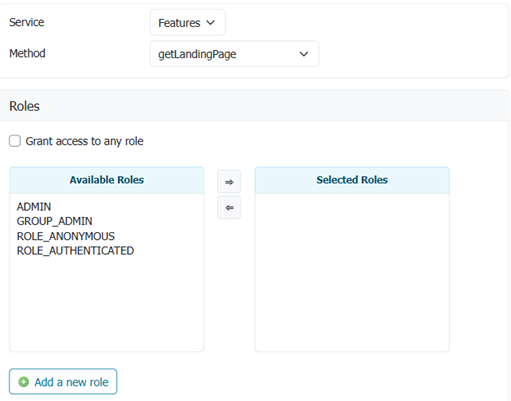
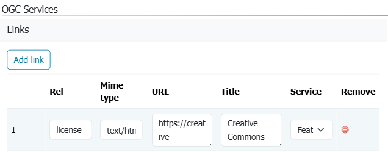
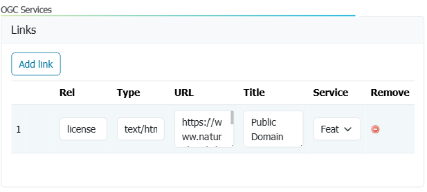
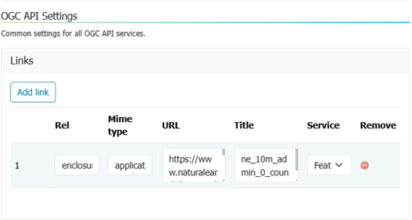

# OGC API Service Configuration

The OGC API services provide additional services alongside the existing Open Web Services (OWS).

## Service

The OGC API services primarily share the same configurations with their equivalent OWS services. For example, setting the limited SRS list on the **Services > Vectors** page also limits the SRS list for **OGC API - Features**.

In addition, the OGC API services will have some unique configuration options.

## Security

- Data security: Data security is managed independently of web service. The same data security restrictions placed on a workspace or layer content are enforced for both OWS services and OGC API web services

- Service security: OGC API web services are managed directly in **Security > Services** page. New access rules can be defined for OGC API services.

  

  *Service rule for OGC API Features getLandingPage*

## Conformance

Each OGC API web service is modular, with supported functionality listed in a `conformance` document.

- OpenAPI service description is mandatory and may not be disabled.

- Built-in output formats (such as HTML and JSON) may not be disabled.

The **Conformance Table** is used to manage each group of standards:

 *  You may enable/disable the functionality included using checkboxes provided.

    The checkboxes cycle through **Enabled** to include a conformance, **Disabled** to exclude, and **Unset** (shown as a `-` line).

 *  The appearance of each conformance **Identifier** is normal when included in the `conformance` document,
and light gray when not included.
  
    The table reflects interaction between conformance settings. For example **Filtering** requires at least one
    filter language (CQL2 or ECQL) to be enabled in order to specify a filter parameter.

 *  When a checkbox is **Unset** the conformance is included depending on how stable a Standard is (Draft standards are still subject to change),
    the GeoServer implementation (Implementing indicates functionality that is under development), and the **Strict CITE compliance** setting used to limit functionality to
    endorsed OGC standards.
    
    | Standard           | Endorsed | Stable    | Default   | Strict    | Description  |
    | ------------------ | -------- | --------- | --------- | -----     | ------------ |
    | Standard           | OGC      | Stable    | Enabled   | Enabled   | Finalized standard |
    | Implementing       | OGC      |           |           |           | Finalized standard, implementation under development. |
    | Draft              | OGC      |           |           |           | Draft standard, subject to change. |
    | Retired            |          | Stable    | Enabled   |           | Retired standard, implementation available for backwards compatibility. |
    | Community Standard |          | Stable    | Enabled   |           | Non-OGC Standard |
    | Community Draft    |          |           |           |           | Non-OGC Standard, subject to change. |
  
    

    *OGC API - Features conformance table*
  
    As an example the GeoServer project lists our own **ECQL** query language alongside the official **CQL2** query language. When using strict
    only the **CQL2** query language would be available by default.
    
    

    *ECQL conformance table*

!!! note

    This approach allows GeoServer to share work-in-progress (both draft standards and implementations being worked on). Use
    the checkboxes to **Enable** such functionality for feedback and review, or leave **Unset** and it will only be included
    when ready.

## Collections

OGCAPI web services provides a `collections` resource describing the published content.

As an example OGC API - Features collections lists:

- **links**: Links and metadata
- **collections**: List of individual collections available
- **crs**: List of coordinate reference systems defined by WFS settings

### Custom links for the "collections" resource

The `collections` resource can have a number of additional links, beyond the basic ones that the service code already includes.

Navigate to **Server > Global Settings**. <!--The links are configured under heading **OGC API Settings**.-->



*Links used to indicate global Creative Commons license*

Link editor column description:

- **rel**: the link relation type, as per the OGC API - Features specification
- **Mime type**: the mime type for the resource found following the link
- **URL**: the link URL
- **Title**: the link title (optional)
- **Service**: the service for which the link is valid (optional, defaults to all)

Common links relationships that could be added for the `collections` resource are:

- `enclosure`, in case there is a package delivering all the collections (e.g. a GeoPackage, a ZIP full of shapefiles).
- `describedBy`, in case there is a document describing all the collections (e.g. a JSON or XML schema).
- `license`, if all collection data is under the same license.

Example from OGC API - Features service (`<http://localhost:8080/geoserver/ogc/features/v1/collections/?f=application%2Fjson>`):

```json
{
  "href": "https://creativecommons.org/licenses/by/3.0/",
  "rel": "license",
  "type": "text/html",
  "title": "Creative Commons - Attribution"
}
```

### Custom links for workspace collections

Additional custom `collections` links can also be defined for an individual workspace. Navigate to **Workspaces > Edit Workspace**. Links are configured on the **Basic Info** tab.



*Links used to indicate public domain license for ne workspace*

In this example the `license` is changed to reflect the natural earth terms of use (overriding the `license` defined in global settings).

Example from workspace OGC API - Features service ( `http://localhost:8080/geoserver/ne/ogc/features/v1/collections/?f=application%2Fjson`):

```json
{
  "href": "https://www.naturalearthdata.com/about/terms-of-use/",
  "rel": "license",
  "type": "text/html",
  "title": "Public Domain"
}
```

## Single collection

Each GeoServer layer is published is represented in OGC API as a single `collection`.

As an example OGC API - Features collections lists:

- **id**: Layer name
- **title**: Layer title
- **description**: Layer abstract
- **extent**: Layer bounds
- **links**: Links to access content and metadata
- **crs**
- **storageCrs**

### Custom links for single collection

Additional custom links can be provided for an individual layer. Use the Layer Editor **Publishing** tab, and locate the heading for **OGC API**.



*Links used to define enclosure download for ne:countries layer*

The relationships are the same as for the `collections` resource, but used in case there is anything that is specific to the collection (e.g., the schema for the single collection).

In addition, other relations can be specified, like the `tag` relation, to link to the eventual INSPIRE feature concept dictionary entry.

Example from workspace `ne:countries` collection providing enclosure for download:

```json
{
  "href": "https://www.naturalearthdata.com/http//www.naturalearthdata.com/download/10m/cultural/ne_10m_admin_0_countries.zip",
  "rel": "enclosure",
  "type": "application/zip",
  "title": "ne_10m_admin_0_countries.zip"
}
```
