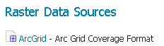
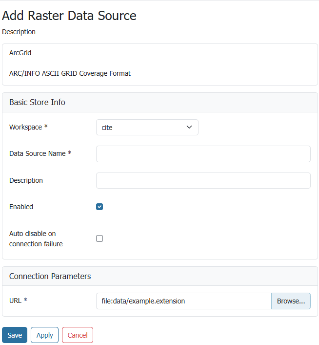

# ArcGrid

!!! note
    GeoServer does not come built-in with support for ArcGrid; it must be installed through an extension. Proceed to [Installing the ArcGrid extension](#arcgrid_install) for installation details.

ArcGrid is a coverage file format created by ESRI.

## Installing the ArcGrid extension {: #arcgrid_install }

1.  Visit the [website download](https://geoserver.org/download) page, locate your release, and download:

    - {{ release }} [geoserver-{{ release }}-arcgrid-plugin.zip](https://sourceforge.net/projects/geoserver/files/GeoServer/{{ release }}/extensions/geoserver-{{ release }}-arcgrid-plugin.zip)
    - {{ snapshot }} [geoserver-{{ snapshot }}-arcgrid-plugin.zip](https://build.geoserver.org/geoserver/main/ext-latest/geoserver-{{ snapshot }}-arcgrid-plugin.zip)

    !!! warning
        Ensure to match plugin (example {{ release }} above) version to the version of the GeoServer instance.

2.  Extract the contents of the archive into the **`WEB-INF/lib`** directory of the GeoServer installation.

## Adding an ArcGrid data store

Once the extension is properly installed **ArcGrid** will be an option in the **Raster Data Sources** list when creating a new data store.

*ArcGrid in the list of raster data stores*

## Configuring a ArcGrid data store

*Configuring an ArcGrid data store*

| **Option**         | **Description** |
|--------------------|-----------------|
| `Workspace`        | Name of the workspace to contain the ArcGrid coverage store. This will also be the prefix of the raster layers created from the store.|
| `Data Source Name` | Name of the ArcGrid coverage store as it will be known to GeoServer. (This can be different from the filename. )|
| `Description`      | A full free-form description of the ArcGrid coverage store.                |
| `Enabled`          | If checked, it enables the store. If unchecked (disabled), no data in the ArcGrid coverage store will be served from GeoServer.|
| `URL`              | Location of the ArcGrid file. This can be an absolute path (such as **`file:C:\Data\raster.asc`**) or a path relative to GeoServer's data directory (such as **`file:data/raster.asc`**). |
