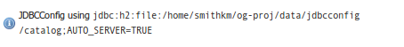

# Installing JDBCConfig {: #community_jdbcconfig_installing }

To install the JDBCConfig module:

1.  Visit the [website download](https://geoserver.org/download) page and download `jdbcconfig`{.interpreted-text role="download_community"}.
2.  Extract this file and place the JARs in `WEB-INF/lib`.
3.  Perform any configuration required by your servlet container, and then restart. On startup, JDBCConfig will create a configuration directory `jdbcconfig` in the [GeoServer data directory](../../datadirectory/index.md).
4.  Verify that the configuration directory was created to be sure installation worked then turn off GeoServer.
5.  Configure JDBCConfig ([JDBCConfig configuration](configuration.md)), being sure to set `enabled`, `initdb`, and `import` to `true`, and to provide the connection information for an empty database.
6.  Start GeoServer again. This time JDBCConfig will connect to the specified database, initialize it, import the old catalog into it, and take over from the old catalog. Subsequent start ups will skip the initialize and import steps unless you re-enable them in `jdbcconfig.properties`.
7.  Log in as admin and a message should appear on the welcome page:

