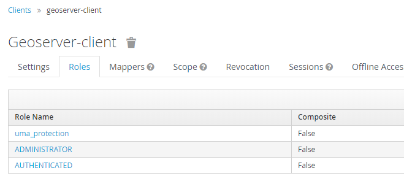
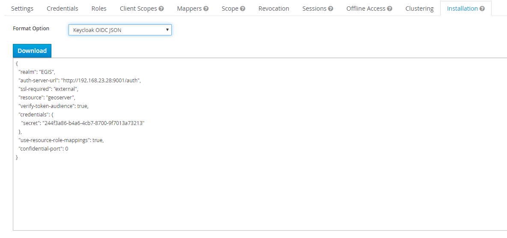
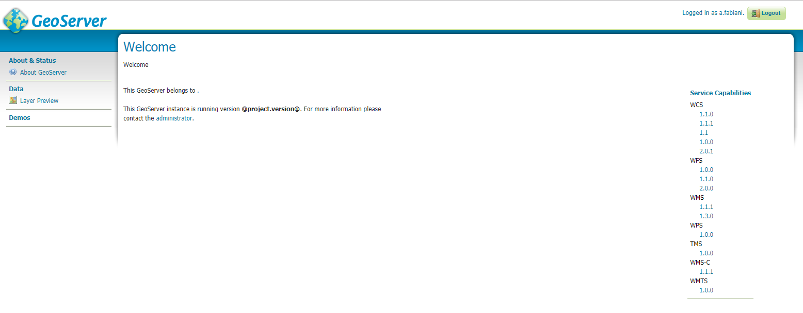

# Authentication with Keycloak {: #security_tutorials_keycloak }

This tutorial introduces GeoServer Keycloak support and walks through the process of setting up authentication against an Keycloak provider. It is recommended that the [Authentication chain](../../security/auth/chain.md) section be read before proceeding.

The GeoServer Keycloak-authn/authz plugin will allow you to use an instance of Keycloak to control access to resources within GeoServer.

## Configuration Instructions

**As the Keycloak Admin:**

!!! note

    In this example the Keycloak service runs on port `80` while GeoServer runs on port `81`

1.  Create a [new client](http://www.keycloak.org/docs/3.3/authorization_services/topics/resource-server/create-client.html) for GeoServer named ``geoserver-client``.

    > 

2.  Make sure to add the base URL of GeoServer to the list of acceptable redirect paths, and add also the Keycloak OIDC endpoint base URI.

    eg:

    :   -   <http://localhost:8181/geoserver>*
        -   <http://localhost:8080/auth/realms/demo/broker/keycloak-oidc/endpoint>*

        

3.  Set the ``access-type`` of client as appropriate. If your GeoServer instance is depending on another service for authentication (eg: NGINX auth plugin) then you should probably select *bearer-only*. Otherwise, you should select *confidential*.

    > 

4.  Add the *ADMINISTRATOR* and *AUTHENTICATED* [client-role](http://www.keycloak.org/docs/2.5/server_admin/topics/roles/client-roles.html) to the ``geoserver-client`` in Keycloak.

    > 

    In this phase you will need to map GeoServer Roles to the ``geoserver-client`` ones in Keycloak.

    > 

    Use the *AUTHENTICATED* one for generic users. Assign this role *ADMINISTRATOR* to the users/groups who should have administrative access to GeoServer.

    > 

5\. Obtain the [installation-configuration](http://www.keycloak.org/docs/3.2/server_admin/topics/clients/installation.html) for the ``geoserver-client`` in JSON, and provide this to the GeoServer Admin for the next steps.

> 

**As the GeoServer Admin:**

!!! note

    In this example the Keycloak service runs on port `80` while GeoServer runs on port `81`

1.  Under the Authentication UI, add a new ``authentication-filter``. Select `ak` from the list of provided options, and name your new filter *keycloak_adapter*. Paste the installation-configuration from the Keycloak-server in the text area provided.

    If not present, be sure to add the following options before clicking `ve`:

    > ``` 
    > "use-resource-role-mappings": true
    > ```
    >
    > 

    The **Enable redirect to Keycloak Login page** checkbox should be checked if the desired behaviour is to authenticate on the web ui only through keycloak. Note that in this case the keycloak filter should be the only one available in the `/web` filter chain. On the contrary if the keycloak filter needs to coexists with other filters on the filter chain and reach it must be unchecked.

    The **Role Source** drop down enable the selection of the desired role source for the user being authenticated through keycloak. If none is selected by default the `Active Role Service` will be used.

2.  Add the `er` to the *web* ``filter-chain`` if you want to protect the Admin GUI, as an instance. If you have checked **Enable redirect to Keycloak Login page** on the filter configuration to be redirected every time to Keycloak, then remove all of the others `rs` (basic, form, rememberme, anonymous).

    > 

3\. Once done navigate to the GeoServer UI. If at filter configuration time the checkbox `Enable redirect to Keycloak Login page` was kept unchecked and the keycloak filter cohexists on the /web chain with the form and anonymous filter you will see a keycloak login button that allows the user to reach the keycloak login page.


Otherwise the user will be directly redirected to the Keycloak ``login-page``, and after logging-in redirected back to the actual GeoServer UI page.

> 
>
> You should verify that the message ``logged in as <USERNAME>`` is posted in the top right corner before continuing.
>
> 

!!! warning

    Workaround in the event of a 403 unauthorized response after logging-in.
    
    Enforce the algorithm RS256 in the keycloak client.
    
    
    
    Copy the public key for the RS256 algorithm from the Realm Settings into the adapter config as:
    
    ``` 
    "realm-public-key": XXXXXXX
    ```
    
    
    
    
