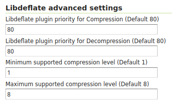

.. _libdeflate:

Libdeflate
==========
Support for alternative Deflate encoder/decoder provided through `libdeflate JNI bindings for Java <https://github.com/astei/libdeflate-java>`_ which provides better performance.

 * Reading can be 10% - 20% faster
 * Writing can be 40% - 60% faster
 
 (Tests have been made on deflate input data stored on SSD disk so neither Disk I/O, nor Network transfer was the bottleneck)

Installation
------------

As a community module, the package needs to be downloaded from the `nightly builds <https://build.geoserver.org/geoserver/>`_,
picking the community folder of the corresponding GeoServer series (e.g. if working on the GeoServer main development branch nightly
builds, pick the zip file form ``main/community-latest``).

To install the module, unpack the zip file contents into the GeoServer ``WEB-INF/lib`` directory and restart GeoServer.

When the community module is not installed, the TIFF Deflate compression/decompression goes through ZLIB based `ZIP Deflater <https://docs.oracle.com/javase/8/docs/api/java/util/zip/Deflater.html>`_ and Inflater counterpart.
Once the community module plugin is installed, TIFF Deflate compression/decompression goes through libdeflate by default. This can be however customized, by changing the plugin priority in the Global Settings page of GeoServer. 

Global Settings
---------------
Default ZIP Deflater compression plugin has priority 50. Libdeflate compression plugin has default priority 80 for both compression and decompression.
Is it possible to fallback to the old plugin for either compression, decompression or both. Go to the Global Settings and set the priority to a value lower than 50.

   Default Libdeflate compression Settings

Finally, during testing phases, we found that, at compression level 9, the old plugin is faster than the new one.
By default, when priority is higher, the Libdeflate compression will be only used for compression levels in the range 1 to 8. These settings can be modified in the above Global Settings too.

Current limitations
-------------------
The current available version is 0.1.0-beta which only contains linux libraries.
