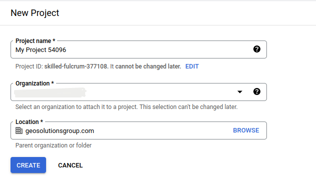
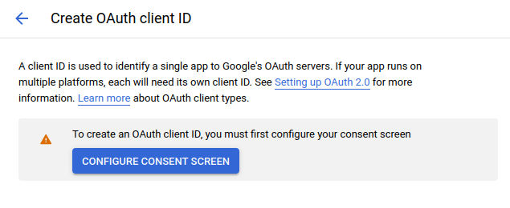
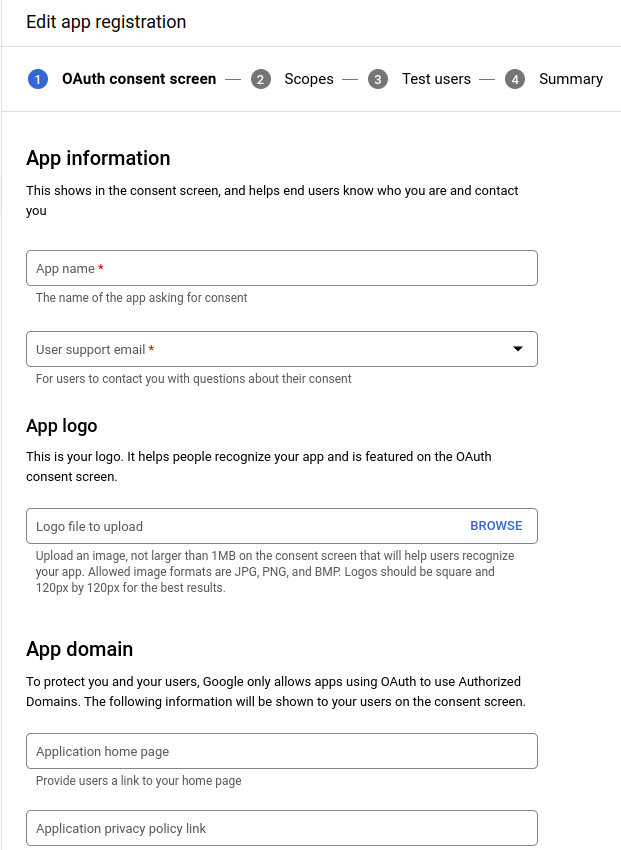
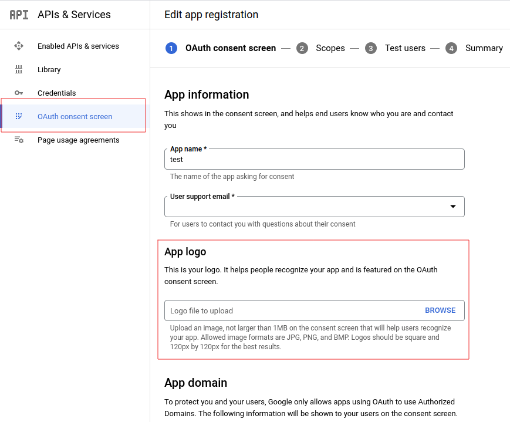

# Configure the Google authentication provider

The first thing to do is to configure the OAuth2 Provider and obtain `Client ID` and `Client Secret` keys.

1.  Obtain OAuth 2.0 credentials from the Google API Console.

    Visit the [Google API Console](https://console.developers.google.com/) to obtain OAuth 2.0 credentials such as a client ID and client secret that are known to both Google and your application. The set of values varies based on what type of application you are building. For example, a JavaScript application does not require a secret, but a web server application does.

    -   Login with a valid Google Account

        

    -   Click on `APIs & Services`

        

    -   Click on `Credentials`

        

        !!! note

            The first time you land here, Google will ask to create at least one project
    
            
    
            For the purpose of this tutorial we will create a sample project. You are free to create other projects or update existing ones through the [Google API Console](https://console.developers.google.com/) later.
    
            
    
            If no `Credentials` are present, you will be asked to create new one.
    
            

2.  Select an existing (or create a new one) `OAuth Client ID`

    

3.  Configure a new `Web application`

    -   If it is the first time you create an `OAuth Client ID`, you will be asked to create a new `consent screen`

        

    -   Customize the `consent screen`

        !!! warning

            This step is mandatory only if it's the first time you are defining a `Web application` on a new project. If you don't have an organization, you can only choose type External from the screen below.

        

    -   Fill the form below and click on `save and continue` untill all tabs are filled.

        

        !!! note

            It can be edited and updated also later (see last point of this section below)

    -   From the credentials page, click on `CREATE CREDENTIALS`> `OAuth Client ID` and select `Application type` -> `Web application`

        !!! warning

            This step is mandatory only if it's the first time you are defining a `Web application` on a new project.

        

    -   Add a `Name` and the `Authorized redirect URIs` like shown here below.

        !!! note

            This sample creates a client working on the default local URL `http://localhost:8080/geoserver`. Of course this will work only on a local instance and can't be used for a production system.
    
            However it is possible to add as many `Authorized redirect URIs` you need to a new `Web application`.
    
            It is also possible to create many `Client credentials` with customised `consent screen` and `Web application`, depending on your specific needs. Every public GeoServer instance (or cluster of GeoServer belonging to a specific project) should have its own specific `Client credentials`.

        

        !!! note

            Always add two entries for each URI. One without the ending `/` and another one with it.

        

4.  Click on `Create` and take note of the `Client ID` and the `Client Secret`.

    At the end of the procedure Google will show-up a small dialog box with the `Client ID` and the `Client Secret`. That info can be always accessed and updated from the [Google API Console](https://console.developers.google.com/)

    

5.  Optionally customize the `OAuth consent screen`.

    At any time it is possible to update and customize the `OAuth consent screen`. You can put here your logo, app name, ToS and so on.

    
