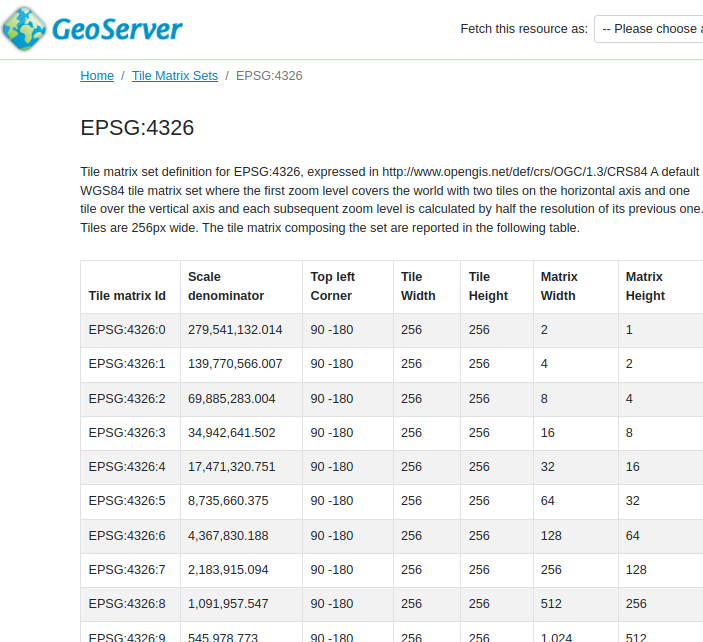

# OGC API - Tiled features demonstration

This module provides an example of extending the OGC API - Features module with a building block from OGC API - Tiles, used for tiled access to raw vector data (the vector tiles modules is included).

This module is not required to use vector tiles, it's also possible to use OGC API - Tiles directly, see [OGC API - Tiles](../tiles/index.md), along with the installation of the vector tiles extension.

## Installing the GeoServer OGC API tiled features module

1.  Download the OGC API nightly GeoServer community module from {{ download_community('ogcapi-tiled-features','snapshot') }}.

    !!! warning

        Verify that the version number in the filename corresponds to the version of GeoServer you are running (for example geoserver-{{ release }}-ogcapi-tiled-features-plugin.zip above).

2.  Extract the contents of the archive into the `WEB-INF/lib` directory of the GeoServer installation.

3.  On restart the services are listed at <http://localhost:8080/geoserver>

## Extensions

Upon installation, the OGC API - Features API will show the following extensions:

-   Conformance classes are expanded with OGC API - Tiles ones

-   Tile matrix sets links from the home page

    
    *Tile matrix EPSG:4326 definition*

-   Collections with vector tiles enabled will have a "data tiles" link pointing at the tiles endpoint

    
    *Data tiles link*
