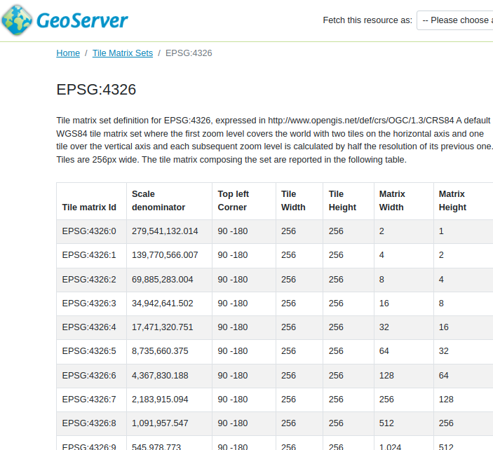
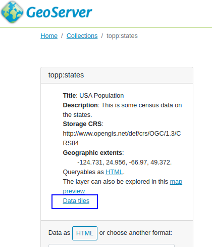

# OGC API - Tiled features demonstration

This module provides an example of extending the OGC API - Features module with a building block from OGC API - Tiles, used for tiled access to raw vector data (the vector tiles modules is included).

This module is not required to use vector tiles, it's also possible to use OGC API - Tiles directly, see [OGC API - Tiles](../tiles/index.md), along with the installation of the vector tiles extension.

## Installing the GeoServer OGC API tiled features module

1.  Login, and navigate to **About & Status > About GeoServer** and check **Build Information** to determine the exact version of GeoServer you are running.

2.  Visit the [website download](https://geoserver.org/download) page, change the **Development** tab, and locate the nightly release that corresponds to the GeoServer you are running.

    Follow the **Community Modules** link and download `ogcapi-tiled-features` zip archive.

    - {{ version }} example: [ogcapi-tiled-features](https://build.geoserver.org/geoserver/main/community-latest/geoserver-{{ version }}-SNAPSHOT-ogcapi-tiled-features-plugin.zip)

    The website lists active nightly builds to provide feedback to developers, you may also [browse](https://build.geoserver.org/geoserver/) for earlier branches.

3.  Extract the contents of the archive into the **`WEB-INF/lib`** directory in GeoServer.

    !!! warning

        Verify that the version number in the filename corresponds to the version of GeoServer you are running (for example geoserver-{{ version }}-ogcapi-tiled-features-plugin.zip above).

4.  Restart GeoServer.

    On restart the services are listed at <http://localhost:8080/geoserver>

## Extensions

Upon installation, the OGC API - Features API will show the following extensions:

- Conformance classes are expanded with OGC API - Tiles ones

- Tile matrix sets links from the home page

  
  *Tile matrix EPSG:4326 definition*

- Collections with vector tiles enabled will have a "data tiles" link pointing at the tiles endpoint

  
  *Data tiles link*
