# Configure the Microsoft Azure authentication provider

We will use Microsoft Entra (Microsoft Azure) for login and either the Azure/Entra ID Token or Microsoft Graph to provide roles.

## Configure Microsoft Entra

1.  Go to [Microsoft Entra](https://entra.microsoft.com/) and login

2.  Click on "App Registration" (left column), then "+ New Registration" (top bar)

    > 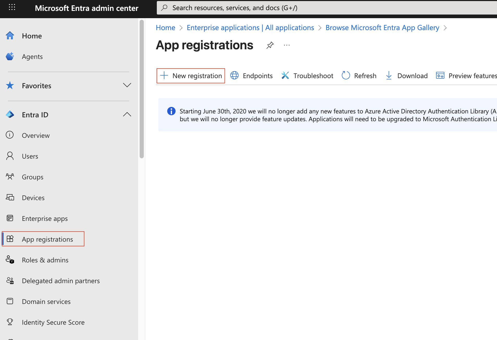

3.  Give the application a name ("gs-azure-app"), set it to the MultiTenant. Use "http://localhost:8080/geoserver/web/login/oauth2/code/microsoft" as the "Web" Redirect URI. Press "Register".

    !!! tip

        The exact redirect URI that GeoServer will use is shown as the read-only **Redirect URI** field in the filter configuration form. In production, use that value instead of `localhost`. See [Redirect Base URI](../configuring.md#community_oidc_redirect_base_uri).
    
        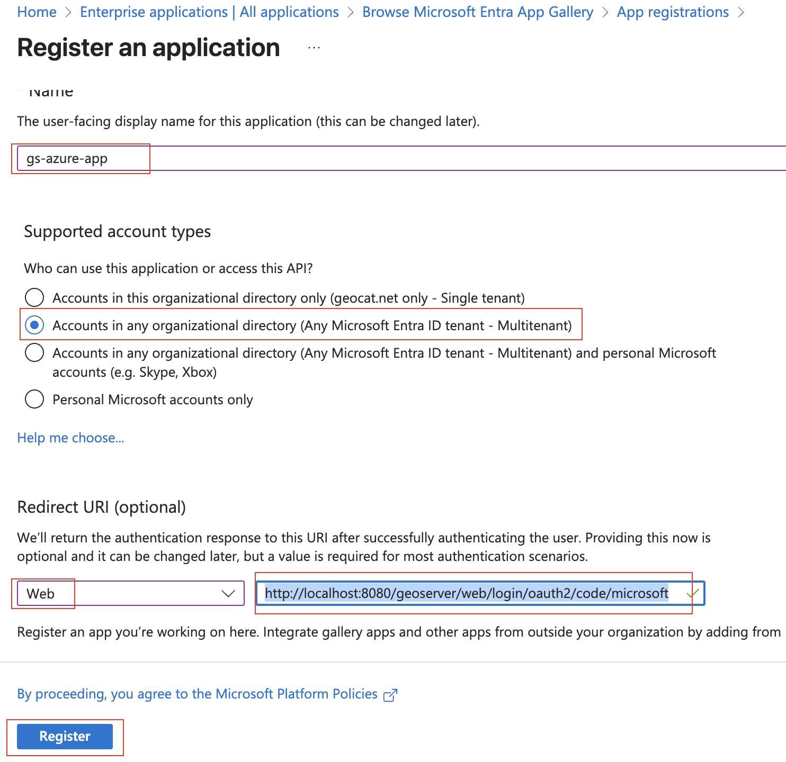

4.  On the app summary screen, press "Certificates & Secrets", "+ New client secret", then press "Add".

    > 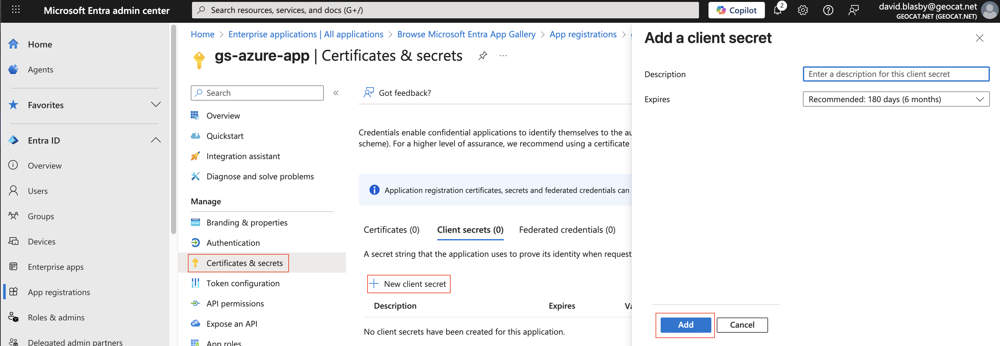

5.  Make sure you copy-and-paste the created Client Secret - you will need this later and you can only access now. Ensure you got the "Value" (not the ID).

    > 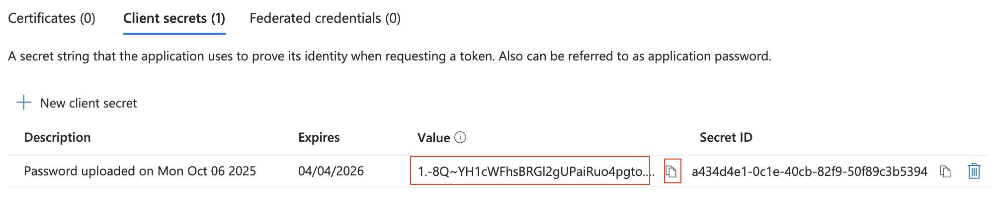

6.  Press "Overview" (left column) and record the "Application (client) ID" - you will need this later.

    > 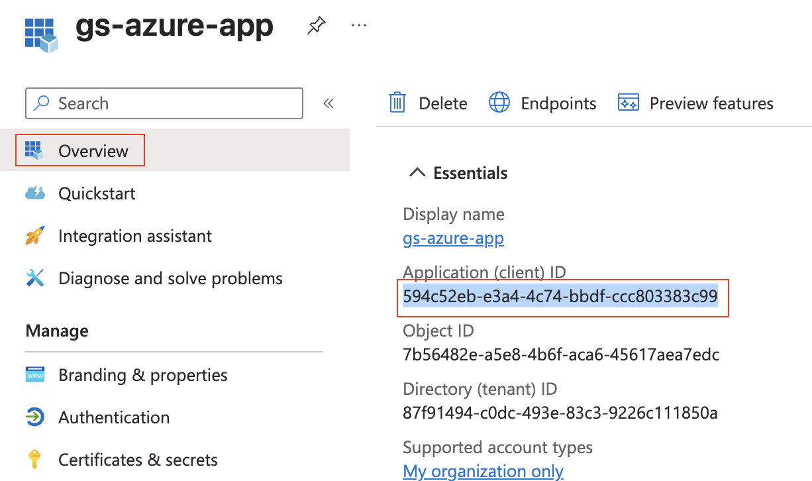

7.  Press "Manifest" (left column), and change ``"groupMembershipClaims":null,`` to ``"groupMembershipClaims": "ApplicationGroup",`` and press "Save". This puts the roles in the ID Token.

    > 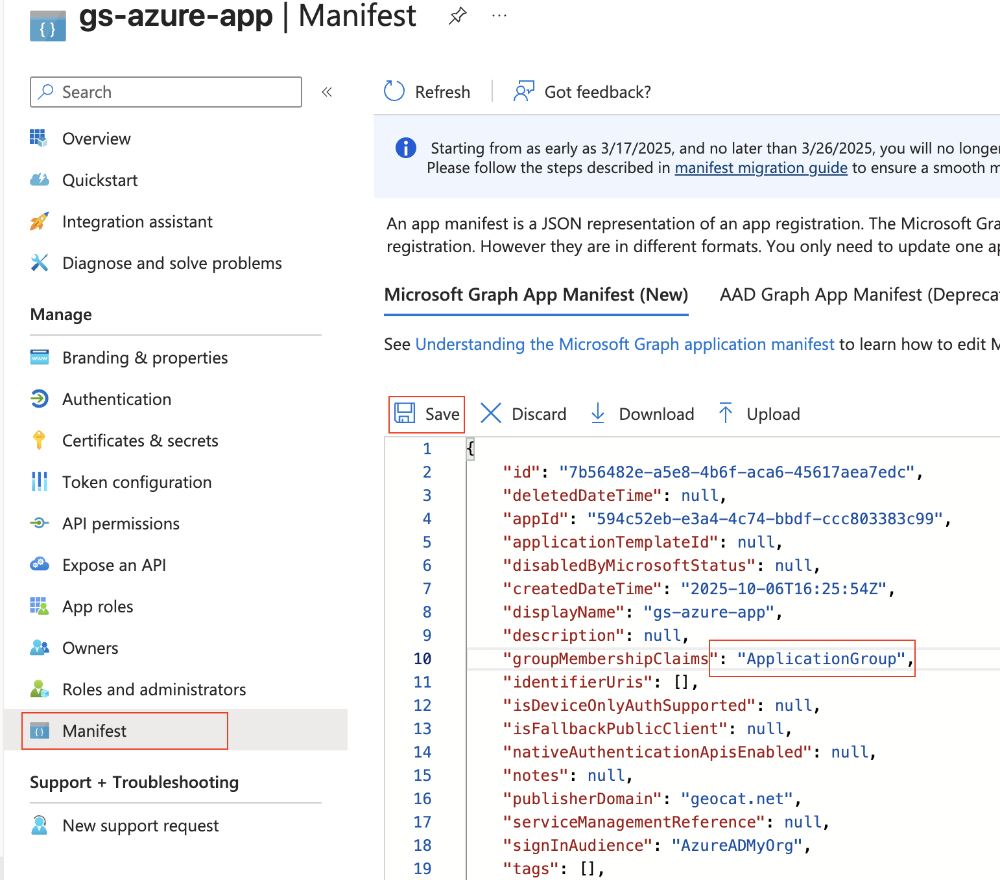

8.  Press "Add roles" (left column), then "+ Create App role", set the "Display name" and "Value" to "geoserverAdmin" and press "Apply".

    > 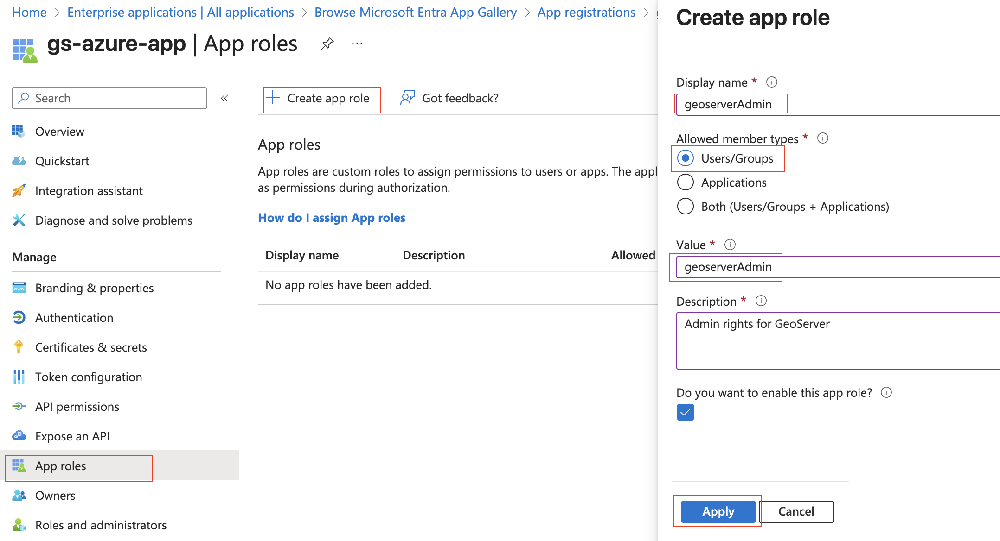

9.  Press "Enterprise Apps" (far left column), choose your application ("gs-azure-app"), and press "Assign users and groups".

    > 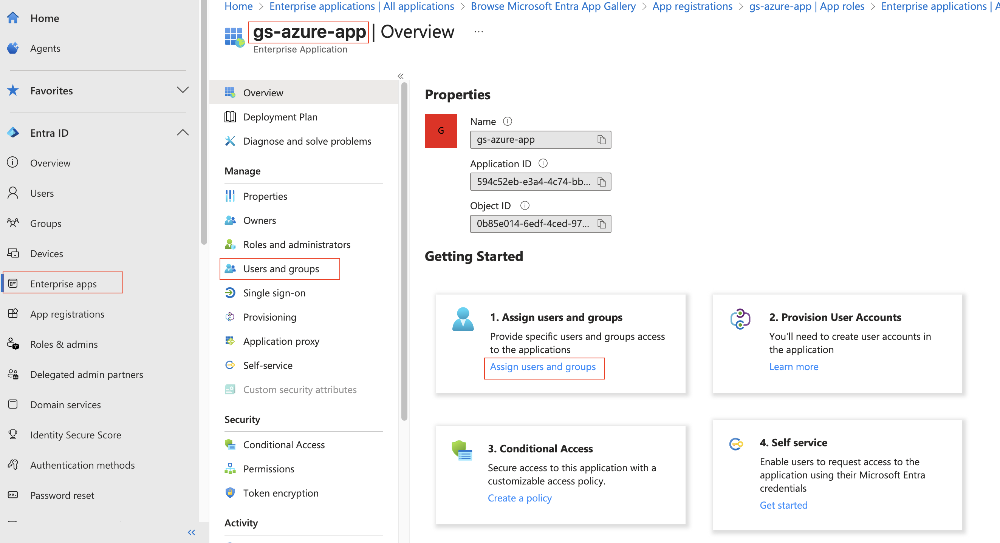

#\. At the top press "+ Add user/group". Under "Users", press "None Selected" and then choose your account. Under "Select a role", keep the selection as "geoserverAdmin". Press "Assign".

> 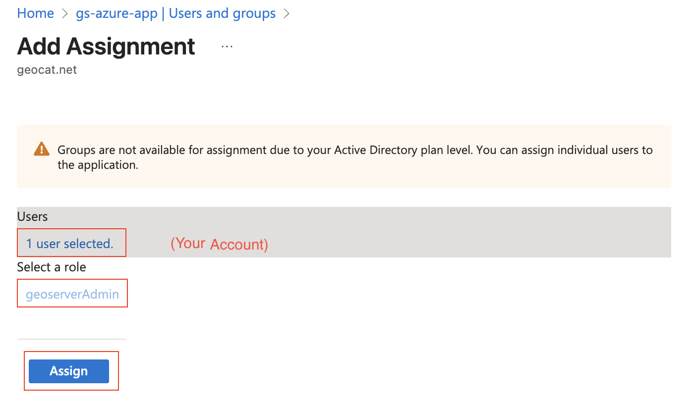

## Configure GeoServer

The next step is to configure your Azure Application as the OIDC IDP for GeoServer.

Ensure you have the following:

1.  Your Client ID ("Application (client) ID"). This is a guid.
2.  Your Client Secret. This is a guid.
3.  Name of the geoserver admin Role ("geoserverAdmin")

### Create the OIDC Filter

1.  Login to GeoServer as an Admin

2.  On the left bar under "Security", click "Authentication", and then "OpenID Connect Login"

    > 

3.  Give the it a name like "oidc-azure", then from the **Provider** dropdown select **Microsoft Azure**.

4.  Fill in the required information:

    - "Client Id" is the Azure "Application (client) ID"
    - "Client Secret" which was copied Zzure when you created it.

    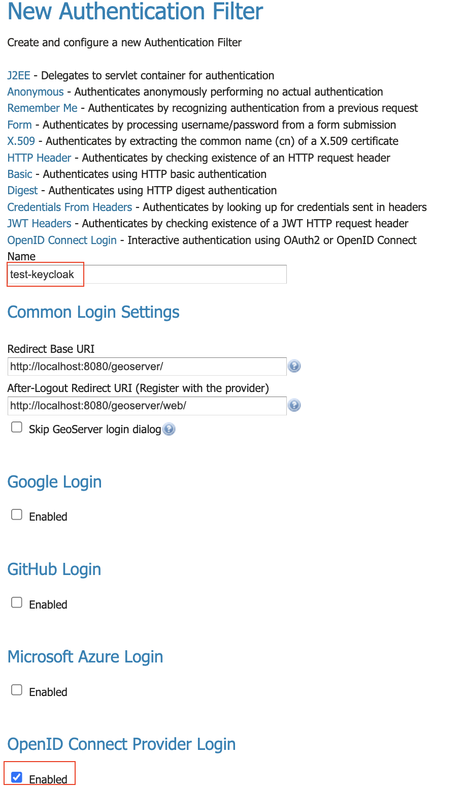

5.  Press Save

### Configure Role Role Source (ID Token)

When we configured Azure, we had it attach the roles to the ID token. We can use that to assign roles inside GeoServer.

1.  Edit your "oidc-azure" security filter.

2.  At the bottom, under "Authorization/Role source", choose "ID Token".

    > - Use "roles" as the JSON Path
    > - Use "geoserverAdmin=ROLE_ADMINISTRATOR" as the Role Converter
    > - Tick the "Only allow External Roles that are explicitly named above"
    > - Press Save

### Configure Role Role Source (MS Graph) - Application Roles

Before you can use the MS Graph for permissions, you must give the app you created more permissions.

#### Setting up Azure

We need to setup azure so GeoServer can access the MSGraph and get the roles/groups the user is assigned to.

**NOTE:** in the ID token, the roles name is used (i.e. "geoserverAdmin"). However, in MSGraph, the role's ID is used (a guid).

1.  Login in to <https://entra.microsoft.com/>

2.  Got to "App registration" (far left column), choose your application ("gs-azure-ap"), choose "API Permissions" (left column), then press "+ Add a permission".

    > 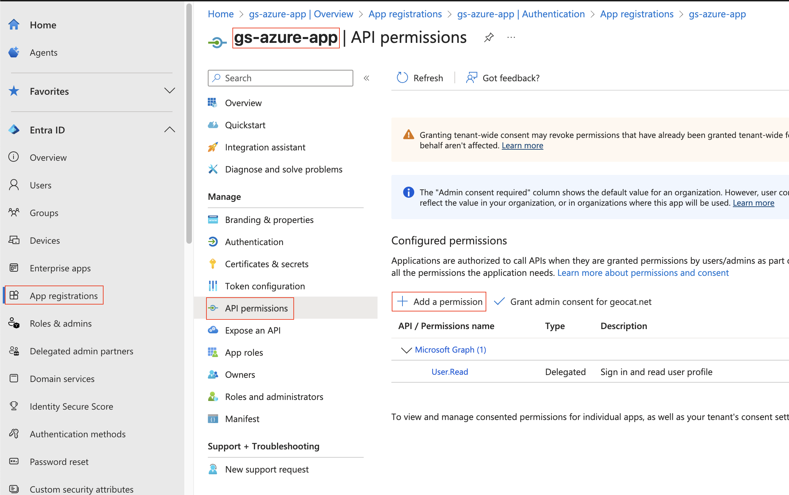

3.  Choose "Microsoft Graph"

    > 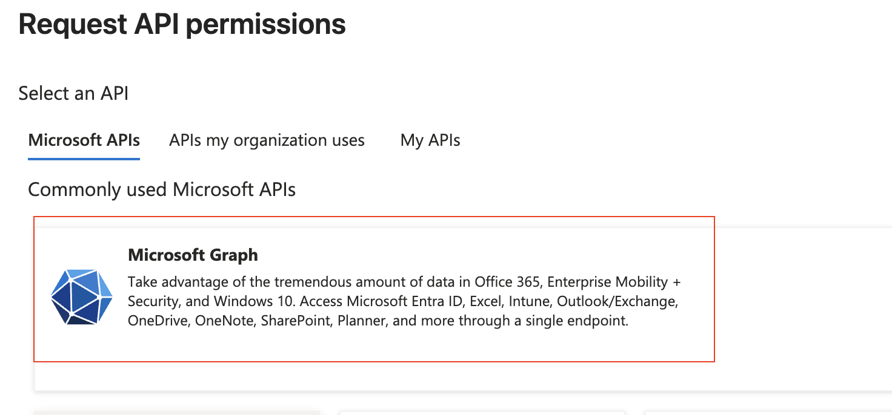

4.  Then add the "GroupMember.Read.All" and "RoleManagement.Read.Directory" permissions and press "Add permissions"

    > - At the top, select "Delegated permissions"
    > - Scroll down to "GroupMember" and select "GroupMember.Read.All"
    > - Scroll down to "RoleManagement" and select "RoleManagement.Read.Directory"
    >
    > 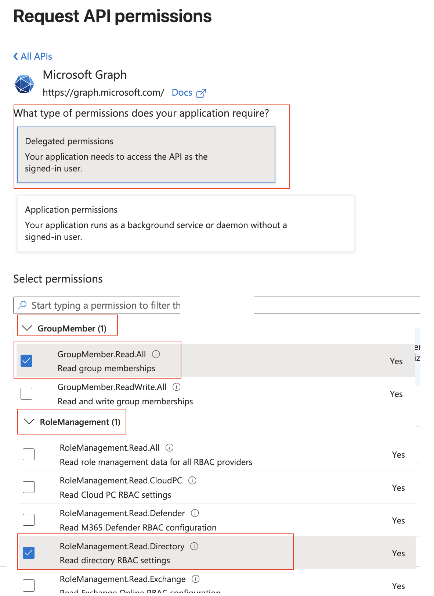

5.  On the "Api permissions" screen, press "Grant admin consent for \..."

    > - This will pop-up a confirmation - press "Yes"
    >
    > 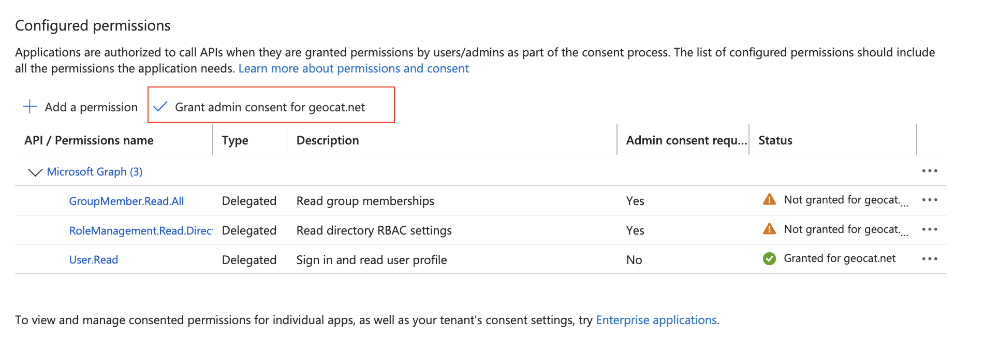

6.  On the left column, press "App roles" and copy the ID for the "geoserverAdmin" role (its a guid). You will need this in the next step.

    > 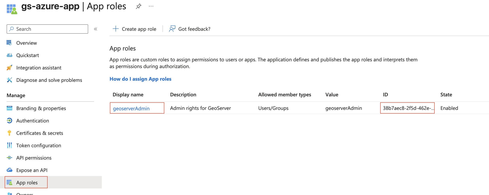

#\. On the far left column, press "Enterprise Apps", choose your application ("gs-azure-app"), and copy the "Object ID" (**not** the Application ID). You will need this in the next step.

> 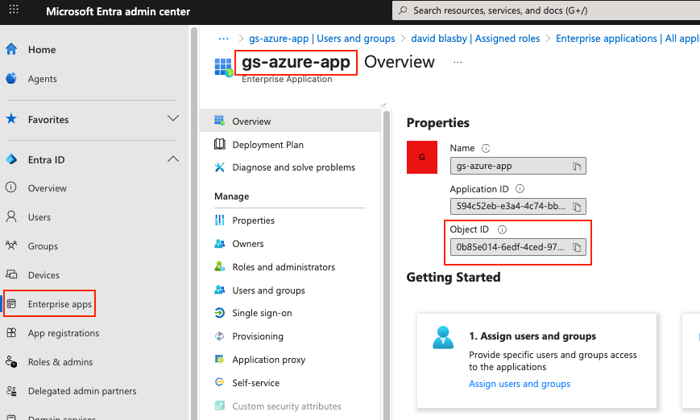

#### Setting up GeoServer

You will need:

> - "geoserverAdmin" role id (GUID)
> - Your enterprise application's Object ID (GUID). This is **NOT** the Client ID.

1.  Login into GeoServer as the ROLE_ADMINISTRATOR
2.  On the left, go to "Security"->"Authentication", and click on your OIDC filter ("oidc-azure")

#\. Scroll down to the "Authorization" section

> - Choose "Microsoft Graph (Entra ID)"
> - Turn on "Get Roles from the User's Application Roles (MSGraph appRoleAssignments endpoint)". GeoServer will retrieve the user's roles from the MSGraph's "appRoleAssignments". These roles are the Role ID (GUID) **not** the name of the role.
> - In the "Object Id for the Azure Enterprise Application (NOT the Client Id)" box, put in your enterprise application's Object ID (GUID).
> - In the converter map, use the role id (guid) for "geoserverAdmin" (found above) and put in "<your geoserverAdmin GUID>=ROLE_ADMINISTRATOR"
> - Press Save
>
> 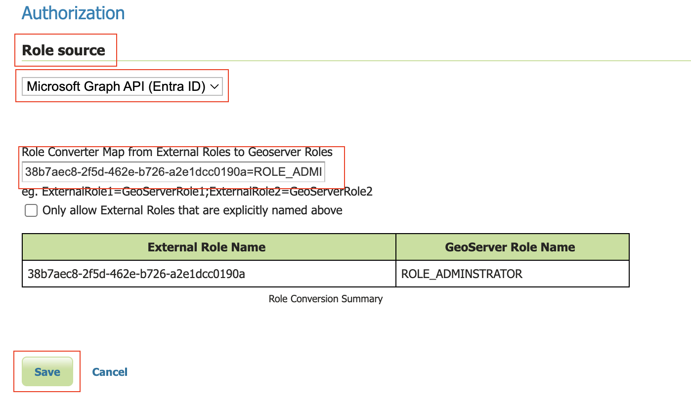

## Notes

See [troubleshooting](../advanced.md#community_oidc_troubleshooting).

1.  Typical MS ID Token. Note that the roles have been put in the "roles" claim.

    > ``` json
    > {
    >     "aud": "594c52eb-e3a4-4c74-bbdf-ccc803383c99",
    >     "iss": "https://login.microsoftonline.com/87f91494-c0dc-493e-83c3-9226c111850a/v2.0",
    >     "iat": 1759773505,
    >     "nbf": 1759773505,
    >     "exp": 1759777405,
    >     "email": "david.blasby@geocat.net",
    >     "name": "david blasby",
    >     "nonce": "m3HsvD9JqU4uWbP1oPzP3Wb-n5u-aXdJAd",
    >     "oid": "6ac682b6-6048-4eb6-b4ca-2538e33cc",
    >     "preferred_username": "david.blasby@geocat.net",
    >     "rh": "1.AV8AlBT5h9zAPkmDw5ImwRGFCutSTFmk43RMu9_PAXZfAA.",
    >     "roles": [
    >         "geoserverAdmin"
    >     ],
    >     "sid": "009988c9-ae02-a521-d4cc-9aaf1a722",
    >     "sub": "oV3o_mu_PccTipAPJSpLJxzdzV2LKZv8mDQauGnY",
    >     "tid": "87f91494-c0dc-493e-83c3-9226c10a",
    >     "uti": "DfmjGZesdUODrGNYAA",
    >     "ver": "2.0"
    > }
    > ```
