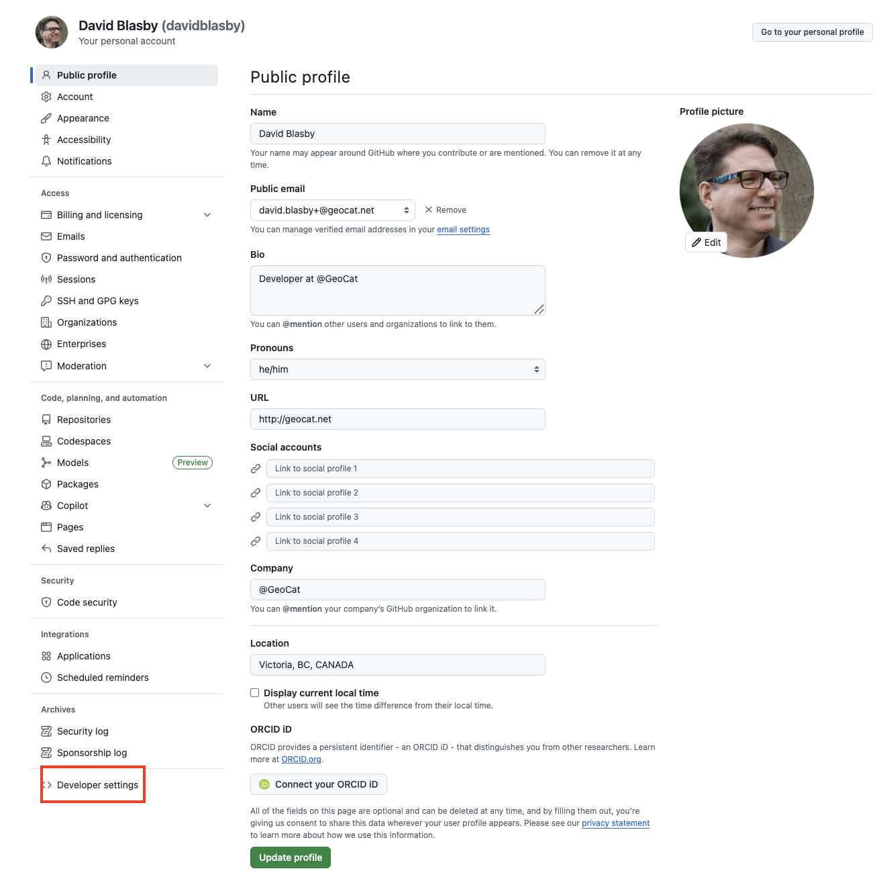
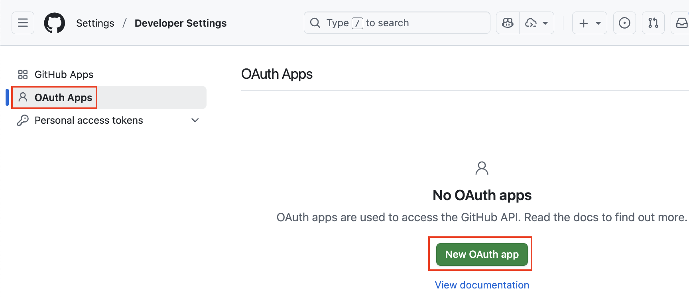
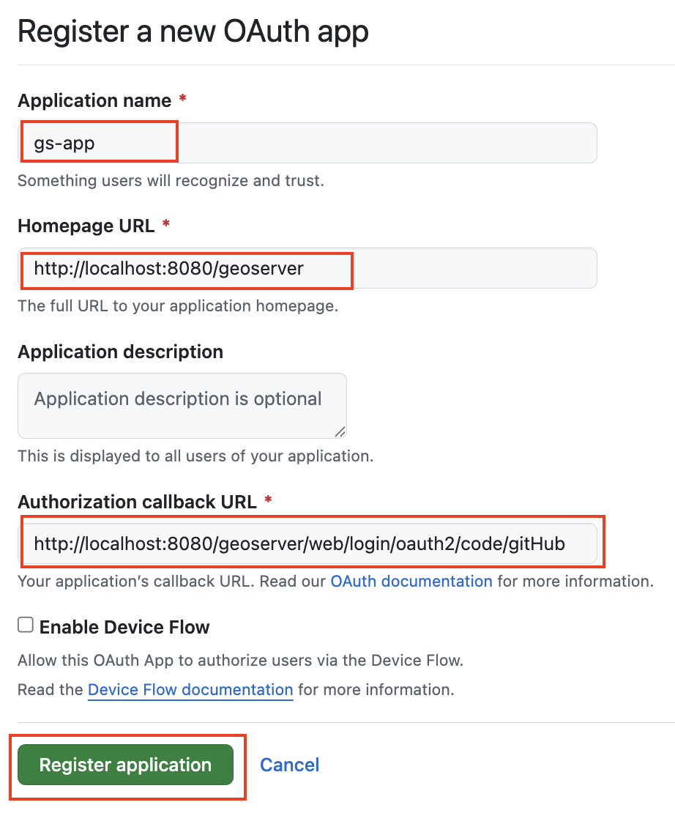
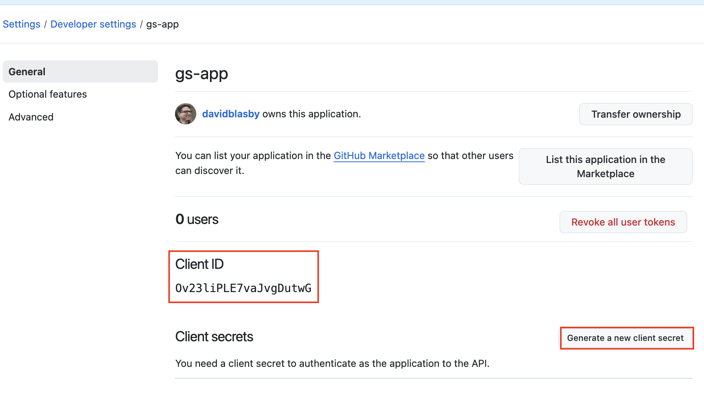
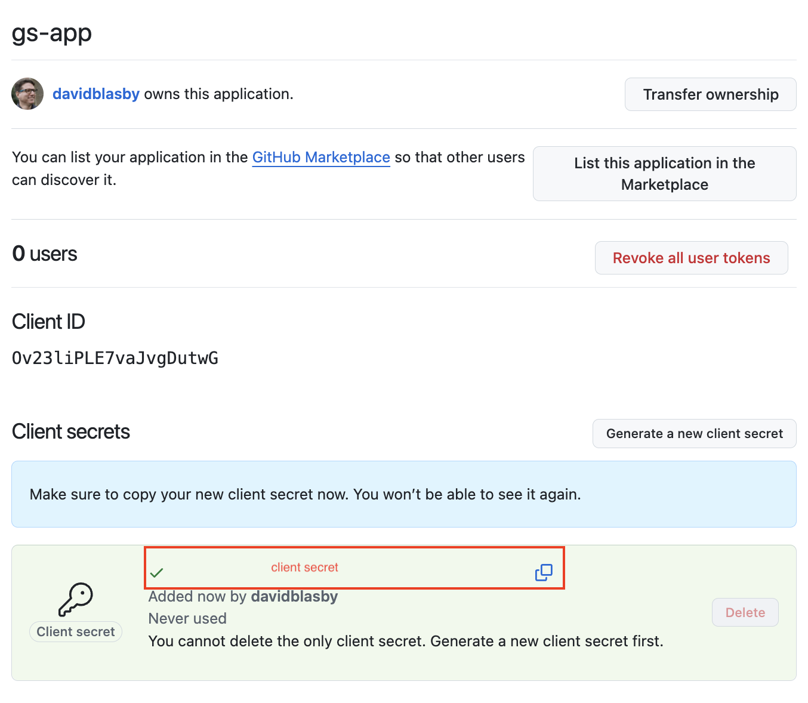
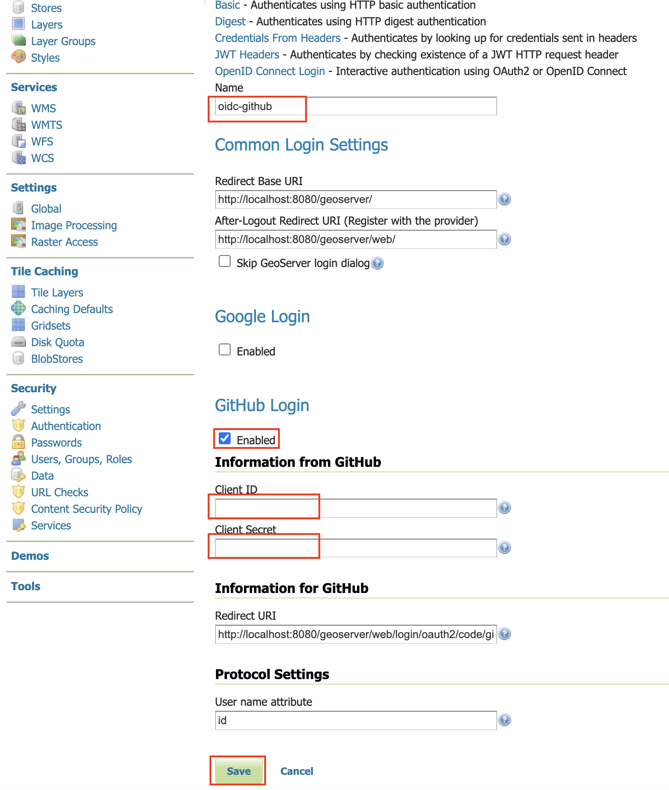
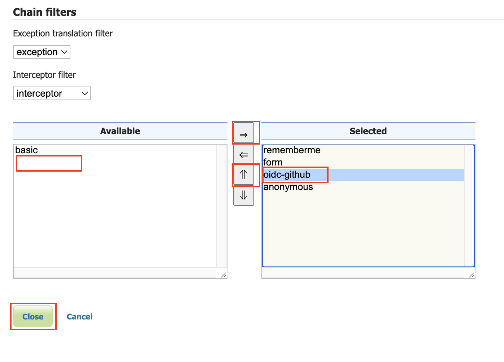
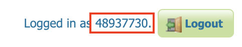

# Configure the GitHub authentication provider

The first thing to do is to configure the OAuth2 Provider and obtain `Client ID` and `Client Secret` keys.

## Configure the GitHub IDP

1.  Go to your [GitHub settings](https://github.com/settings/profile)

2.  At the very bottom of the left bar, click "<> Developer Settings"

    > 

3.  On the left, press "OAuth Apps" and then "New OAuth app"

    > 

4.  Give the application:

    - A name (i.e. "gs-app")
    - The homepage of the geoserver (i.e. "http://localhost:8080/geoserver")
    - The authorization callback in the form of "http://localhost:8080/geoserver/web/login/oauth2/code/gitHub"
    - Press "Register application"

    > 

5.  You will be taken to the application page. Record the "Client ID" (you will need this in the GeoServer configuration)

    > 

6.  Press "Generate a new client secret"

    > 

7.  Record the client secret (you will need this in the GeoServer configuration)

8.  At the very bottom (scroll down), press "Update Application"

## Configure GeoServer

The next step is to configure your Google application as the OIDC IDP for GeoServer.

### Create the OIDC Filter

> - Login to GeoServer as an Admin
>
> - On the left bar under "Security", click "Authentication", and then "OpenID Connect Login"
>
>   > 
>
> - Give the it a name like "oidc-github", then click the "GitHub Login" checkbox and copy-and-paste in the Client ID and Client Secret (from when you configured the github client).
>
>   > 
>
> - Go down to the bottom and configure the role source (if you want) - see [role source](../role-config.md). NOTE: GitHub's access token in Opaque (not a JWT) and it does NOT supply an ID Token (it is OAUTH2, not OIDC).
>
> - Press "Save"

### Allow Web Access (Filter Chain)

> * On the left bar under "Security", click "Authentication", and then click "Web" under "Filter Chains"
>
> > 
> >
> > - Scroll down, and move the new GitHub OIDC Filter to the Selected side by pressing the "->" button.
> >
> > 
> >
> > - Move the new GitHub OIDC Filter above "anonymous" by pressing the up arrow button (See above diagram).
> > - Press "Close"
> > - Press "Save"

## Notes

See [troubleshooting](../advanced.md#community_oidc_troubleshooting).

1.  When you login, your username will be a number. For privacy reasons, GitHub does not usually include the email address of the user!

    > 

2.  GitHub's Access Token is opaque, so [configure roles](../role-config.md)

3.  GitHub is OAUTH2-only (not OIDC) so it does **not** have an ID Token

4.  GitHub does have userinfo

Example GitHub UserInfo:

> ``` json
> {
>     "login" : "davidblasby",
>     "id" : 4893,
>     "node_id" : "MDQ6VXNlcj",
>     "avatar_url" : "https://avatars.githubusercontent.com/u/48937?v=4",
>     "gravatar_id" : "",
>     "url" : "https://api.github.com/users/davidblasby",
>     "html_url" : "https://github.com/davidblasby",
>     "followers_url" : "https://api.github.com/users/davidblasby/followers",
>     "following_url" : "https://api.github.com/users/davidblasby/following{/other_user}",
>     "gists_url" : "https://api.github.com/users/davidblasby/gists{/gist_id}",
>     "starred_url" : "https://api.github.com/users/davidblasby/starred{/owner}{/repo}",
>     "subscriptions_url" : "https://api.github.com/users/davidblasby/subscriptions",
>     "organizations_url" : "https://api.github.com/users/davidblasby/orgs",
>     "repos_url" : "https://api.github.com/users/davidblasby/repos",
>     "events_url" : "https://api.github.com/users/davidblasby/events{/privacy}",
>     "received_events_url" : "https://api.github.com/users/davidblasby/received_events",
>     "type" : "User",
>     "user_view_type" : "private",
>     "site_admin" : false,
>     "name" : "David Blasby",
>     "company" : "@GeoCat",
>     "blog" : "http://geocat.net",
>     "location" : "BC, CANADA",
>     "email" : "david.blasby+@geocat.net",
>     "hireable" : null,
>     "bio" : "Developer at @GeoCat",
>     "twitter_username" : null,
>     "notification_email" : "david.blasby+@geocat.net",
>     "public_repos" : 23,
>     "public_gists" : 0,
>     "followers" : 4,
>     "following" : 0,
>     "created_at" : "2019-03-26T04:03:17Z",
>     "updated_at" : "2025-10-01T18:36:02Z",
>     "private_gists" : 0,
>     "total_private_repos" : 0,
>     "owned_private_repos" : 0,
>     "disk_usage" : 2095,
>     "collaborators" : 0,
>     "two_factor_authentication" : true,
>     "plan" : {
>         "name" : "free",
>         "space" : 97656,
>         "collaborators" : 0,
>         "private_repos" : 10000
>     }
> }
> ```
