# Configure the Google authentication provider

The first thing to do is to configure the OAuth2 Provider and obtain `Client ID` and `Client Secret` keys.

## Configure the Google IDP

1.  Obtain OAuth 2.0 credentials from the Google API Console.

    Visit the [Google API Console](https://console.developers.google.com/) to obtain OAuth 2.0 credentials such as a client ID and client secret that are known to both Google and your application. The set of values varies based on what type of application you are building. For example, a JavaScript application does not require a secret, but a web server application does.

    - Login with a valid Google Account

    - Click on `Create project`

      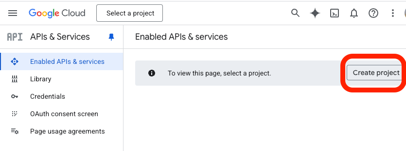

    - give the project a name like `geoserver-oidc` and press "Create"

      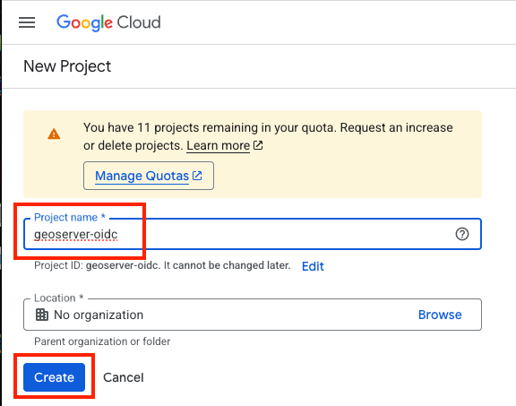

    - Click on `Credentials` (left column)

      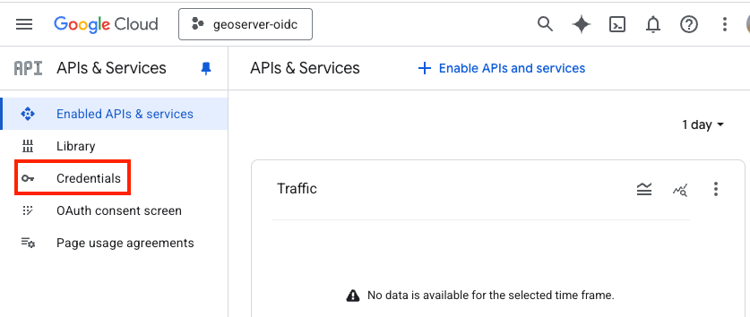

    - Click on "+ Create credentials" (top bar)

      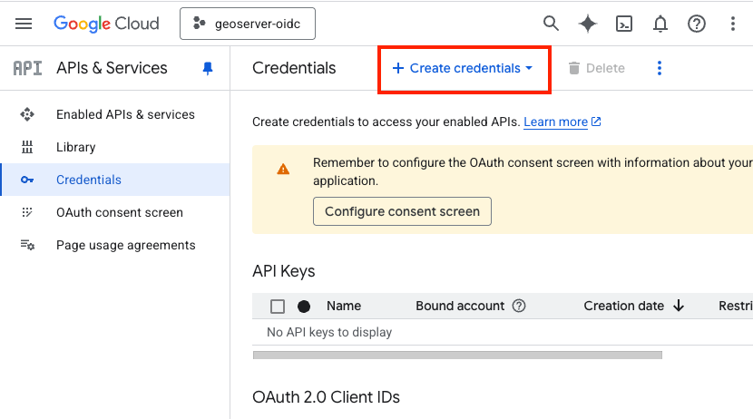

    - Choose "OAuth client ID"

      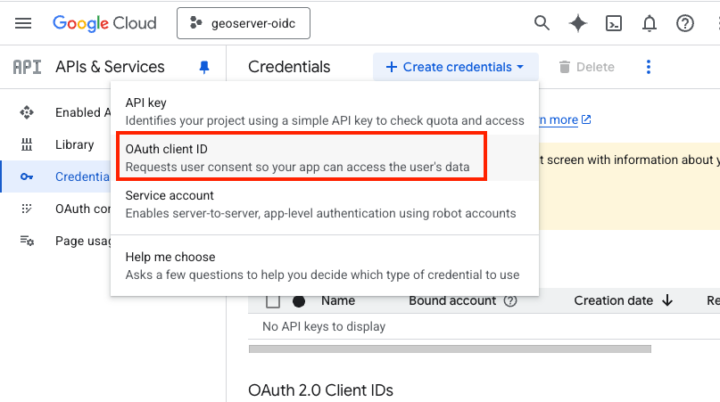

    - Click on "Configure consent Screen"

      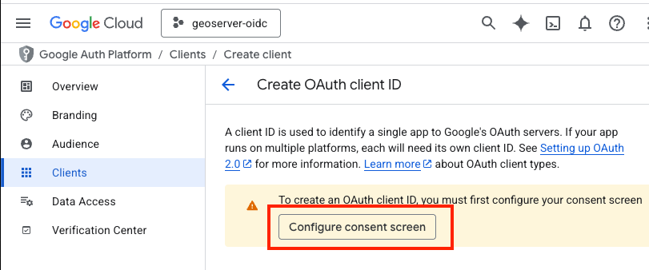

    - Press "Get Started"

      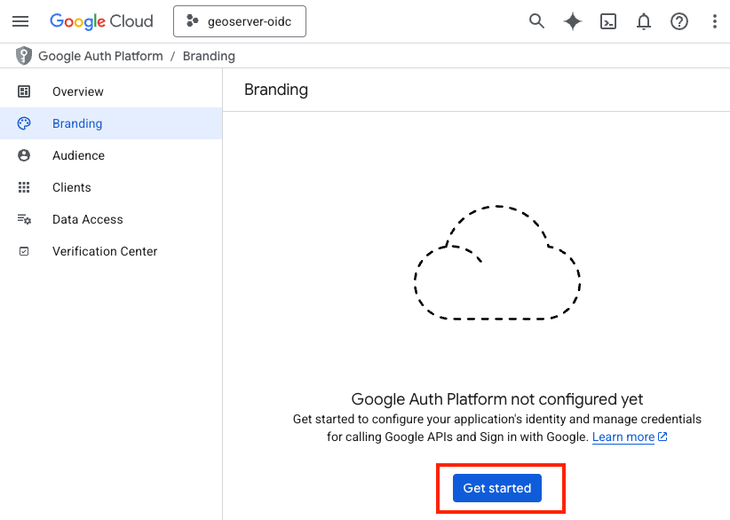

    - Type in an "App name" (like "test-gs"), choose your Email address, and then press "Next"

      > 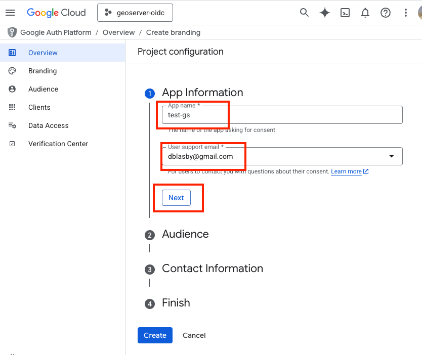

    - In the Audience section, choose "External" then press "Next"

      > 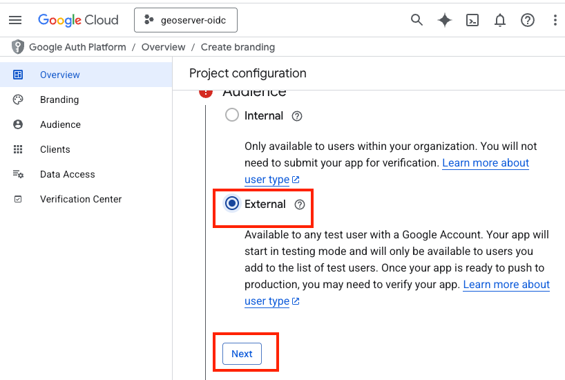

    - Type in a contact email, then press "Next"

      > 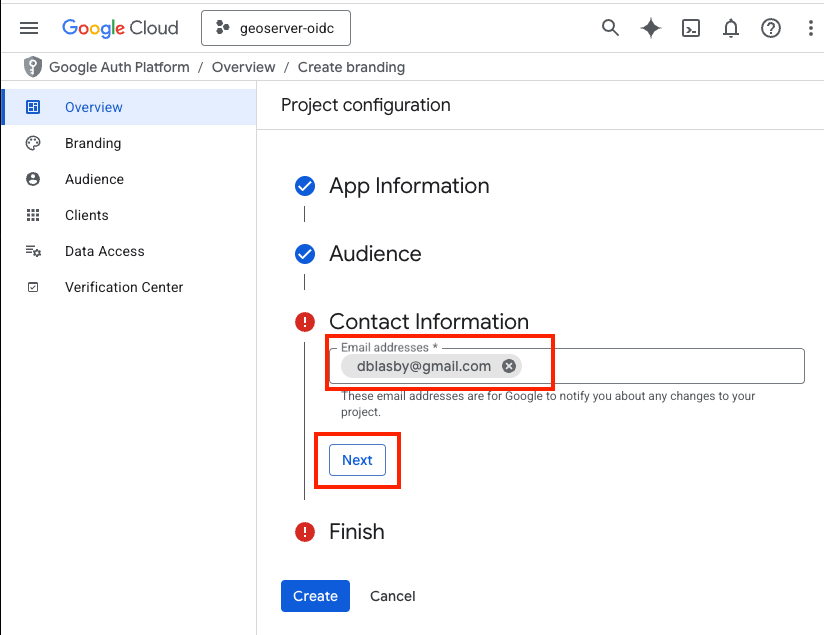

    - Agree to the terms, then press "Continue", and then "Create"

      > 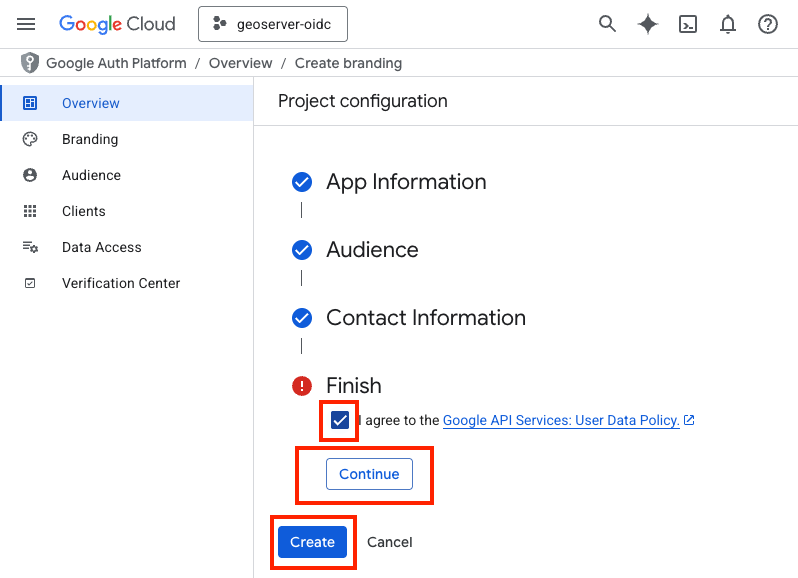

    - Go to Clients (Left Bar), press the 3-vertical-dots ,and then press "+ Create Client"

      > 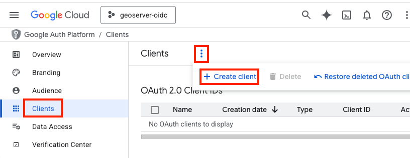

    - Choose "Web Application" and name the web application (i.e. "gs test app")

      > 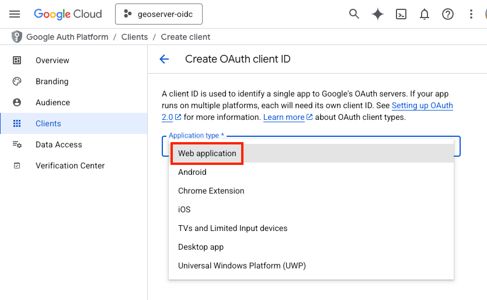

    * Go down to "Authorized redirect URIs" and press "+ Add URI", type in "http://localhost:8080/geoserver/web/login/oauth2/code/google", then press "Create"

    > 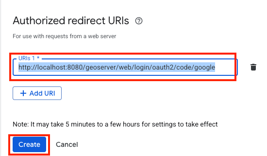

    !!! tip

        The exact redirect URI that GeoServer will use is shown as the read-only **Redirect URI** field in the filter configuration form. In production, use that value instead of `localhost`. See [Redirect Base URI](../configuring.md#community_oidc_redirect_base_uri).

    - Record your Client ID and Client Secret, then press "Ok"

      - **You will not be able to retrieve your client secret once you press "ok"**

      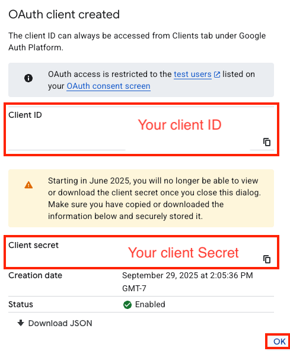

    - Go to "Audience" (left bar), go down to "Test Users", press "+Add users", and add your google email as the test user.

      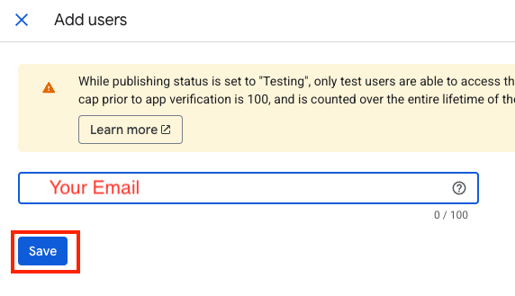

    - Press Save

## Configure GeoServer

The next step is to configure your Google application as the OIDC IDP for GeoServer.

### Create the OIDC Filter

> - Login to GeoServer as an Admin
>
> - On the left bar under "Security", click "Authentication", and then "OpenID Connect Login"
>
>   > 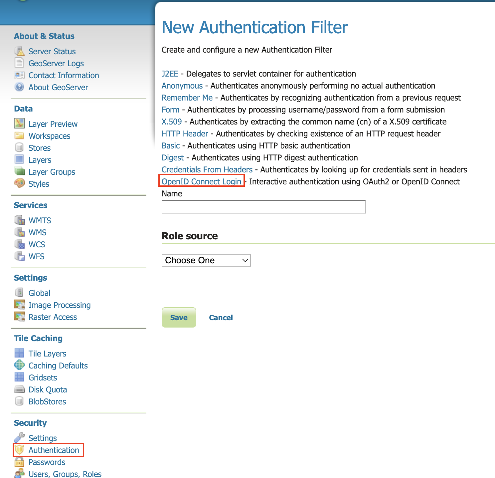
>
> - Give the it a name like "test-google", then from the **Provider** dropdown select **Google** and copy-and-paste in the Client ID and Client Secret (from when you configured the google client).
>
>   > 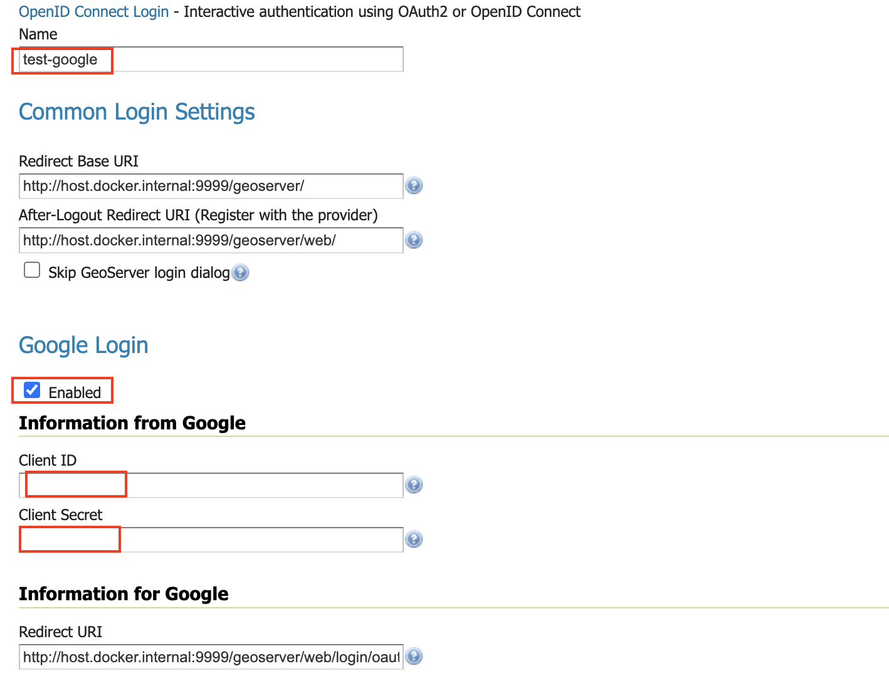
>
> - Go down to the bottom and configure the role source (if you want) - see [role source](../role-config.md)
>
> - Press "Save"

### Allow Web Access (Filter Chain)

> * On the left bar under "Security", click "Authentication", and then click "Web" under "Filter Chains"
>
> > 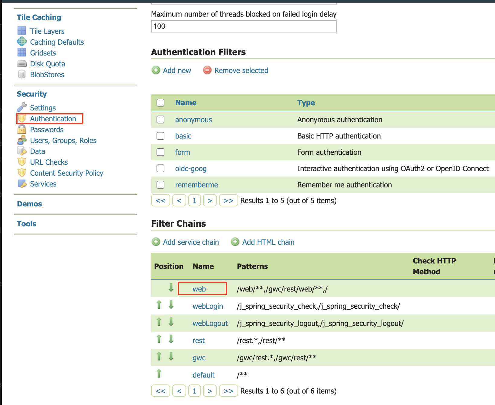
> >
> > - Scroll down, and move the new Google OIDC Filter to the Selected side by pressing the "->" button.
> >
> > 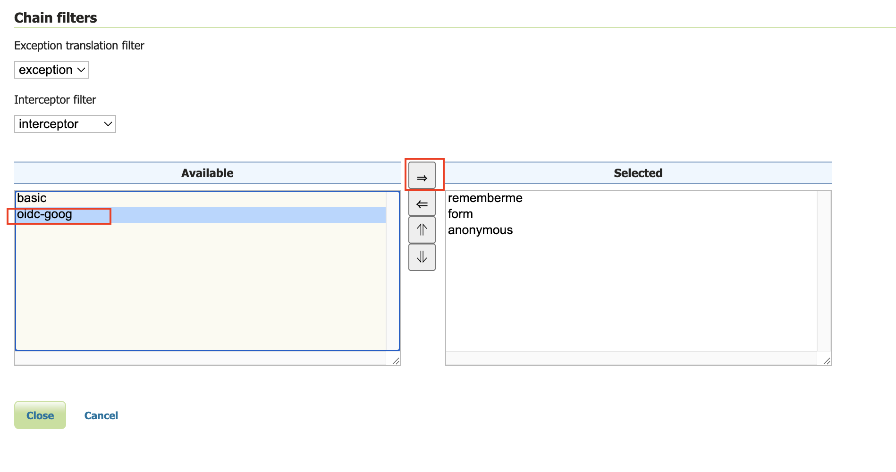
> >
> > - Move the new Google OIDC Filter above "anonymous" by pressing the up arrow button.
> >
> > 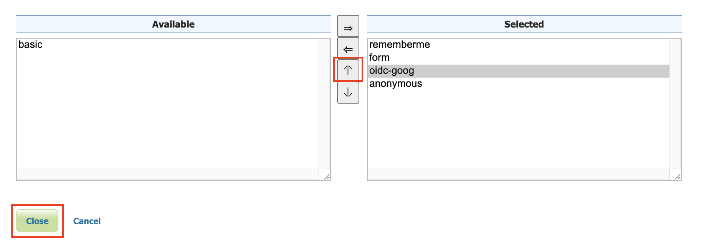
> >
> > - Press "Close"
> > - Press "Save"

## Notes

See [troubleshooting](../advanced.md#community_oidc_troubleshooting).

1.  Google's Access Token is opaque, so [configure roles](../role-config.md) via the ID Token

2.  Google's ID Token does not contain very much info

    > ``` json
    > {
    >    "iss": "https://accounts.google.com",
    >    "azp": "...",
    >    "aud": "...",
    >    "sub": "..",
    >    "email": "dblasby@gmail.com",
    >    "email_verified": true,
    >    "at_hash": "1iKn2vPzlGpK-aY2n3",
    >    "nonce": "Gi-fBHjrpUdC3o8K6zYhIbEdv1Jz6Zu0IF3sIT",
    >    "name": "David Blasby",
    >    "picture": "https://lh3.googleusercontent.com/a/ACg8ocLEhY",
    >    "given_name": "David",
    >    "family_name": "Blasby",
    >    "iat": 175,
    >    "exp": 175
    > }
    > ```
