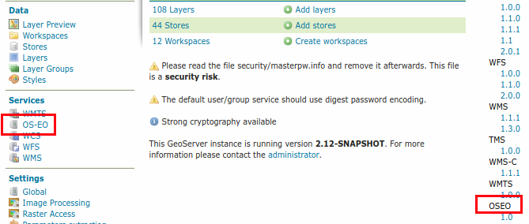

---
render_macros: true
---

# Installing the OpenSearch for EO module

The installation of the module requires several steps:

- Setting up a PostGIS database with the required schema
- Install the OpenSearch for EO plugin and configure it
- Fill the database with information about collection and metadata

## Setting up the PostGIS database

Create a PostgreSQL database and run the following SQL script:

    https://raw.githubusercontent.com/geoserver/geoserver/main/src/community/oseo/oseo-core/src/test/resources/postgis.sql

```sql
<!-- Include path goes outside docs directory: ../../../../src/community/oseo/oseo-core/src/test/resources/postgis.sql -->
<!-- TODO: Copy file to docs directory or use alternative approach -->
```

## Downloading and installing the OpenSearch extension

This module is a community module pending graduation, and is available alongside the official release for production testing.

1.  Login, and navigate to **About & Status > About GeoServer** and check **Build Information** to determine the exact version of GeoServer you are running.

2.  Visit the [website download](https://geoserver.org/download) page, change the **Archive** tab, and locate your release.

    From the list of **Pending** community plugins download **OpenSearch (EO)**.

    - {{ release }} example: [opensearch-eo-plugin](https://sourceforge.net/projects/geoserver/files/GeoServer/opensearch-eo-plugin)
    - {{ version }} example: [opensearch-eo-plugin](https://build.geoserver.org/geoserver/main/ext-latest/geoserver-{{ version }}-SNAPSHOT-opensearch-eo-plugin-plugin.zip)

    The website lists community modules for active nightly builds providing feedback to developers, you may also [browse](https://build.geoserver.org/geoserver/) for earlier versions.

3.  Download the plugin zip file, and unzip its contents in the GeoServer unpacked WAR lib directory, e.g., **`geoserver/WEB-INF/lib`**

4.  Restart GeoServer

    
    *The GeoServer home page after the OpenSearch for EO module installation.*
