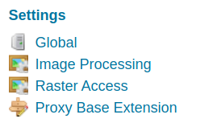

# Installing the Proxy Base extension

The Proxy Base extension is listed among the other extension downloads on the GeoServer download page.

The installation process is similar to other GeoServer extensions:

1.  Visit the [website download](https://geoserver.org/download) page, locate your release, and download: {{ download_extension('proxy-base-ext') }} (nightly {{ download_extension('proxy-base-ext','snapshot') }})

    Verify that the version number in the filename (for example {{ release }} above) corresponds to the version of GeoServer you are running.

2.  Extract the contents of the archive into the **`WEB-INF/lib`** directory in GeoServer. Make sure not to create any sub-directories during the extraction process.

3.  Restart GeoServer.

On successful installation, a new Proxy Base Extension entry will appear in the left menu, under "Settings".

*The Proxy Base Extension menu entry*
