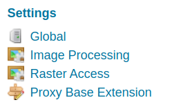

---
render_macros: true
---

# Installing the Proxy Base extension

The Proxy Base extension is listed among the other extension downloads on the GeoServer download page.

The installation process is similar to other GeoServer extensions:

1.  Login, and navigate to **About & Status > About GeoServer** and check **Build Information** to determine the exact version of GeoServer you are running.

2.  Visit the [website download](https://geoserver.org/download) page, change the **Development** tab, and locate the nightly release that corresponds to the GeoServer you are running.

    Follow the **Community Modules** link and download `proxy-base-ext` zip archive.

    - {{ version }} example: [proxy-base-ext](https://build.geoserver.org/geoserver/main/community-latest/geoserver-{{ version }}-SNAPSHOT-proxy-base-ext-plugin.zip)

    The website lists active nightly builds to provide feedback to developers, you may also [browse](https://build.geoserver.org/geoserver/) for earlier branches.

3.  Extract the contents of the archive into the **`WEB-INF/lib`** directory in GeoServer.

    !!! warning

        Verify that the version number in the filename corresponds to the version of GeoServer you are running (for example geoserver-{{ version }}-proxy-base-ext-plugin.zip above).

4.  Restart GeoServer.

    On successful installation, a new Proxy Base Extension entry will appear in the left menu, under "Settings".

    
    *The Proxy Base Extension menu entry*
