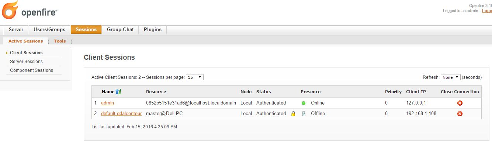
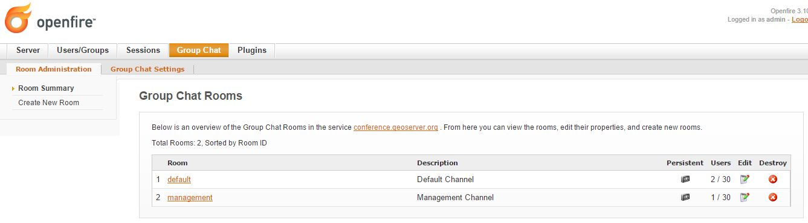
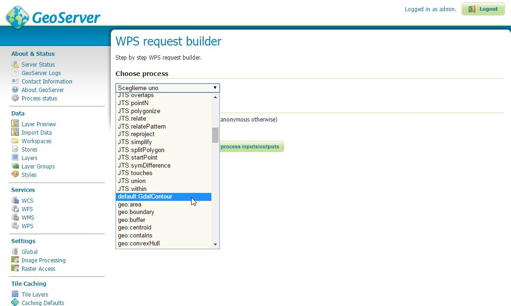
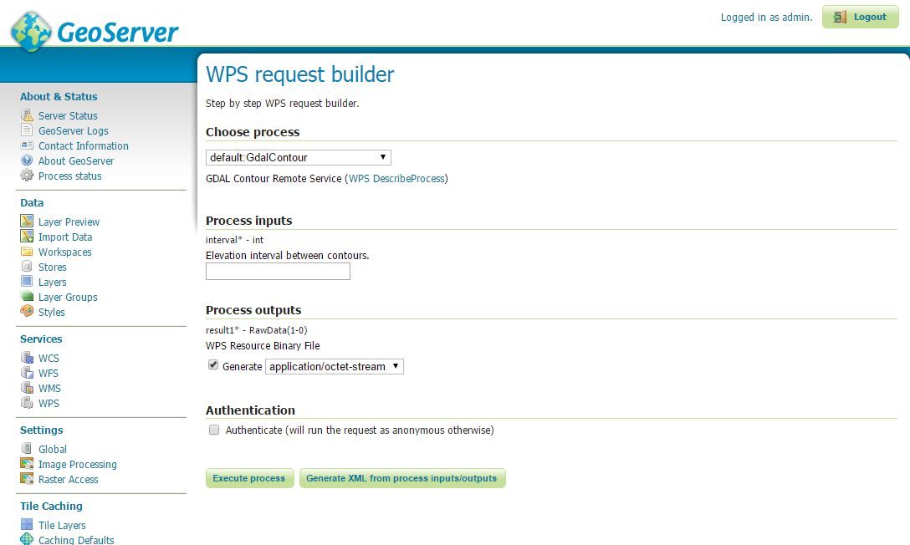
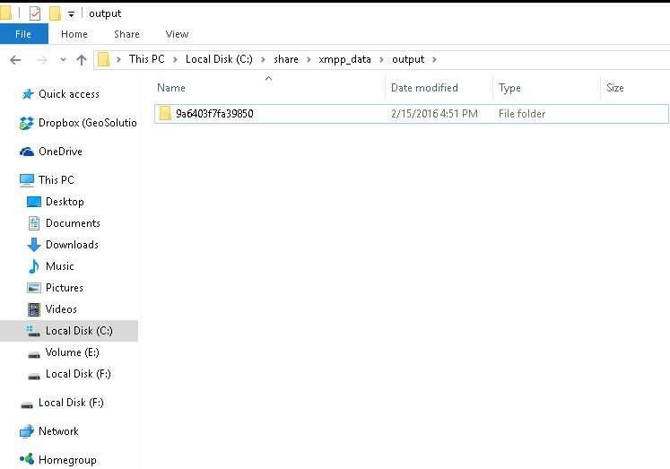
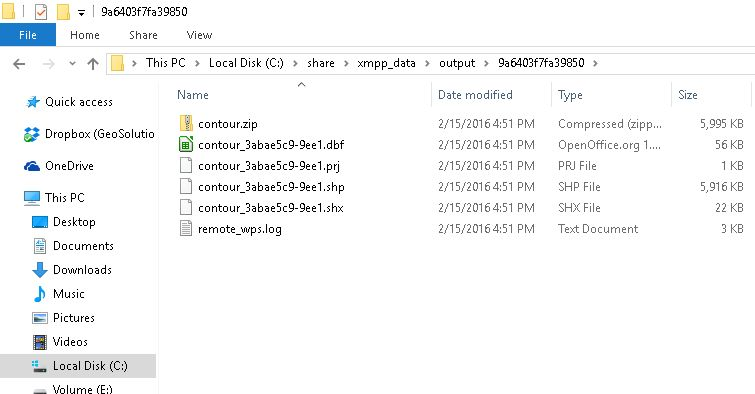
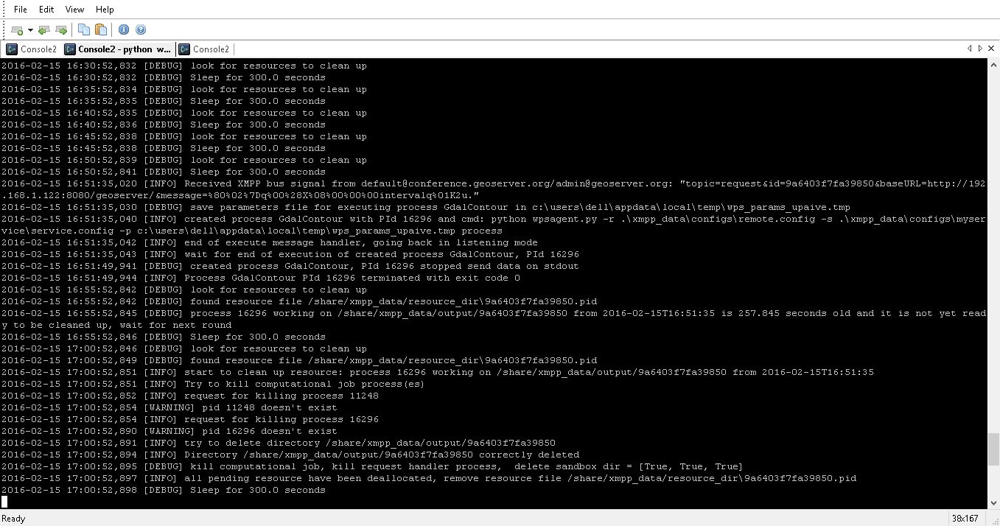
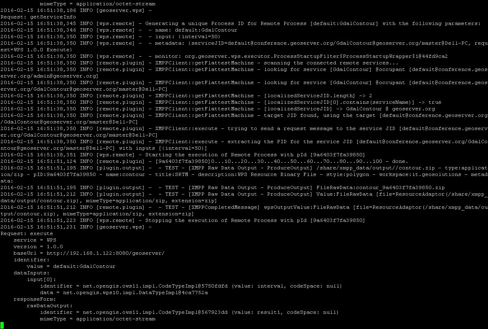

# A Remote "Gdal Contour" Process Binding Example {: #extensions_wps_remote_install_example }

Before continue reading this section, please be sure to have fully understood and successfully completed all the passages at sections:

-   [Deployment And Setup Of GeoServer With WPS Remote Plugin](install_geoserver.md)
-   [Installation Of OpenFire XMPP Server To Exchange Messages](install_xmpp.md)
-   [Deployment And Setup Of The XMPP Python Wrappers](install_python.md)

## Running the Python WPS Agent

In order to start the RemoteWPS Python Wrapper, we need to run an instance of the `wpsagent.py` using the configuration files defined at section [Deployment And Setup Of The XMPP Python Wrappers](install_python.md)

``` bash
$> cd C:\work\RemoteWPS

$> python wpsagent.py -r .\xmpp_data\configs\remote.config -s .\xmpp_data\configs\myservice\service.config service
```

Few instants after the execution of the command, you should be able to see con `invite` message on the prompt


and the `default.GdalContour` instance successfully connected and authenticated into the XMPP Server channels





The new GeoServer WPS Process should be now available among the GeoServer Processes



The GeoServer Remote Process Factory automatically creates the WPS interface for the new process, exposing through the OGC WPS Protocol the Inputs and Outputs definitions like shown in the illustration below



At the Execute Request the Remote WPS Python framework starts a new thread and assigns to it the unique **execution_id** provided by GeoServer.



The logs of the execution are stored into the **working directory**



From the log file is possible to recognize the full command line executed by the Remote WPS Python wrapper along with the lines received through the standard output


The main window shows the received XMPP messages and the actions taken accordingly



!!! note

    The same information can be found into the log file specified into the "logger.properties" file (see above).

On GeoServer side, it is possible to follow the process execution by following the messages sent via XMPP to the GeoServer logs

``` bash
$> tail -F -n 200 /storage/data/logs/geoserver.log
```


