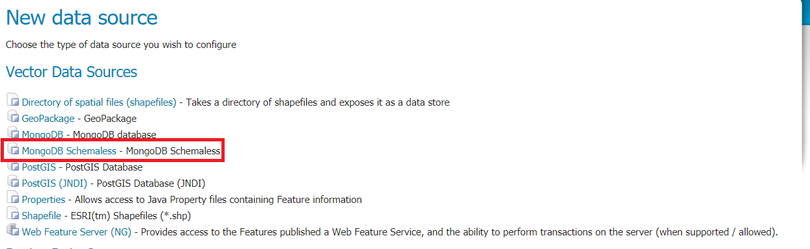

# Installing the Schemaless Mongo module

1.  Download `mongodb-schemaless`{.interpreted-text role="download_community"} nightly GeoServer community module.

    !!! warning

        Verify that the version number in the filename corresponds to the version of GeoServer you are running (for example geoserver- {{ release }}-schemaless-features-plugin.zip above).

2.  Extract the contents of the archive into the `WEB-INF/lib` directory of the GeoServer installation.

3.  On restart the `MongoDB Schemaless` vector source option will be available from the `New Data Source` page:

