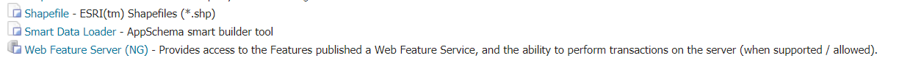

# Installing the Smart Data Loader extension

The Smart Data Loader community module is listed among the other extension downloads on the GeoServer download page.

The installation process is similar to other GeoServer community modules:

1.  Login, and navigate to **About & Status > About GeoServer** and check **Build Information** to determine the exact version of GeoServer you are running.

2.  Make sure you have downloaded and installed the ``app-schema`` extension first.

    Visit the [website download](https://geoserver.org/download) page, change the **Archive** tab, and locate your release.

    From the list of **Vector Formats** extensions download **App Schema**.

    - {{ release }} example: [app-schema](https://build.geoserver.org/geoserver/main/ext-latest/app-schema)
    - {{ version }} example: [app-schema](https://build.geoserver.org/geoserver/main/ext-latest/geoserver-{{ version }}-SNAPSHOT-app-schema-plugin.zip)

    Verify that the version number in the filename corresponds to the version of GeoServer you are running (for example {{ release }} above).

3.  Then you can download and install the Smart Data Loader.

    Visit the [website download](https://geoserver.org/download) page, change the **Development** tab, and locate the nightly release that corresponds to the GeoServer you are running.

    - {{ version }} example: [smart-data-loader](https://build.geoserver.org/geoserver/main/community-latest/geoserver-{{ version }}-SNAPSHOT-smart-data-loader-plugin.zip)

    The website lists active nightly builds to provide feedback to developers, you may also ``browse <https://build.geoserver.org/geoserver/>`` for earlier branches.

4.  Extract the contents of the archive into the **`WEB-INF/lib`** directory in GeoServer. Make sure you do not create any sub-directories during the extraction process.

5.  Restart GeoServer.

    When installation is successful, a Smart Data Loader entry is available in "new Data Source" menu.

    
    *Smart Data Loader entry*
