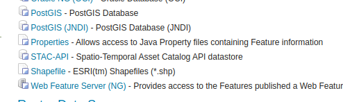

---
render_macros: true
---

# Installing the STAC data store

The STAC store community module is listed among the other community modules on the GeoServer download page.

The installation process is similar to other GeoServer community modules:

1.  Login, and navigate to **About & Status > About GeoServer** and check **Build Information** to determine the exact version of GeoServer you are running.

2.  Visit the [website download](https://geoserver.org/download) page, change the **Development** tab, and locate the nightly release that corresponds to the GeoServer you are running.

    Follow the **Community Modules** link and download `stac-datastore` zip archive.

    - {{ version }} example: [stac-datastore](https://build.geoserver.org/geoserver/main/community-latest/geoserver-{{ version }}-SNAPSHOT-stac-datastore-plugin.zip)

    The website lists active nightly builds to provide feedback to developers, you may also [browse](https://build.geoserver.org/geoserver/) for earlier branches.

3.  Extract the contents of the archive into the **`WEB-INF/lib`** directory in GeoServer.

    !!! warning

        Verify that the version number in the filename corresponds to the version of GeoServer you are running (for example geoserver-{{ version }}-stac-datastore-plugin.zip above).

4.  Restart GeoServer.

    On successful installation there is a new STAC-API datastore entry in the "new Data Source" menu.

    
    *STAC datastore entry*
