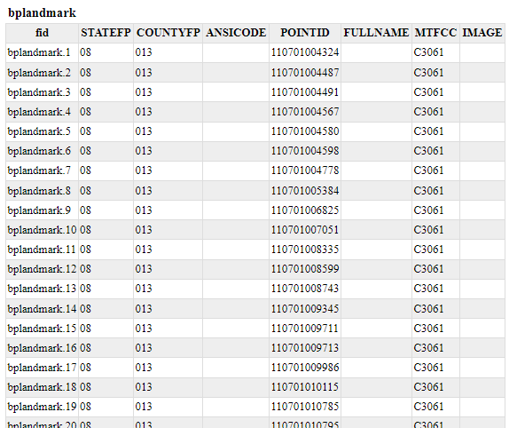
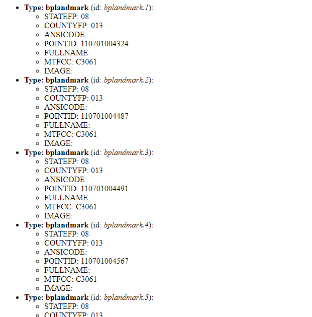

# WFS FreeMarker Extension configuration

## Template Lookup

Reference: [GetFeatureInfo Templates](../../tutorials/GetFeatureInfo/index.md)

## Example Configuration on a Vector Layer

The WFS GetFeature can generate output in various formats: GML, GeoJSON, \... and, through this extension, also HTML.

WFS Templating is concerned with the HTML one.

Assume we have a Vectorial layer named **geosolutions:bplandmarks**

1.  Go to the Layer preview to show **geosolutions:bplandmarks** layer.

2.  Search for the HTML format from the **All Formats** select-box, under the WFS ones.

    > 

3.  In order to configure a custom template of the GetFeature results create three files `.ftl` in `$geoserver_data/workspaces/geosolutions` directory named:

    > ``` 
    > - header.ftl
    > - content.ftl
    > - footer.ftl
    > ```
    >
    > :::: note
    > ::: title
    > Note
    > :::
    >
    > The Template is managed using Freemarker. This is a simple yet powerful template engine that GeoServer uses whenever developers allowed user customization of textual outputs. In particular, at the time of writing, it's used to allow customization of GetFeatureInfo, GeoRSS and KML outputs.
    > ::::
    >
    > :::: note
    > ::: title
    > Note
    > :::
    >
    > Splitting the template in three files allows the administrator to keep a consistent styling for the GetFeatureInfo result, but use different templates for different workspaces or different layers. This is done by providing a master header.ftl and footer.ftl file, but specify a different content.ftl for each layer.
    > ::::

4.  In header.ftl file enter the following HTML:

    > ``` 
    > <#--
    > Header section of the GetFeatureInfo HTML output. Should have the <head> section, and
    > a starter of the <body>. It is advised that eventual CSS uses a special class for featureInfo,
    > since the generated HTML may blend with another page changing its aspect when using generic classes
    > like td, tr, and so on.
    > -->
    > <html>
    >         <head>
    >                 <title>Geoserver GetFeatureInfo output</title>
    >         </head>
    >         <style type="text/css">
    >                 table.featureInfo, table.featureInfo td, table.featureInfo th {
    >                         border:1px solid #ddd;
    >                         border-collapse:collapse;
    >                         margin:0;
    >                         padding:0;
    >                         font-size: 90%;
    >                         padding:.2em .1em;
    >                 }
    >
    >                 table.featureInfo th{
    >                         padding:.2em .2em;
    >                         text-transform:uppercase;
    >                         font-weight:bold;
    >                         background:#eee;
    >                 }
    >
    >                 table.featureInfo td{
    >                         background:#fff;
    >                 }
    >
    >                 table.featureInfo tr.odd td{
    >                         background:#eee;
    >                 }
    >
    >                 table.featureInfo caption{
    >                         text-align:left;
    >                         font-size:100%;
    >                         font-weight:bold;
    >                         text-transform:uppercase;
    >                         padding:.2em .2em;
    >                 }
    >         </style>
    >         <body>
    > ```

5.  In content.ftl file enter the following HTML:

    > ``` 
    > <ul>
    > <#list features as feature>
    >         <li><b>Type: ${type.name}</b> (id: <em>${feature.fid}</em>):
    >         <ul>
    >         <#list feature.attributes as attribute>
    >                 <#if !attribute.isGeometry>
    >                         <li>${attribute.name}: ${attribute.value}</li>
    >                 </#if>
    >         </#list>
    >         </ul>
    >         </li>
    > </#list>
    > </ul>
    > ```

6.  In footer.ftl file enter the following HTML:

    > ``` 
    > <#--
    > Footer section of the GetFeatureInfo HTML output. Should close the body and the html tag.
    > -->
    >         </body>
    > </html>
    > ```

7.  Refresh the WFS GetFeature HTML output

    > 
