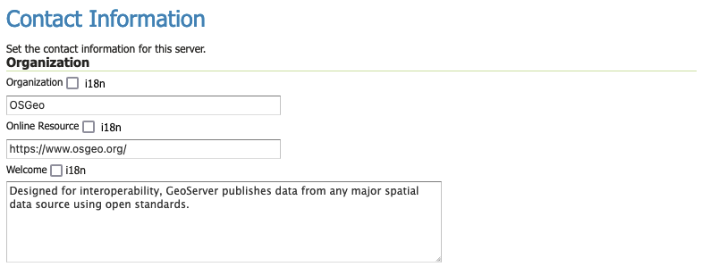
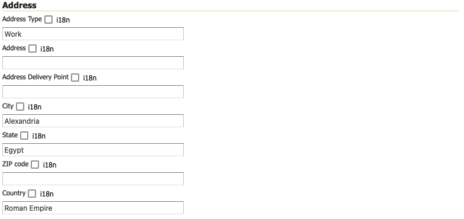

.. _config_contact:

Contact Information
===================

The Contact Information is used in the ``Capabilities``` document of the WMS and other web services, and is publicly accessible.

Contact information supports :ref:`internationalization` allowing services to be described in the requested locale.

Organization
------------

Complete this form with the organization details.


   
   Contact Information Organization

The welcome message is displayed in the welcome page header as an introduction to the GeoServer web services. The organization name and online resource, if provided, are used in the welcome page header for the :guilabel:`For more information visit` link.

Contact information fields:

.. list-table::
   :widths: 30 70 
   :header-rows: 1

   * - Field
     - Description
   * - Organization
     - Name of the organization with which the contact is affiliated 
   * - Online Resource
     - Website for organization
   * - Welcome
     - Introduction displayed on the welcome page

Primary contact
---------------

Complete this form with the relevant contact information.

.. figure:: img/contact_information.png
   
   Contact Information Primary Contact

The :guilabel:`email` address, if provided, is used to provide a :guilabel:`Contact administrator` link for the welcome page footer.

Contact information fields:

.. list-table::
   :widths: 30 70 
   :header-rows: 1

   * - Field
     - Description
   * - Contact
     - Contact information for webmaster
   * - Position
     - Position of the contact within their organization
   * - Email
     - Contact email address
   * - Telephone
     - Contact phone number      
   * - Fax
     - Contact Fax number

Address
-------

Complete this form with the relevant physical address information.


   
   Contact Information Address
   
Address information fields:

.. list-table::
   :widths: 30 70 
   :header-rows: 1

   * - Address Type
     - Type of address specified, such as postal
   * - Address
     - Actual street address     
   * - City
     - City of the address
   * - State
     - State or province of the address
   * - Zip code
     - Postal code for the address
   * - Country
     - Country of the address     

