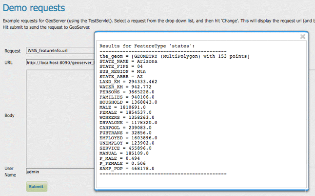
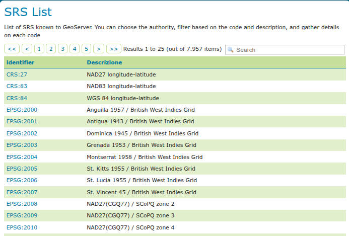
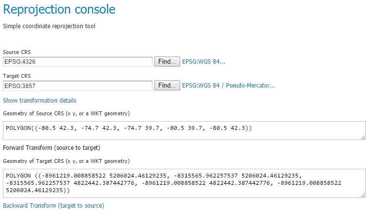

# Demos

This page contains helpful links to various information pages regarding GeoServer and its features. You do not need to be logged into GeoServer to access this page.

The page contains the following options

-   [Demo Requests](index.md#demos_demorequests)
-   [SRS List](index.md#srs_list)
-   [Reprojection console](index.md#demos_reprojectionconsole)
-   [WCS Request Builder](index.md#demos_wcsrequestbuilder)

*Demos page*

If you have the [WPS](../../services/wps/index.md) extension installed, you will see an additional option:

-   [WPS Request Builder](index.md#demos_wpsrequestbuilder)

*Demos page with WPS extension installed*

## Demo Requests {: #demos_demorequests }

This page has example WMS, WCS, and WFS requests for GeoServer that you can use, examine, and change. Select a request from the drop down list.

*Selecting demo requests*

Both [Web Feature Service (WFS)](../../services/wfs/index.md) as well as [Web Coverage Service (WCS)](../../services/wcs/index.md) requests will display the request URL and the XML body. [Web Map Service (WMS)](../../services/wms/index.md) requests will only display the request URL.

*WFS 1.1 DescribeFeatureType sample request*

Click **Submit** to send the request to GeoServer. For WFS and WCS requests, GeoServer will automatically generate an XML response.

*XML response from a WFS 1.1 DescribeFeatureType sample request*

Submitting a WMS GetMap request displays an image based on the provided geographic data.

*OpenLayers WMS GetMap request*

WMS GetFeatureInfo requests retrieve information regarding a particular feature on the map image.

*WMS GetFeatureInfo request*

## SRS List {: #srs_list }

GeoServer natively supports almost 4,000 Spatial Referencing Systems (SRS), also known as **projections**, and more can be added. A spatial reference system defines an ellipsoid, a datum using that ellipsoid, and either a geocentric, geographic or projection coordinate system. This page lists all SRS info known to GeoServer.

*Listing of all Spatial Referencing Systems (SRS) known to GeoServer*

The **Code** column refers to the unique integer identifier defined by the author of that spatial reference system. Each code is linked to a more detailed description page, accessed by clicking on that code.

*Details for SRS EPSG:2000*

The title of each SRS is composed of the author name and the unique integer identifier (code) defined by the Author. In the above example, the author is the [European Petroleum Survey Group](http://www.epsg.org/) (EPSG) and the Code is 2000. The fields are as follows:

**Description**---A short text description of the SRS

**WKT**---A string describing the SRS. WKT stands for "Well Known Text"

**Area of Validity**---The bounding box for the SRS

## Reprojection console {: #demos_reprojectionconsole }

The reprojection console allows you to calculate and test coordinate transformation. You can input a single coordinate or WKT geometry, and transform it from one CRS to another.

For example, you can use the reprojection console to transform a bounding box (as a WKT polygon or line) between different CRSs.

*Reprojection console showing a transformed bounding box*

Use **Forward transformation** to convert from source CRS to target CRS, and **Backward transformation** to convert from target CRS to source CRS.

You can also view the underlying calculation GeoServer is using to perform the transformation.

*Reprojection console showing operation details*

Read more about [Coordinate Reference System Handling](../crshandling/index.md).

## WCS Request Builder {: #demos_wcsrequestbuilder }

The WCS Request Builder is a tool for generating and executing WCS requests. Since WCS requests can be cumbersome to author, this tool can make working with WCS much easier.

Read more about the [WCS Request Builder](../../services/wcs/requestbuilder.md).

## WPS Request Builder {: #demos_wpsrequestbuilder }

GeoServer with the [WPS extension installed](../../services/wps/install.md) includes a request builder for generating and executing WPS processes. Since WPS requests can be cumbersome to author, this tool can make working with WPS much easier.

Read more about the [WPS Request Builder](../../services/wps/requestbuilder.md).
