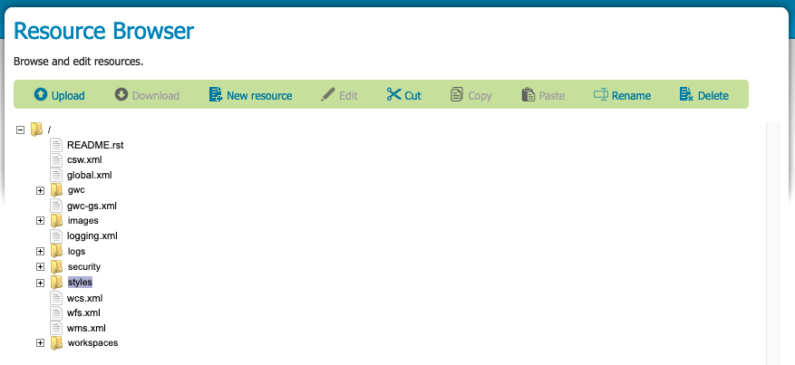

.. _web_resource:

Resource Browser
================

The :guilabel:`Resource Browser` provides a tree showing configuration folders, along with actions to edit and manage resources.

   
   Resource Browser

User interface elements:

* :guilabel:`Resource tree` is used to explore configuration folders and resource items.

* :guilabel:`Upload` uploads files to GeoServer. Select a directory to enable this tool.
   
  .. figure:: img/upload.png
     
     Upload a resource
     
* :guilabel:`Download` is used to download a selected resource from GeoServer as a file.

* :guilabel:`New resource` creates a new text file in the selected directory. The :guilabel:`Edit Resource` dialog is used to record the resource location, and the contents.
  
  .. figure:: img/new_resource.png
     
     Edit a Resource (New File)

* :guilabel:`Edit` a selected resource.
  
  .. figure:: img/edit_resource.png
     
     Edit a Resource (Existing File)

* Use :guilabel:`Cut`, :guilabel:`Copy`, and :guilabel:`Paste` to move resources between folders.
  
  .. figure:: img/paste_resource.png
     
     Paste a Resource
     
* :guilabel:`Rename` to rename a selected resource.
   
   .. figure:: img/rename_resource.png
      
      Rename a Resource
      
* :guilabel:`Delete` to remove a selected resource.
   
   .. figure:: img/delete_resource.png
      
      Delete a resource

Before you start
----------------

The resource browser is used to manage configuration resources in environments that do not provide direct disk access:

* When running GeoServer on a remote machine it can be difficult mange the icons and fonts used for effective styling
* Some cloud deployments of GeoServer operate without a data directory. In these environments the resource browser is used to manage items stored in a database or cloud storage rather than a file system.
* Folders are visual only, when creating or uploading a resource you can type a path and folders will be created as needed.

.. warning::
   
   Please use this tool with caution:

   * Configuration files managed by the web administration application can be reviewed and even modified using this tool.
   * It is not advised to edit these files directly as GeoServer must reload its Catalog to notice these changes.
