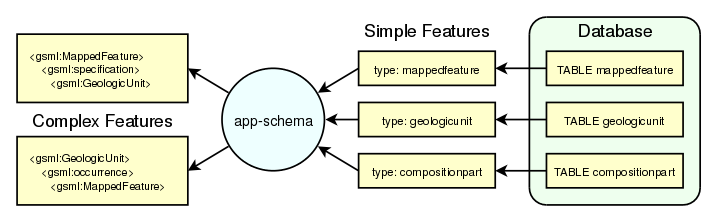

# Application schemas

The application schema support (app-schema) extension provides support for [app-schema.complex-features](#app-schema.complex-features) in GeoServer WFS.

!!! note

    You must install the app-schema plugin to use Application Schema Support.

GeoServer provides support for a broad selection of simple feature data stores, including property files, shapefiles, and JDBC data stores such as PostGIS and Oracle Spatial. The app-schema module takes one or more of these simple feature data stores and applies a mapping to convert the simple feature types into one or more complex feature types conforming to a GML application schema.

*Three tables in a database are accessed using GeoServer simple feature support and converted into two complex feature types.*

The app-schema module looks to GeoServer just like any other data store and so can be loaded and used to service WFS requests. In effect, the app-schema data store is a wrapper or adapter that converts a simple feature data store into complex features for delivery via WFS. The mapping works both ways, so queries against properties of complex features are supported.

- [DataApp SchemaComplex Features](complex-features.md)
- [DataApp SchemaInstallation](installation.md)
- [DataApp SchemaWfs Service Settings](wfs-service-settings.md)
- [DataApp SchemaConfiguration](configuration.md)
- [DataApp SchemaMapping File](mapping-file.md)
- [DataApp SchemaApp Schema Resolution](app-schema-resolution.md)
- [DataApp SchemaSupported Gml Versions](supported-gml-versions.md)
- [DataApp SchemaSecondary Namespaces](secondary-namespaces.md)
- [DataApp SchemaCql Functions](cql-functions.md)
- [DataApp SchemaProperty Interpolation](property-interpolation.md)
- [DataApp SchemaData Stores](data-stores.md)
- [DataApp SchemaFeature Chaining](feature-chaining.md)
- [DataApp SchemaPolymorphism](polymorphism.md)
- [DataApp SchemaData Access Integration](data-access-integration.md)
- [DataApp SchemaWms Support](wms-support.md)
- [DataApp SchemaWfs 2.0 Support](wfs-2.0-support.md)
- [DataApp SchemaJoining](joining.md)
- [DataApp SchemaTutorial](tutorial.md)
- [DataApp SchemaMongo Tutorial](mongo-tutorial.md)
- [DataApp SchemaSolr Tutorial](solr-tutorial.md)

