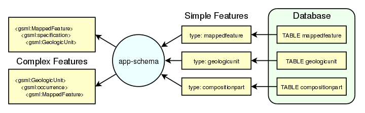

.. _app-schema:

Application schemas
===================

The application schema support (app-schema) extension provides support for :ref:`app-schema.complex-features` in GeoServer WFS.

.. note:: You must install the app-schema plugin to use Application Schema Support.

GeoServer provides support for a broad selection of simple feature data stores, including property files, shapefiles, and JDBC data stores such as PostGIS and Oracle Spatial. The app-schema module takes one or more of these simple feature data stores and applies a mapping to convert the simple feature types into one or more complex feature types conforming to a GML application schema.

   *Three tables in a database are accessed using GeoServer simple feature support and converted into two complex feature types.*

The app-schema module looks to GeoServer just like any other data store and so can be loaded and used to service WFS requests. In effect, the app-schema data store is a wrapper or adapter that converts a simple feature data store into complex features for delivery via WFS. The mapping works both ways, so queries against properties of complex features are supported.

.. toctree::
   :maxdepth: 2

   complex-features
   installation
   wfs-service-settings
   configuration
   mapping-file
   app-schema-resolution
   supported-gml-versions
   secondary-namespaces
   cql-functions
   property-interpolation
   data-stores
   feature-chaining
   polymorphism
   data-access-integration
   wms-support
   wfs-2.0-support
   joining
   tutorial
   mongo-tutorial
   solr-tutorial
   

