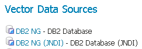
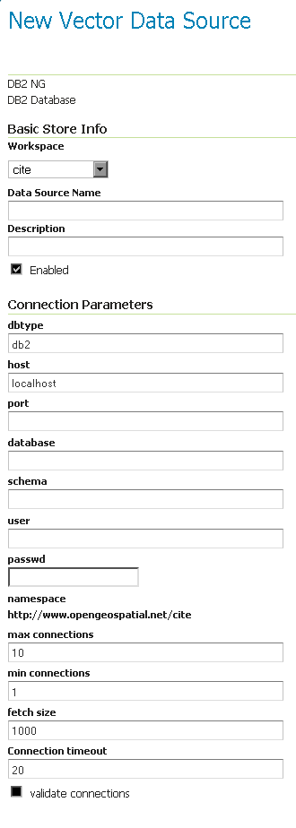

# Db2

!!! note

    GeoServer does not come built-in with support for Db2; it must be installed through an extension. Proceed to [Installing the Db2 extension](#Db2_install) for installation details.

The Db2 spatial support implements the OGC specification "Simple Features for SQL using types and functions" and the ISO "SQL/MM Part 3 Spatial" standard. When installing Db2 on Linux, Unix and Windows platforms, the "custom" option must be selected and the server spatial support included.

A free of charge copy of Db2 can be downloaded from <https://www.ibm.com/analytics/db2/trials>.

## Installing the Db2 extension {: #Db2_install }

!!! warning

    Due to licensing requirements, not all files are included with the extension. To install Db2 support, it is necessary to download additional files. **Just installing the Db2 extension will have no effect.**

### GeoServer files

1.  Login, and navigate to **About & Status > About GeoServer** and check **Build Information** to determine the exact version of GeoServer you are running.

2.  Visit the [website download](https://geoserver.org/download) page, change the **Development** tab, and locate the nightly release that corresponds to the GeoServer you are running.

    Follow the **Community Modules** link and download `db2` zip archive.

    - {{ version }} example: [db2](https://build.geoserver.org/geoserver/main/community-latest/geoserver-{{ version }}-SNAPSHOT-db2-plugin.zip)

    The website lists active nightly builds to provide feedback to developers, you may also [browse](https://build.geoserver.org/geoserver/) for earlier branches.

3.  Extract the contents of the archive into the **`WEB-INF/lib`** directory in GeoServer.

    !!! warning

        Verify that the version number in the filename corresponds to the version of GeoServer you are running (for example geoserver-{{ version }}-loader-plugin.zip above).

4.  Restart GeoServer.

### Required external files

The Db2 JDBC driver is not packaged with the GeoServer extension: **`db2jcc4.jar`**. This file should be available in the **`java`** subdirectory of your Db2 installation directory. Copy this file to the `WEB-INF/lib` directory of the GeoServer installation.

After all GeoServer files and external files have been downloaded and copied, restart GeoServer.

## Adding a Db2 data store

When properly installed, **Db2** will be an option in the **Vector Data Sources** list when creating a new data store.

*Db2 in the list of raster data stores*

## Configuring a Db2 data store

*Configuring a Db2 data store*

## Configuring a Db2 data store with JNDI

## Notes on usage

Db2 schema, table, and column names are all case-sensitive when working with GeoTools/GeoServer. When working with Db2 scripts and the Db2 command window, the default is to treat these names as upper-case unless enclosed in double-quote characters but this is not the case in GeoServer.
