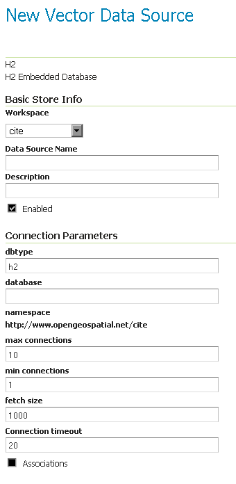

# H2 {: #data_h2 }

!!! note

    GeoServer does not come built-in with support for H2; it must be installed through an extension. Proceed to [Installing the H2 extension](h2.md#h2_install) for installation details.

## Installing the H2 extension {: #h2_install }

1.  Visit the [website download](https://geoserver.org/download) page, locate your release, and download: `h2`{.interpreted-text role="download_extension"}

    !!! warning

        Ensure to match plugin (example {{ release }} above) version to the version of the GeoServer instance.

2.  Extract the contents of the archive into the **`WEB-INF/lib`** directory of the GeoServer installation.

## Adding an H2 data store

Once the extension is properly installed **H2** will be an option in the **Vector Data Sources** list when creating a new data store.

*H2 in the list of vector data stores*

## Configuring an H2 data store

*Configuring an H2 data store*

## Configuring an H2 data store with JNDI

See [JNDI](jndi.md).
