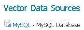
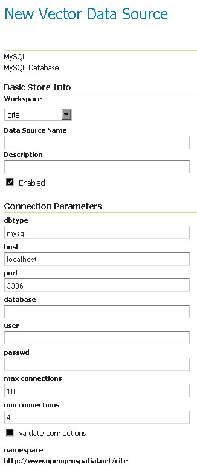

# MySQL

!!! note

    GeoServer does not come built-in with support for MySQL; it must be installed through an extension. Proceed to [Installing the MySQL extension](mysql.md#mysql_install) for installation details.

!!! warning

    Currently the MySQL extension is unmaintained and carries unsupported status. While still usable, do not expect the same reliability as with other extensions.

[MySQL](http://www.mysql.com) is an open source relational database with some limited spatial functionality.

## Installing the MySQL extension {: #mysql_install }

1.  Visit the [website download](https://geoserver.org/download) page, locate your release, and download: {{ download_extension('mysql') }} (nightly {{ download_extension('mysql','snapshot') }})

    !!! warning

        Ensure to match plugin (example {{ release }} above) version to the version of the GeoServer instance.

2.  Extract the contents of the archive into the **`WEB-INF/lib`** directory of the GeoServer installation.

## Adding a MySQL database

Once the extension is properly installed `MySQL` will show up as an option when creating a new data store.

*MySQL in the list of data sources*

## Configuring a MySQL data store

*Configuring a MySQL data store*

|                                                            |                                                                                                                                            |
|------------------------------------------------------------|--------------------------------------------------------------------------------------------------------------------------------------------|
| `host`                                                     | The mysql server host name or ip address.                                                                                                  |
| `port`                                                     | The port on which the mysql server is accepting connections.                                                                               |
| `database`                                                 | The name of the database to connect to. Can also contain a suffix with a connection URL query, such as ``mydbname?useSSL=false`` |
| `user`                                                     | The name of the user to connect to the mysql database as.                                                                                  |
| `password`                                                 | The password to use when connecting to the database. Left blank for no password.                                                           |
| `max connections` `min connections` `validate connections` | Connection pool configuration parameters. See the [Database Connection Pooling](connection-pooling.md) section for details.               |
