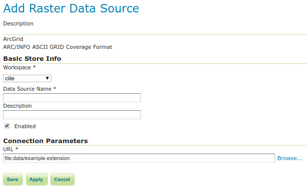

# ArcGrid

ArcGrid is a coverage file format created by ESRI.

## Adding an ArcGrid data store

By default, **ArcGrid** will be an option in the **Raster Data Sources** list when creating a new data store.

*ArcGrid in the list of raster data stores*

## Configuring a ArcGrid data store

*Configuring an ArcGrid data store*

  -------------------- --------------------------------------------------------
  **Option**           **Description**

  `Workspace`          

  `Data Source Name`   

  `Description`        

  `Enabled`            

  `URL`                
  -------------------- --------------------------------------------------------
