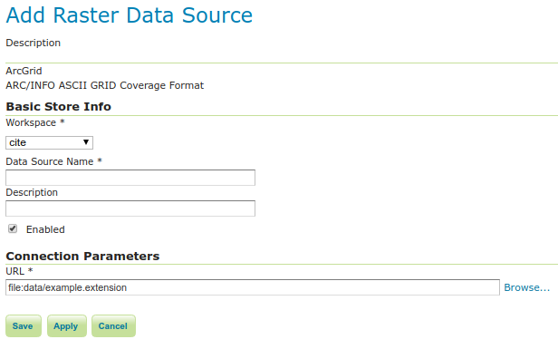

---
render_macros: true
---

# ArcGrid

!!! note

    GeoServer does not come built-in with support for ArcGrid; it must be installed through an extension. Proceed to [Installing the ArcGrid extension](arcgrid.md#arcgrid_install) for installation details.

ArcGrid is a coverage file format created by ESRI.

## Installing the ArcGrid extension {: #arcgrid_install }

1.  Visit the [website download](https://geoserver.org/download) page, locate your release, and download:

    - {{ release }} [arcgrid](https://build.geoserver.org/geoserver/main/ext-latest/arcgrid)
    - {{ version }} [arcgrid](https://build.geoserver.org/geoserver/main/ext-latest/geoserver-{{ version }}-SNAPSHOT-arcgrid-plugin.zip)

    !!! warning

        Ensure to match plugin (example {{ release }} above) version to the version of the GeoServer instance.

2.  Extract the contents of the archive into the **`WEB-INF/lib`** directory of the GeoServer installation.

## Adding an ArcGrid data store

Once the extension is properly installed **ArcGrid** will be an option in the **Raster Data Sources** list when creating a new data store.

*ArcGrid in the list of raster data stores*

## Configuring a ArcGrid data store

*Configuring an ArcGrid data store*

| **Option**         | **Description** |
|--------------------|-----------------|
| `Workspace`        |                 |
| `Data Source Name` |                 |
| `Description`      |                 |
| `Enabled`          |                 |
| `URL`              |                 |
