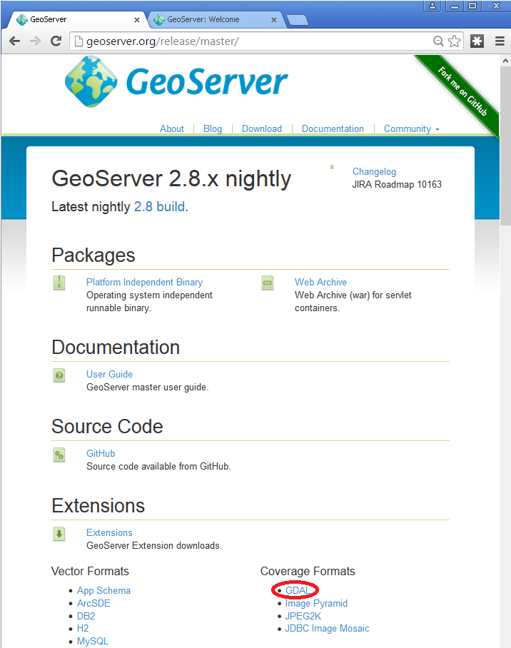
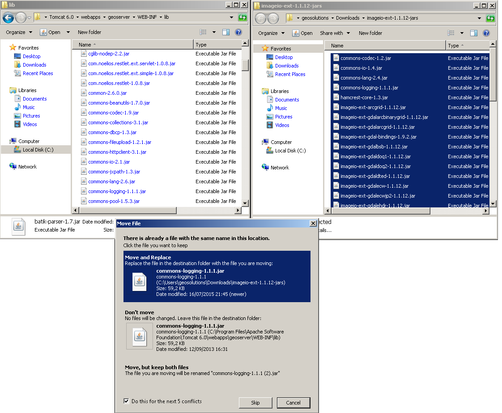
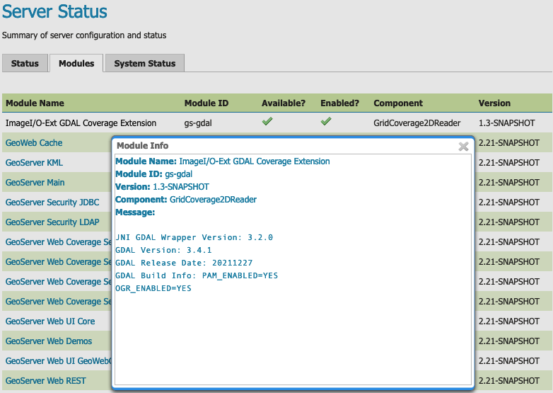
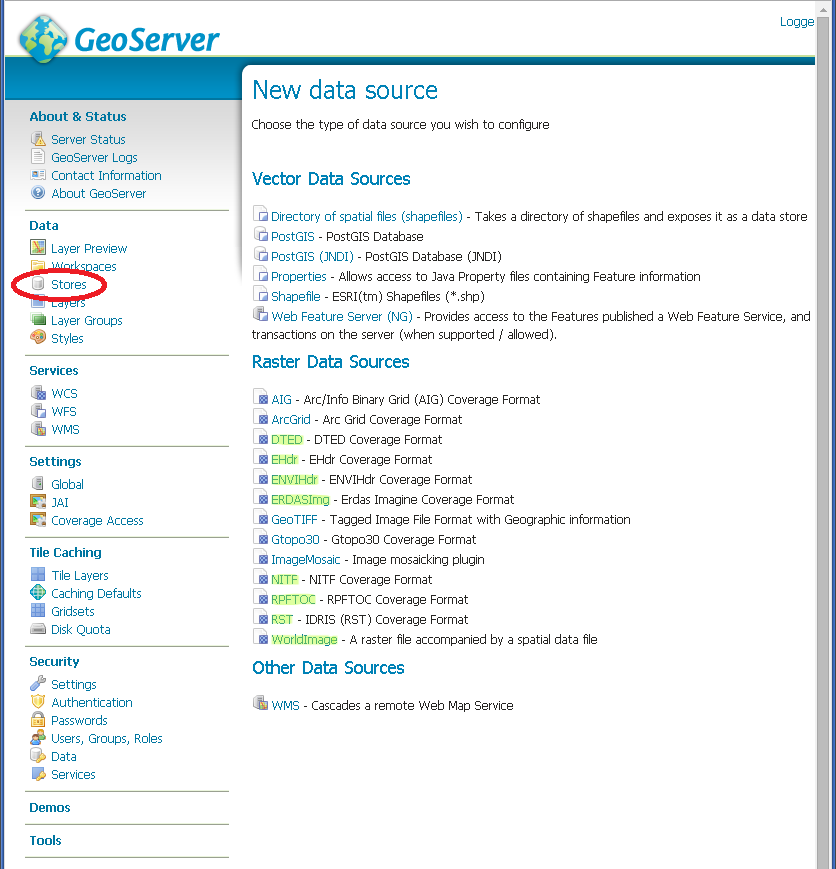
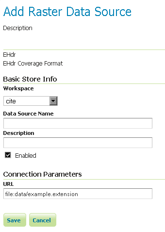
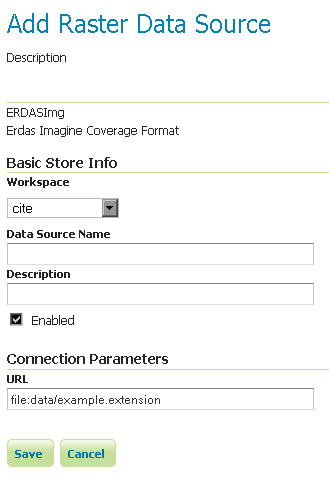
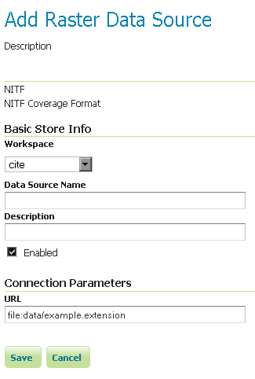

# GDAL Image Formats

GeoServer can leverage the [ImageI/O-Ext](https://github.com/geosolutions-it/imageio-ext/wiki) GDAL libraries to read selected coverage formats. [GDAL](http://www.gdal.org) is able to read many formats, but for the moment GeoServer supports only a few general interest formats and those that can be legally redistributed and operated in an open source server.

The following image formats can be read by GeoServer using GDAL:

-   [DTED](https://www.gdal.org/frmt_dted.html): Military Elevation Data (**`.dt0`**, **`.dt1`**, **`.dt2`**)
-   [EHdr](https://gdal.org/drivers/raster/ehdr.html): ESRI **`.hdr`** Labelled:
-   [ENVI](https://gdal.org/drivers/raster/envi.html): ENVI **`.hdr`** Labelled Raster
-   [HFA](https://www.gdal.org/frmt_hfa.html): Erdas Imagine (**`.img`**)
-   [JP2MrSID](https://www.gdal.org/frmt_jp2mrsid.html): JPEG2000 (**`.jp2`**, **`.j2k`**)
-   [MrSID](https://www.gdal.org/frmt_mrsid.html): Multi-resolution Seamless Image Database
-   [NITF](https://www.gdal.org/frmt_nitf.html): National Imagery Transmission Format
-   [ECW](https://www.gdal.org/frmt_ecw.html): ERDAS Compressed Wavelets (**`.ecw)`**:
-   [JP2ECW](https://www.gdal.org/frmt_jp2ecw.html): JPEG2000 (**`.jp2`**, **`.j2k`**)
-   [AIG](https://gdal.org/drivers/raster/aig.html): Arc/Info Binary Grid
-   [JP2KAK](https://www.gdal.org/frmt_jp2kak.html): JPEG2000 (**`.jp2`**, **`.j2k`**)

## Installing GDAL extension

From GeoServer version 2.2.x, GDAL must be installed as an extension. To install it:

1.  Visit the [website download](https://geoserver.org/download) page, locate your release, and download: {{ download_extension('gdal') }} (nightly {{ download_extension('gdal','snapshot') }})

    !!! warning

        Ensure to match plugin (example {{ release }} above) version to the version of the GeoServer instance.

-   The download link for **GDAL** will be in the **Extensions** section under **Coverage Format**.



-   Extract the files in this archive to the **`WEB-INF/lib`** directory of your GeoServer installation. On Windows You may be prompted for confirmation to overwrite existing files, confirm the replacement of the files



Moreover, in order for GeoServer to leverage these libraries, the GDAL (binary) libraries must be installed through your host system's OS. Once they are installed, GeoServer will be able to recognize GDAL data types. See below for more information.

### Installing GDAL native libraries

Starting with GeoServer 2.21.x the imageio-ext plugin is tested with GDAL version 3.x (tested in particular with 3.2.x and 3.4.x).

The imageio-ext plugin is tested with the GDAL 3.2 SWIG bindings, included in the extension download as **`gdal-3.2.0.jar`**.

#### In case of version mismatch

We recommend matching the version **`gdal`** jar to the version of gdal available in your environment:

``` console
gdalinfo --version
```

    GDAL 3.4.1, released 2021/12/27

If you are using a version of GDAL that does not match the one expected by GeoServer, you can go and replace the **`gdal-3.2.0.jar`** file with the equivalent java binding jar (typically named either **`gdal-<version>.jar`**) included with your GDAL version:

-   If your GDAL version does not include a bindings jar, it was probably not compiled with the java bindings and will not work with GeoServer.
-   You may also search for the correct **`gdal`** jar here: <https://search.maven.org/artifact/org.gdal/gdal>

#### Windows packages and setup

For Windows, [gisinternals.com](http://www.gisinternals.com/release.php) provides complete packages, with Java bindings support, in the `release-<version>-GDAL-<version>-mapserver-<version>.zip` packages (the GDAL binary downloads at the time of writing do not include Java support).

Unpack the **`zip`** file in a suitable location, and then set the following variables before starting up GeoServer:

``` bat
set PATH=%PATH%;C:\<unzipped_package>\bin;C:\<unzipped_package>\bin\gdal\java
set GDAL_DRIVER_PATH=C:\<unzipped_package>\bin\gdal\plugins
set GDAL_DATA=C:\<unzipped_package>\bin\gdal-data
```

There are a few optional drivers that you can find in [file:`C:\](file:%60C:\)<unzipped_package>bingdalplugins-extra` and **`C:<unzipped_package>bingdalplugins-optional`**. Include these paths in `` `GDAL_DRIVER_PATH `` enables the additional formats.

!!! warning

    Before adding the extra formats please make sure that you are within your rights to use them in a server environment (some packages are specifically forbidden from free usage on the server side and require a commercial licence, e.g., ECW).

!!! note

    Depending on the version of the underlying operating system you will have to pick up the right one. You can google around for the one you need. Also make sure you download the 32 bit version if you are using a 32 bit version of Windows or the 64 bit version (has a "-x64" suffix in the name of the zip file) if you are running a 64 bit version of Windows. Again, pick the one that matches your infrastructure.

#### Note on running GeoServer as a Service on Windows

Deploying the GDAL ImageI/O-Ext native libraries in a location referred by the `PATH` environment variable (like, as an instance, the JDK/bin folder) will not allow the GeoServer service to use GDAL. As a result, during the service startup, GeoServer log will likely report the following message:

    it.geosolutions.imageio.gdalframework.GDALUtilities loadGDAL
    WARNING: Native library load failed.java.lang.UnsatisfiedLinkError: no gdaljni in java.library.path

Taking a look at the `jsl74.ini` configuration file available inside the GeoServer installation , there is this useful entry:

``` ini
;The java command line
;The entry method below using a parameter list still works but the command line variant is more convenient.
;Everything separated by whitespace on a java command line is broken down into a parameter here. 
;You don't need to care about quotes
;around strings containing spaces here. e.g. 
cmdline = -cp "..\src" com.roeschter.jsl.TelnetEcho
```

To allow the GDAL native DLLs to be loaded:

1.  Edit the command line to include `-Djava.library.path` with the location of your GDAL libraries.

#### Linux packages and setup

For common LTS Linux distribution there are packages for GDAL and the associated Java bindings, e.g., on Ubuntu and derivatives you can install them using:

    sudo apt-get install gdal-bin libgdal-java

The libraries as installed above are already in the search path, so no extra setup is normally needed. In case setting up the `GDAL_DATA` is required to handle certain projections, it's normally found in `/usr/share/gdal/<version>`, so you can execute the following prior to start GeoServer, e.g:

    export GDAL_DATA=/usr/share/gdal/<version>

In case you decide to build from sources instead, remember to run `configure` with `--with-java`, and after the main build and install, get into the `swig/java` and run a build and install there. For more information about building GDAL see:

-   [General build information](https://trac.osgeo.org/gdal/wiki/BuildHints)
-   [Specific info to build GDAL Java bindings](https://trac.osgeo.org/gdal/wiki/GdalOgrInJavaBuildInstructionsUnix)

After the build and installation, export the following variables to make GeoServer use the GDAL custom build:

    export LD_LIBRARY_PATH=/<path_to_gdal_install>/lib
    export GDAL_DATA=/<path_to_gdal_install>/share/gdal

## Testing the installation

Once these steps have been completed, restart GeoServer.

Navigate to **About > Server Status** page, and change to the **Modules** tab, and click **ImageI/O-Ext GDAL Coverage Extension** link for status information.


*ImageI/O GDAL Coverage Extension Module Status*

This information can be used to verify that the extension is active, the version of GDAL used, and the version of the SWIG bindings used.

If all the steps have been performed correctly, new data formats will be in the **Raster Data Sources** list when creating a new data store in the **Stores** section as shown here below.


*GDAL image formats in the list of raster data stores*

If new formats do not appear in the GUI and you see the following message in the log file:

    *it.geosolutions.imageio.gdalframework.GDALUtilities loadGDAL
    WARNING: Native library load failed.java.lang.UnsatisfiedLinkError: no gdaljni in java.library.path*
    WARNING: Native library load failed.java.lang.UnsatisfiedLinkError: no gdalalljni in java.library.path*

This means that the extension was installed, bu twas not able to access your gdal library for some reason.

## Configuring a DTED data store


*Configuring a DTED data store*

## Configuring a EHdr data store


*Configuring a EHdr data store*

## Configuring a ERDASImg data store


*Configuring a ERDASImg data store*

## Configuring a JP2MrSID data store


*Configuring a JP2MrSID data store*

## Configuring a NITF data store


*Configuring a NITF data store*

## Supporting vector footprints

Starting with version 2.9.0, GeoServer supports vector footprints. A footprint is a shape used as a mask to hide those pixels that are outside of the mask, hence making that part of the parent image transparent. The currently supported footprint formats are WKB, WKT and Shapefile. By convention, the footprint file should be located in the same directory as the raster data that the footprint applies to.

!!! note

    In the examples of this section and related subsections, we will always use .wkt as extension, representing a WKT footprint, although both .wkb and .shp are supported too.

For example, supposing you have a MrSID file located at **`/mnt/storage/data/landsat/N-32-40_2000.sid`** to be masked, you just need to place a WKT file on the same folder, as **`/mnt/storage/data/landsat/N-32-40_2000.wkt`** Note that the footprint needs to have same path and name of the original data file, with .wkt extension.

This is how the sample footprint geometry looks:


*A sample geometry stored as WKT, rendered on OpenJump*

Once footprint file has been added, you need to change the FootprintBehavior parameter from None (the default value) to Transparent, from the layer configuration.


*Setting the FootprintBehavior parameter*

The next image depicts 2 layer previews for the same layer: the left one has no footprint, the right one has a footprint available and FootprintBehavior set to transparent.


*No Footprint VS FootprintBehavior = Transparent*

### External Footprints data directory

As noted above, the footprint file should be placed in the same directory as the raster file. However in some cases this may not be possible. For example, the folder containing the raster data may be read only.

As an alternative, footprint files can be located in a common directory, the **footprints data directory**. The subdirectories and file names under that directory must match the original raster path and file names. The footprints data directory is specified as a Java System Property or an Environment Variable, by setting the ``FOOTPRINTS_DATA_DIR`` property/variable to the directory to be used as base folder.

#### Example

Suppose you have 3 raster files with the following paths:

-   **`/data/raster/charts/nitf/italy_2015.ntf`**
-   **`/data/raster/satellite/ecw/orthofoto_2014.ecw`**
-   **`/data/raster/satellite/landsat/mrsid/N-32-40_2000.sid`**

They can be represented by this tree:

``` text
/data
 \---raster
     +---charts
     |   \---nitf
     |           italy_2015.ntf
     |
     \---satellite
         +---ecw
         |       orthofoto_2014.ecw
         |
         \---landsat
             \---mrsid
                     N-32-40_2000.sid
```

In order to support external footprints you should

1.  Create a **`/footprints`** (as an example) directory on disk
2.  Set the **`FOOTPRINTS_DATA_DIR=/footprints`** variable/property.
3.  Replicate the rasters folder hierarchy inside the specified folder, using the full paths.
4.  Put the 3 WKT files in the proper locations:

-   **`/footprints/data/raster/charts/nitf/italy_2015.wkt`**
-   **`/footprints/data/raster/satellite/ecw/orthofoto_2014.wkt`**
-   **`/footprints/data/raster/satellite/landsat/mrsid/N-32-40_2000.wkt`**

Which can be represented by this tree:

``` text
/footprints
 \---data
     \---raster
         +---charts
         |   \---nitf
         |           italy_2015.wkt
         |
         \---satellite
             +---ecw
             |       orthofoto_2014.wkt
             |
             \---landsat
                 \---mrsid
                         N-32-40_2000.wkt
```

Such that, in the end, you will have the following folders hierarchy tree:

``` text
+---data
|   \---raster
|       +---charts
|       |   \---nitf
|       |           italy_2015.ntf
|       |
|       \---satellite
|           +---ecw
|           |       orthofoto_2014.ecw
|           |
|           \---landsat
|               \---mrsid
|                       N-32-40_2000.sid
|
\---footprints
    \---data
        \---raster
            +---charts
            |   \---nitf
            |           italy_2015.wkt
            |
            \---satellite
                +---ecw
                |       orthofoto_2014.wkt
                |
                \---landsat
                    \---mrsid
                            N-32-40_2000.wkt
```

Note the parallel mirrored folder hierarchy, with the only differences being a **`/footprints`** prefix at the beginning of the path, and the change in suffix.
