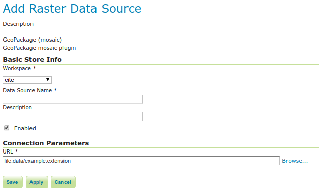

.. _data_geopkg_raster:

GeoPackage
==========

`GeoPackage <http://www.opengeospatial.org/projects/groups/geopackageswg/>`_ is an SQLite based standard format that is able to hold multiple vector and raster data layers in a single file.

GeoPackage files can be used both as Vector Data Stores as well as Raster Data Stores (so that both kinds of layers can published).

Adding a GeoPackage Raster (Mosaic) Data Store
----------------------------------------------

By default, :guilabel:`GeoPackage (mosaic)` will be an option in the :guilabel:`Raster Data Sources` list when creating a new data store.

.. figure:: images/geopackagemosaiccreate.png
   :align: center

   *GeoPackage (mosaic) in the list of raster data stores*

   *Configuring a GeoPackage (mosaic) data store*

.. list-table::
   :widths: 20 80

   * - **Option**
     - **Description**
   * - ``Workspace``
     - Name of the workspace to contain the GeoPackage Mosaic store. This will also be the prefix of the raster layers created from the store.
   * - ``Data Source Name``
     - Name of the GeoPackage Mosaic Store as it will be known to GeoServer. This can be different from the filename. )
   * - ``Description``
     - A full free-form description of the GeoPackage Mosaic Store.
   * - ``Enabled``
     -  If checked, it enables the store. If unchecked (disabled), no data in the GeoPackage Mosaic Store will be served from GeoServer.
   * - ``URL``
     - Location of the GeoPackage file. This can be an absolute path (such as :file:`file:C:\\Data\\landbase.gpkg`) or a path relative to GeoServer's data directory (such as :file:`file:data/landbase.gpkg`).

When finished, click :guilabel:`Save`.
